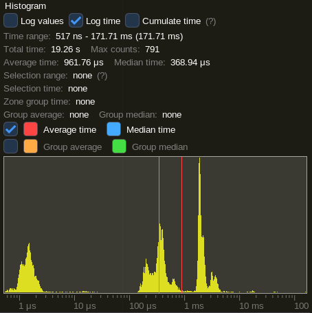
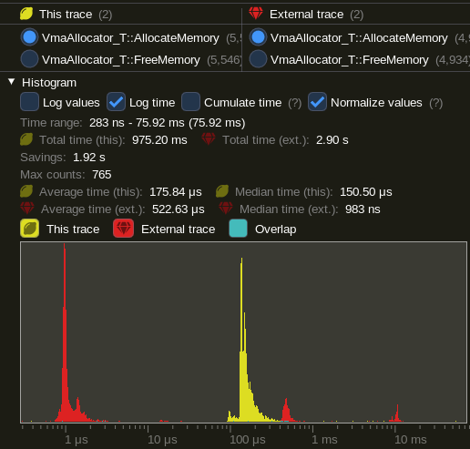
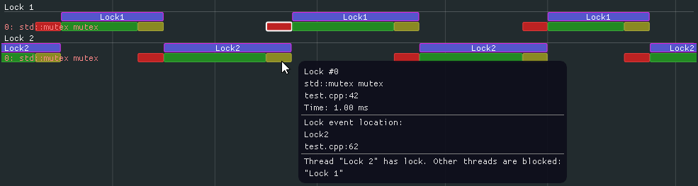
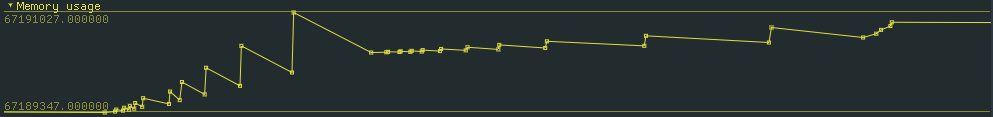

# Tracy Profiler

Tracy is a real time, nanosecond resolution frame profiler that can be used for remote or embedded telemetry of your application. It can profile CPU (C, C++11, Lua), GPU (OpenGL, Vulkan) and memory. It also can display locks held by threads and their interactions with each other.

The following compilers are supported:

- MSVC
- gcc
- clang

The following platforms are confirmed to be working (this is not a complete list):

- Windows (x86, x64)
- Linux (x86, x64, ARM, ARM64)
- Android (ARM, x86)
- FreeBSD (x64)
- Cygwin (x64)
- WSL (x64)
- OSX (x64)

[Introduction to Tracy Profiler v0.2](https://www.youtube.com/watch?v=fB5B46lbapc)  
[New features in Tracy Profiler v0.3](https://www.youtube.com/watch?v=3SXpDpDh2Uo)  
[New features in Tracy Profiler v0.4](https://www.youtube.com/watch?v=eAkgkaO8B9o)  
[New features in Tracy Profiler v0.5](https://www.youtube.com/watch?v=P6E7qLMmzTQ)

[A quick FAQ.](FAQ.md)  
[List of changes.](NEWS)

### High-level overview

Tracy is split into client and server side. The client side collects events using a high-efficiency queue and awaits for an incoming connection. The server part connects to client and receives collected data from the client, which is then reconstructed into a viewable timeline. The transfer is performed using a TCP connection.

### Performance impact

To check how much slowdown is introduced by using Tracy, I have profiled [etcpak](https://bitbucket.org/wolfpld/etcpak), which is the fastest ETC texture compression utility there is. I used an 8192×8192 test image as input data and instrumented everything down to the 4×4 pixel block compression function (that's 4 million blocks to compress). It should be noted that Tracy needs to calibrate its internal timers at each run. This introduces a delay of 115 ms (on my machine), which is negligible when doing lengthy profiling runs, but it skews the results of etcpak timing. The following times have this delay subtracted, to give focus on zone collection impact, which is the thing that really matters here.

|                        Scenario                       |  Zones  | Clean run | Profiling run | Difference |
|-------------------------------------------------------|---------|-----------|---------------|------------|
| Compression of an image to ETC1 format                | 4194568 |    0.94 s |       1.003 s |   +0.063 s |
| Compression of an image to ETC2 format, with mip-maps | 5592822 |   1.034 s |       1.119 s |   +0.085 s |

In both scenarios the per-zone time cost is at ~15 ns. This is in line with the measured 8 ns single event collection time (each zone has to report start and end event).

## Usage instructions

The user manual for Tracy is available [at the following address](https://bitbucket.org/wolfpld/tracy/downloads/tracy.pdf). It provides information about the integration process, required code markup and so on.

## Features

#### Histogram of function execution times

#### Comparison of two profiling runs

#### Marking locks

#### Plotting data

#### Message log

