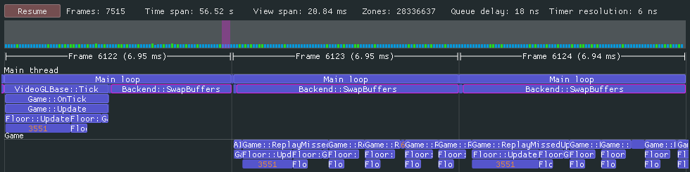
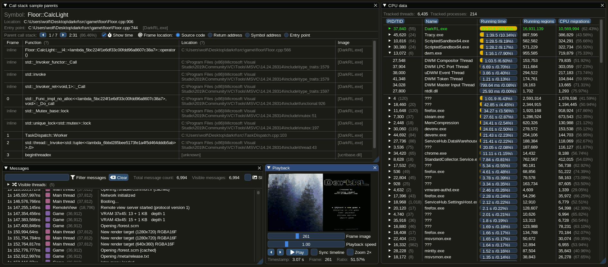
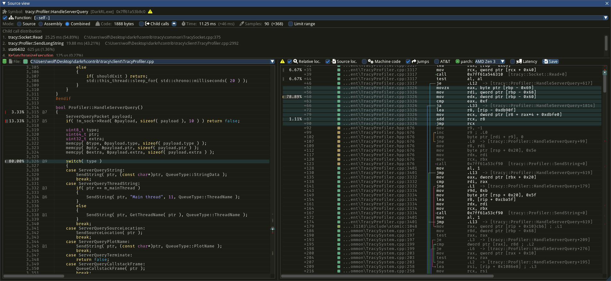

# Tracy Profiler

### A real time, nanosecond resolution, remote telemetry, hybrid frame and sampling profiler for games and other applications.

Tracy supports profiling CPU (Direct support is provided for C, C++, Lua and Python integration. At the same time, third-party bindings to many other languages exist on the internet, such as [Rust](https://github.com/nagisa/rust_tracy_client), [Zig](https://github.com/nektro/zig-tracy), [C#](https://github.com/clibequilibrium/Tracy-CSharp), [OCaml](https://github.com/imandra-ai/ocaml-tracy), [Odin](https://github.com/oskarnp/odin-tracy), etc.), GPU (All major graphic APIs: OpenGL, Vulkan, Direct3D 11/12, OpenCL.), memory allocations, locks, context switches, automatically attribute screenshots to captured frames, and much more.

- [Documentation](https://github.com/wolfpld/tracy/releases/latest/download/tracy.pdf) for usage and build process instructions
- [Releases](https://github.com/wolfpld/tracy/releases) containing the documentation (`tracy.pdf`) and compiled Windows x64 binaries (`Tracy-<version>.7z`) as assets
- [Changelog](NEWS)
- [Interactive demo](https://tracy.nereid.pl/)

[An Introduction to Tracy Profiler in C++ - Marcos Slomp - CppCon 2023](https://youtu.be/ghXk3Bk5F2U?t=37)

[Introduction to Tracy Profiler v0.2](https://www.youtube.com/watch?v=fB5B46lbapc)  
[New features in Tracy Profiler v0.3](https://www.youtube.com/watch?v=3SXpDpDh2Uo)  
[New features in Tracy Profiler v0.4](https://www.youtube.com/watch?v=eAkgkaO8B9o)  
[New features in Tracy Profiler v0.5](https://www.youtube.com/watch?v=P6E7qLMmzTQ)  
[New features in Tracy Profiler v0.6](https://www.youtube.com/watch?v=uJkrFgriuOo)  
[New features in Tracy Profiler v0.7](https://www.youtube.com/watch?v=_hU7vw00MZ4)  
[New features in Tracy Profiler v0.8](https://www.youtube.com/watch?v=30wpRpHTTag)
