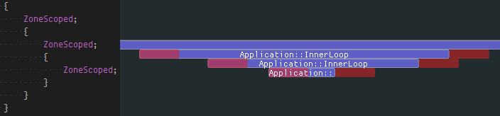

# Tracy Profiler

Tracy is a real time, nanosecond resolution frame profiler that can be used for remote or embedded telemetry of your application. It can profile CPU (C++, Lua), GPU (OpenGL, Vulkan) and memory. It also can display locks held by threads and their interactions with each other.

Tracy requires compiler support for C++11, Thread Local Storage and a way to workaround static initialization order fiasco. There are no other requirements. The following platforms are confirmed to be working (this is not a complete list):

- Windows (x86, x64)
- Linux (x86, x64, ARM, ARM64)
- Android (ARM, x86)
- FreeBSD (x64)
- Cygwin (x64)
- WSL (x64)
- OSX (x64)

The following compilers are supported:

- MSVC
- gcc
- clang

[Introduction to Tracy Profiler v0.2](https://www.youtube.com/watch?v=fB5B46lbapc)  
[New features in Tracy Profiler v0.3](https://www.youtube.com/watch?v=3SXpDpDh2Uo)

[A quick FAQ.](FAQ.md)  
[List of changes.](NEWS)

### High-level overview

Tracy is split into client and server side. The client side collects events using a high-efficiency queue and awaits for an incoming connection. The server part connects to client and receives collected data from the client, which is then reconstructed into a viewable timeline. The transfer is performed using a TCP connection.

### Performance impact

To check how much slowdown is introduced by using tracy, I have profiled [etcpak](https://bitbucket.org/wolfpld/etcpak), which is the fastest ETC texture compression utility there is. I used an 8192×8192 test image as input data and instrumented everything down to the 4×4 pixel block compression function (that's 4 million blocks to compress). It should be noted that tracy needs to calibrate its internal timers at each run. This introduces a delay of 115 ms (on my machine), which is negligible when doing lengthy profiling runs, but it skews the results of etcpak timing. The following times have this delay subtracted, to give focus on zone collection impact, which is the thing that really matters here.

|                        Scenario                       |  Zones  | Clean run | Profiling run | Difference |
|-------------------------------------------------------|---------|-----------|---------------|------------|
| Compression of an image to ETC1 format                | 4194568 |    0.94 s |       1.003 s |   +0.063 s |
| Compression of an image to ETC2 format, with mip-maps | 5592822 |   1.034 s |       1.119 s |   +0.085 s |

In both scenarios the per-zone time cost is at ~15 ns. This is in line with the measured 8 ns single event collection time (each zone has to report start and end event).

## Usage instructions

#### Initial client setup

Copy files from `tracy/client` and `tracy/common` to your project. Add `tracy/TracyClient.cpp` to source files list. That's all. Tracy is now integrated into your application.

In the default configuration tracy is disabled. To enable it, add a `TRACY_ENABLE` define.

If you want to profile a short-lived application, add a `TRACY_NO_EXIT` define. In this configuration tracy will not exit until an incoming connection is made, even if the application has already finished.

If you don't want to perform a complete application life-time capture, you may define a `TRACY_ON_DEMAND` macro, which will enable profiling only when there's an incoming connection from the server.

On Unix make sure you are linking your application with libpthread and libdl.

#### Running the server

The easiest way to get going is to build the standalone server, available in the `standalone` directory. You can connect to localhost or remote clients and view the collected data right away.

If you prefer to inspect the data only after a trace has been performed, you may use the command line utility in the `capture` directory. It will save a data dump that may be later opened in the graphical viewer application.

Alternatively, you may want to embed the server in your application, the same which is running the client part of tracy.

#### Marking zones

To begin data collection, tracy requires that you manually instrument your application (automatic tracing of every entered function is not feasible due to the amount of data that would generate). All the user-facing interface is contained in the `tracy/Tracy.hpp` header file.

To slice the program's execution recording into frame-sized chunks, put the `FrameMark` macro after you have completed rendering the frame. Ideally that would be right after the swap buffers command. Note that this step is optional, as some applications (for example: a compression utility) do not have the concept of a frame.

To record a zone's execution time add the `ZoneScoped` macro at the beginning of the scope you want to measure. This will automatically record function name, source file name and location. Optionally you may use the `ZoneScopedC( 0xRRGGBB )` macro to set a custom color for the zone. Note that the color value will be constant in the recording (don't try to parametrize it). You may also set a custom name for the zone, using the `ZoneScopedN( name )` macro, where name is a string literal. Color and name may be combined by using the `ZoneScopedNC( name, color )` macro.

Use the `ZoneText( const char* text, size_t size )` macro to add a custom text string that will be displayed along the zone information (for example, name of the file you are opening). Note that every time `ZoneText` is invoked, a memory allocation is performed to store an internal copy of the data. The provided string is not used by tracy after ZoneText returns.

If you want to set zone name on a per-call basis, you may do so using the `ZoneName( text, size )` macro.

#### Marking locks

Tracy can collect and display lock interactions in threads.

To mark a lock (mutex) for event reporting, use the `TracyLockable( type, varname )` macro. Note that the lock must implement a [Lockable concept](http://en.cppreference.com/w/cpp/concept/Lockable) (i.e. there's no support for timed mutices). For a concrete example, you would replace the line `std::mutex m_lock` with `TracyLockable( std::mutex, m_lock )`. You may use `TracyLockableN( type, varname, description )` to provide a custom lock name.

The standard `std::lock_guard` and `std::unique_lock` wrappers should use the `LockableBase( type )` macro for their template parameter (unless you're using C++17, with improved template argument deduction). For example, `std::lock_guard<LockableBase( std::mutex )> lock( m_lock )`.

To mark the location of lock being held, use the `LockMark( varname )` macro, after you have obtained the lock. Note that the varname must be a lock variable (a reference is also valid). This step is optional.

Similarly, you can use `TracySharedLockable`, `TracySharedLockableN` and `SharedLockableBase` to mark locks implementing the [SharedMutex concept](http://en.cppreference.com/w/cpp/concept/SharedMutex). Note that while there's no support for timed mutices in tracy, both `std::shared_mutex` and `std::shared_timed_mutex` may be used.

#### Plotting data

Tracy is able to capture and draw value changes over time. You may use it to analyse draw call count, number of performed queries, etc. To report data, use the `TracyPlot( name, value )` macro.

#### Message log

Fast navigation in large data set and correlation of zones with what was happening in application may be difficult. To ease these issues tracy provides a message log functionality. You can send messages (for example, your typical debug output) using the `TracyMessage( text, size )` macro (tracy will allocate memory for message storage). Alternatively, use `TracyMessageL( text )` for string literal messages. Messages are displayed on a chronological list and in the zone view.

#### Memory profiling

Tracy can monitor memory usage of your application. Knowledge about each performed memory allocation enables the following:

- Memory usage graph (like in massif, but fully interactable).
- List of active allocations at program exit (leak list).
- Visualization of memory map.
- Ability to rewind view of active allocations and memory map to any point of program execution.
- Information about memory statistics of each zone.

To mark memory events, use the `TracyAlloc( ptr, size )` and `TracyFree( ptr )` macros. Typically you would do that in overloads of `operator new` and `operator delete`.

#### Lua support

To profile Lua code using tracy, include the `tracy/TracyLua.hpp` header file in your Lua wrapper and execute `tracy::LuaRegister( lua_State* )` function to add instrumentation support. In your Lua code, add `tracy.ZoneBegin()` and `tracy.ZoneEnd()` calls to mark execution zones. Double check if you have included all return paths! Use `tracy.ZoneBeginN( name )` to set zone name. Use `tracy.ZoneText( text )` to set zone text. Use `tracy.Message( text )` to send messages. Use `tracy.ZoneName( text )` to set zone name on a per-call basis.

Even if tracy is disabled, you still have to pay the no-op function call cost. To prevent that you may want to use the `tracy::LuaRemove( char* script )` function, which will replace instrumentation calls with whitespace. This function does nothing if profiler is enabled.

#### GPU profiling

Tracy provides bindings for profiling OpenGL and Vulkan execution time on GPU.

##### OpenGL

You will need to include the `tracy/TracyOpenGL.hpp` header file and declare each of your rendering contexts using the `TracyGpuContext` macro (typically you will only have one context). Tracy expects no more than one context per thread and no context migration.

To mark a GPU zone use the `TracyGpuZone( name )` macro, where `name` is a string literal name of the zone. Alternatively you may use `TracyGpuZoneC( name, color )` to specify zone color.

You also need to periodically collect the GPU events using the `TracyGpuCollect` macro. A good place to do it is after swap buffers function call.

GPU profiling is not supported on OSX, iOS (because Apple is unable to implement standards properly). Android devices do work, if GPU drivers are not broken. Disjoint events are not currently handled, so some readings may be a bit spotty. NVIDIA drivers are unable to provide consistent timing results when two OpenGL contexts are used simultaneously.

##### Vulkan

Include the `tracy/TracyVulkan.hpp` header file and initialize the Vulkan instance using the `TracyVkContext( physdev, device, queue, cmdbuf )` macro. Cleanup is performed using the `TracyVkDestroy()` macro. Currently you can't track more than one instance.

The physical device, logical device, queue and command buffer must relate with each other. The queue must support graphics or compute operations. The command buffer must be in the initial state and be able to be reset. It will be rerecorded and submitted to the queue multiple times and it will be in the executable state on exit from the initialization function.

To mark a GPU zone use the `TracyVkZone( cmdbuf, name )` macro, where `name` is a string literal name of the zone. Alternatively you may use `TracyVkZoneC( cmdbuf, name, color )` to specify zone color. The provided command buffer must be in the recording state.

You also need to periodically collect the GPU events using the `TracyVkCollect( cmdbuf )` macro. The provided command buffer must be in the recording state and outside of a render pass instance.

#### Collecting call stacks

Tracy can capture true calls stacks on selected platforms (Windows, Linux, Android). It can be performed by using macros with the `S` postfix, which require an additional parameter, specifying the depth of call stack to be captured. The greater the depth, the longer it will take to do capture. Currently you can use the following macros: `ZoneScopedS`, `ZoneScopedNS`, `ZoneScopedCS`, `ZoneScopedNCS`, `TracyAllocS`, `TracyFreeS`, `TracyGpuZoneS`, `TracyGpuZoneCS`, `TracyVkZoneS`, `TracyVkZoneCS`.

## Good practices

- Remember to set thread names for proper identification of threads. You may use the functions exposed in the `tracy/common/TracySystem.hpp` header to do so.

## Practical considerations

Tracy's time measurement precision is not infinite. It's only as good as the system-provided timers are.

- On x86 the time resolution depends on the hardware implementation of the RDTSCP instruction and typically is a couple of nanoseconds. This may vary from one micro-architecture to another and requires a fairly modern (Sandy Bridge) processor for reliable results.
- On ARM-based systems tracy will try to use timer register (~40 ns resolution). If it fails, tracy falls back to system provided timer, which can range in resolution from 250 ns to 1 us.

While the data collection is very lightweight, it is not completely free. Each recorded zone event has a cost, which tracy tries to calculate and display on the timeline view, as a red zone. Note that this is an *approximation* of the real cost, which ignores many important factors. For example, you can't determine the impact of cache effects. The CPU frequency may be reduced in some situations, which will increase the recorded time, but the displayed profiler cost will not compensate for that.

Lua instrumentation needs to perform additional work (including memory allocation) to store source location. This approximately doubles the data collection cost.

You may use named colors predefined in `common/TracyColor.hpp` (included by `Tracy.hpp`). Visual reference: [wikipedia](https://en.wikipedia.org/wiki/X11_color_names).

Tracy server will perform statistical data collection on the fly, if the macro `TRACY_NO_STATISTICS` is not defined. This allows extended analysis of the trace (for example, you can perform a live search for matching zones) at a small CPU processing cost and a considerable memory usage increase (at least 10 bytes per zone).
