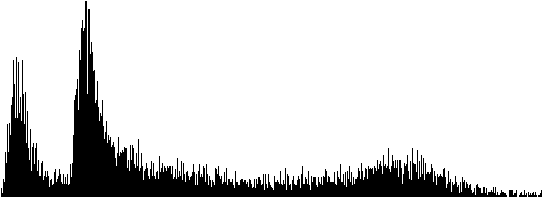
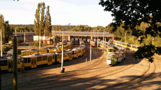

---
bibliography:
- tracy.bib
---

::: titlepage
Tracy Profiler

The user manual

{height="40mm"}

**Bartosz Taudul** [\<wolf@nereid.pl\>](mailto:wolf@nereid.pl)

2026-01-14 <https://github.com/wolfpld/tracy>
:::

# Quick overview {#quick-overview .unnumbered}

Hello and welcome to the Tracy Profiler user manual! Here you will find all the information you need to start using the profiler. This manual has the following layout:

- Chapter [1](#quicklook), *A quick look at Tracy Profiler*, gives a short description of what Tracy is and how it works.

- Chapter [2](#firststeps), *First steps*, shows how you can integrate the profiler into your application and how to build the graphical user interface (section [2.3](#buildingserver)). At this point, you will be able to establish a connection from the profiler to your application.

- Chapter [3](#client), *Client markup*, provides information on how to instrument your application, in order to retrieve useful profiling data. This includes a description of the C API (section [3.13](#capi)), which enables usage of Tracy in any programming language.

- Chapter [4](#capturing), *Capturing the data*, goes into more detail on how the profiling information can be captured and stored on disk.

- Chapter [5](#analyzingdata), *Analyzing captured data*, guides you through the graphical user interface of the profiler.

- Chapter [6](#csvexport), *Exporting zone statistics to CSV*, explains how to export some zone timing statistics into a CSV format.

- Chapter [7](#importingdata), *Importing external profiling data*, documents how to import data from other profilers.

- Chapter [8](#configurationfiles), *Configuration files*, gives information on the profiler settings.

# Quick-start guide {#quick-start-guide .unnumbered}

For Tracy to profile your application, you will need to integrate the profiler into your application and run an independent executable that will act both as a server with which your application will communicate and as a profiling viewer. The most basic integration looks like this:

- Add the Tracy repository to your project directory.

- Tracy source files in the `project/tracy/public` directory.

- Add `TracyClient.cpp` as a source file.

- Add `tracy/Tracy.hpp` as an include file.

- Include `Tracy.hpp` in every file you are interested in profiling.

- Define `TRACY_ENABLE` for the **WHOLE** project.

- Add the macro `FrameMark` at the end of each frame loop.

- Add the macro `ZoneScoped` as the first line of your function definitions to include them in the profile.

- Compile and run both your application and the profiler server.

- Hit *Connect* on the profiler server.

- Tada! You're profiling your program!

There's much more Tracy can do, which can be explored by carefully reading this manual. In case any problems should surface, refer to section [2.1](#initialsetup) to ensure you've correctly included Tracy in your project. Additionally, you should refer to section [3](#client) to make sure you are using `FrameMark`, `ZoneScoped`, and any other Tracy constructs correctly.

# A quick look at Tracy Profiler {#quicklook}

Tracy is a real-time, nanosecond resolution *hybrid frame and sampling profiler* that you can use for remote or embedded telemetry of games and other applications. It can profile CPU[^1], GPU[^2], memory allocations, locks, context switches, automatically attribute screenshots to captured frames, and much more.

[^1]: Direct support is provided for C, C++, Lua, Python and Fortran integration. At the same time, third-party bindings to many other languages exist on the internet, such as Rust, Zig, C#, OCaml, Odin, etc.

[^2]: All major graphic APIs: OpenGL, Vulkan, Direct3D 11/12, Metal, OpenCL.

While Tracy can perform statistical analysis of sampled call stack data, just like other *statistical profilers* (such as VTune, perf, or Very Sleepy), it mainly focuses on manual markup of the source code. Such markup allows frame-by-frame inspection of the program execution. For example, you will be able to see exactly which functions are called, how much time they require, and how they interact with each other in a multi-threaded environment. In contrast, the statistical analysis may show you the hot spots in your code, but it cannot accurately pinpoint the underlying cause for semi-random frame stutter that may occur every couple of seconds.

Even though Tracy targets *frame* profiling, with the emphasis on analysis of *frame time* in real-time applications (i.e. games), it does work with utilities that do not employ the concept of a frame. There's nothing that would prohibit the profiling of, for example, a compression tool or an event-driven UI application.

You may think of Tracy as the RAD Telemetry plus Intel VTune, on overdrive.

## Real-time

The concept of Tracy being a real-time profiler may be explained in a couple of different ways:

1.  The profiled application is not slowed down by profiling[^3]. The act of recording a profiling event has virtually zero cost -- it only takes a few nanoseconds. Even on low-power mobile devices, execution speed has no noticeable impact.

2.  The profiler itself works in real-time, without the need to process collected data in a complex way. Actually, it is pretty inefficient in how it works because it recalculates the data it presents each frame anew. And yet, it can run at 60 frames per second.

3.  The profiler has full functionality when the profiled application runs and the data is still collected. You may interact with your application and immediately switch to the profiler when a performance drop occurs.

[^3]: See section [1.7](#perfimpact) for a benchmark.

## Nanosecond resolution

It is hard to imagine how long a nanosecond is. One good analogy is to compare it with a measure of length. Let's say that one second is one meter (the average doorknob is at the height of one meter).

One millisecond ($\frac{1}{1000}$ of a second) would be then the length of a millimeter. The average size of a red ant or the width of a pencil is 5 or 6 mm. A modern game running at 60 frames per second has only 16 ms to update the game world and render the entire scene.

One microsecond ($\frac{1}{1000}$ of a millisecond) in our comparison equals one micron. The diameter of a typical bacterium ranges from 1 to 10 microns. The diameter of a red blood cell or width of a strand of spider web silk is about 7 μm.

And finally, one nanosecond ($\frac{1}{1000}$ of a microsecond) would be one nanometer. The modern microprocessor transistor gate, the width of the DNA helix, or the thickness of a cell membrane are in the range of 5 nm. In one ns the light can travel only 30 cm.

Tracy can achieve single-digit nanosecond measurement resolution due to usage of hardware timing mechanisms on the x86 and ARM architectures[^4]. Other profilers may rely on the timers provided by the operating system, which do have significantly reduced resolution (about 300 ns -- 1 μs). This is enough to hide the subtle impact of cache access optimization, etc.

[^4]: In both 32 and 64 bit variants. On x86, Tracy requires a modern version of the `rdtsc` instruction (Sandy Bridge and later). Note that Time Stamp Counter readings' resolution may depend on the used hardware and its design decisions related to how TSC synchronization is handled between different CPU sockets, etc. On ARM-based systems Tracy will try to use the timer register (\~40 ns resolution). If it fails (due to kernel configuration), Tracy falls back to system provided timer, which can range in resolution from 250 ns to 1 μs.

### Timer accuracy

You may wonder why it is vital to have a genuinely high resolution timer[^5]. After all, you only want to profile functions with long execution times and not some short-lived procedures that have no impact on the application's run time.

[^5]: Interestingly the `std::chrono::high_resolution_clock` is not really a high-resolution clock.

It is wrong to think so. Optimizing a function to execute in 430 ns, instead of 535 ns (note that there is only a 100 ns difference) results in 14 ms savings if the function is executed 18000 times[^6]. It may not seem like a big number, but this is how much time there is to render a complete frame in a 60 FPS game. Imagine that this is your particle processing loop.

[^6]: This is a real optimization case. The values are median function run times and do not reflect the real execution time, which explains the discrepancy in the total reported time.

You also need to understand how timer precision is reflected in measurement errors. Take a look at figure [1](#timer). There you can see three discrete timer tick events, which increase the value reported by the timer by 300 ns. You can also see four readings of time ranges, marked $A_1$, $A_2$; $B_1$, $B_2$; $C_1$, $C_2$ and $D_1$, $D_2$.

<figure id="timer">

<figcaption>Low precision (300 ns) timer. Discrete timer ticks are indicated by the (Clock icon) icon.</figcaption>
</figure>

Now let's take a look at the timer readings.

- The $A$ and $D$ ranges both take a very short amount of time (10 ns), but the $A$ range is reported as 300 ns, and the $D$ range is reported as 0 ns.

- The $B$ range takes a considerable amount of time (590 ns), but according to the timer readings, it took the same time (300 ns) as the short lived $A$ range.

- The $C$ range (610 ns) is only 20 ns longer than the $B$ range, but it is reported as 900 ns, a 600 ns difference!

Here, you can see why using a high-precision timer is essential. While there is no escape from the measurement errors, a profiler can reduce their impact by increasing the timer accuracy.

## Frame profiler

Tracy aims to give you an understanding of the inner workings of a tight loop of a game (or any other kind of interactive application). That's why it slices the execution time of a program using the *frame*[^7] as a basic work-unit[^8]. The most interesting frames are the ones that took longer than the allocated time, producing visible hitches in the on-screen animation. Tracy allows inspection of such misbehavior.

[^7]: A frame is used to describe a single image displayed on the screen by the game (or any other program), preferably 60 times per second to achieve smooth animation. You can also think about physics update frames, audio processing frames, etc.

[^8]: Frame usage is not required. See section [3.3](#markingframes) for more information.

## Sampling profiler

Tracy can periodically sample what the profiled application is doing, which provides detailed performance information at the source line/assembly instruction level. This can give you a deep understanding of how the processor executes the program. Using this information, you can get a coarse view at the call stacks, fine-tune your algorithms, or even 'steal' an optimization performed by one compiler and make it available for the others.

On some platforms, it is possible to sample the hardware performance counters, which will give you information not only *where* your program is running slowly, but also *why*.

## Remote or embedded telemetry

Tracy uses the client-server model to enable a wide range of use-cases (see figure [2](#clientserver)). For example, you may profile a game on a mobile phone over the wireless connection, with the profiler running on a desktop computer. Or you can run the client and server on the same machine, using a localhost connection. It is also possible to embed the visualization front-end in the profiled application, making the profiling self-contained[^9].

[^9]: See section [2.3.3](#embeddingserver) for guidelines.

<figure id="clientserver">

<figcaption>Client-server model.</figcaption>
</figure>

In Tracy terminology, the profiled application is a *client*, and the profiler itself is a *server*. It was named this way because the client is a thin layer that just collects events and sends them for processing and long-term storage on the server. The fact that the server needs to connect to the client to begin the profiling session may be a bit confusing at first.

## Why Tracy?

You may wonder why you should use Tracy when so many other profilers are available. Here are some arguments:

- Tracy is free and open-source (BSD license), while RAD Telemetry costs about \$8000 per year.

- Tracy provides out-of-the-box Lua bindings. It has been successfully integrated with other native and interpreted languages (Rust, Arma scripting language) using the C API (see chapter [3.13](#capi) for reference).

- Tracy has a wide variety of profiling options. For example, you can profile CPU, GPU, locks, memory allocations, context switches, and more.

- Tracy is feature-rich. For example, statistical information about zones, trace comparisons, or inclusion of inline function frames in call stacks (even in statistics of sampled stacks) are features unique to Tracy.

- Tracy focuses on performance. It uses many tricks to reduce memory requirements and network bandwidth. As a result, the impact on the client execution speed is minimal, while other profilers perform heavy data processing within the profiled application (and then claim to be lightweight).

- Tracy uses low-level kernel APIs, or even raw assembly, where other profilers rely on layers of abstraction.

- Tracy is multi-platform right from the very beginning. Both on the client and server-side. Other profilers tend to have Windows-specific graphical interfaces.

- Tracy can handle millions of frames, zones, memory events, and so on, while other profilers tend to target very short captures.

- Tracy doesn't require manual markup of interesting areas in your code to start profiling. Instead, you may rely on automated call stack sampling and add instrumentation later when you know where it's needed.

- Tracy provides a mapping of source code to the assembly, with detailed information about the cost of executing each instruction on the CPU.

## Performance impact {#perfimpact}

Let's profile an example application to check how much slowdown is introduced by using Tracy. For this purpose we have used etcpak[^10]. The input data was a $16384 \times 16384$ pixels test image, and the $4 \times 4$ pixel block compression function was selected to be instrumented. The image was compressed on 12 parallel threads, and the timing data represents a mean compression time of a single image.

[^10]: <https://github.com/wolfpld/etcpak>

The results are presented in table [1](#PerformanceImpact). Dividing the average of run time differences (37.7 ms) by the count of captured zones per single image (16777216) shows us that the impact of profiling is only 2.25 ns per zone (this includes two events: start and end of a zone).

::: {#PerformanceImpact}
   **Mode**   **Zones (total)**   **Zones (single image)**   **Clean run**   **Profiling run**   **Difference**
  ---------- ------------------- -------------------------- --------------- ------------------- ----------------
     ETC1         201326592               16777216             110.9 ms          148.2 ms           +37.3 ms
     ETC2         201326592               16777216             212.4 ms          250.5 ms           +38.1 ms

  : Zone capture time cost.
:::

### Assembly analysis

To see how Tracy achieves such small overhead (only 2.25 ns), let's take a look at the assembly. The following x64 code is responsible for logging the start of a zone. Do note that it is generated by compiling fully portable C++.

``` {.[x86masm]Assembler language="[x86masm]Assembler"}
mov         byte ptr [rsp+0C0h],1           ; store zone activity information
mov         r15d,28h
mov         rax,qword ptr gs:[58h]          ; TLS
mov         r14,qword ptr [rax]             ; queue address
mov         rdi,qword ptr [r15+r14]         ; data address
mov         rbp,qword ptr [rdi+28h]         ; buffer counter
mov         rbx,rbp
and         ebx,7Fh                         ; 128 item buffer
jne         function+54h  -----------+      ; check if current buffer is usable
mov         rdx,rbp                  |
mov         rcx,rdi                  |
call        enqueue_begin_alloc      |      ; reclaim/alloc next buffer
shl         rbx,5  <-----------------+      ; buffer items are 32 bytes
add         rbx,qword ptr [rdi+48h]         ; calculate queue item address
mov         byte ptr [rbx],10h              ; queue item type
rdtsc                                       ; retrieve time
shl         rdx,20h
or          rax,rdx                         ; construct 64 bit timestamp
mov         qword ptr [rbx+1],rax           ; write timestamp
lea         rax,[__tracy_source_location]   ; static struct address
mov         qword ptr [rbx+9],rax           ; write source location data
lea         rax,[rbp+1]                     ; increment buffer counter
mov         qword ptr [rdi+28h],rax         ; write buffer counter
```

The second code block, responsible for ending a zone, is similar but smaller, as it can reuse some variables retrieved in the above code.

## Examples

To see how to integrate Tracy into your application, you may look at example programs in the `examples` directory. Looking at the commit history might be the best way to do that.

## On the web

Tracy can be found at the following web addresses:

- Homepage -- <https://github.com/wolfpld/tracy>

- Bug tracker -- <https://github.com/wolfpld/tracy/issues>

- Discord chat -- <https://discord.gg/pk78auc>

- Sponsoring development -- <https://github.com/sponsors/wolfpld/>

- Interactive demo -- <https://tracy.nereid.pl/>

### Binary distribution

The version releases of the profiler are provided as precompiled Windows binaries for download at <https://github.com/wolfpld/tracy/releases>, along with the user manual. You will need to install the latest Visual C++ redistributable package to use them.

Development builds of Windows binaries, and the user manual are available as artifacts created by the automated Continuous Integration system on GitHub.

Note that these binary releases require AVX2 instruction set support on the processor. If you have an older CPU, you will need to set a proper instruction set architecture in the project properties and build the executables yourself.

# First steps {#firststeps}

Tracy Profiler supports MSVC, GCC, and clang. You will need to use a reasonably recent version of the compiler due to the C++11 requirement. The following platforms are confirmed to be working (this is not a complete list):

- Windows (x86, x64)

- Linux (x86, x64, ARM, ARM64)

- Android (ARM, ARM64, x86)

- FreeBSD (x64)

- WSL (x64)

- OSX (x64)

- iOS (ARM, ARM64)

- QNX (x64)

Moreover, the following platforms are not supported due to how secretive their owners are but were reported to be working after extending the system integration layer:

- PlayStation 4

- Xbox One

- Nintendo Switch

- Google Stadia

You may also try your luck with Mingw, but don't get your hopes too high. This platform was usable some time ago, but nobody is actively working on resolving any issues you might encounter with it.

## Initial client setup {#initialsetup}

The recommended way to integrate Tracy into an application is to create a git submodule in the repository (assuming that you use git for version control). This way, it is straightforward to update Tracy to newly released versions. If that's not an option, all the files required to integrate your application with Tracy are contained in the `public` directory.

::: bclogo
What revision should I use? You have two options when deciding on the Tracy Profiler version you want to use. Take into consideration the following pros and cons:

- Using the last-version-tagged revision will give you a stable platform to work with. You won't experience any breakages, major UI overhauls, or network protocol changes. Unfortunately, you also won't be getting any bug fixes.

- Working with the bleeding edge `master` development branch will give you access to all the new improvements and features added to the profiler. While it is generally expected that `master` should always be usable, **there are no guarantees that it will be so.**

Do note that all bug fixes and pull requests are made against the `master` branch.
:::

With the source code included in your project, add the `public/TracyClient.cpp` source file to the IDE project or makefile. You're done. Tracy is now integrated into the application.

In the default configuration, Tracy is disabled. This way, you don't have to worry that the production builds will collect profiling data. To enable profiling, you will probably want to create a separate build configuration, with the `TRACY_ENABLE` define.

::: bclogo
Important

- Double-check that the define name is entered correctly (as `TRACY_ENABLE`), don't make a mistake of adding an additional `D` at the end. Make sure that this macro is defined for all files across your project (e.g. it should be specified in the `CFLAGS` variable, which is always passed to the compiler, or in an equivalent way), and *not* as a `#define` in just some of the source files.

- Tracy does not consider the value of the definition, only the fact if the macro is defined or not (unless specified otherwise). Be careful not to make the mistake of assigning numeric values to Tracy defines, which could lead you to be puzzled why constructs such as `TRACY_ENABLE=0` don't work as you expect them to do.
:::

You should compile the application you want to profile with all the usual optimization options enabled (i.e. make a release build). Profiling debugging builds makes little sense, as the unoptimized code and additional checks (asserts, etc.) completely change how the program behaves. In addition, you should enable usage of the native architecture of your CPU (e.g. `-march=native`) to leverage the expanded instruction sets, which may not be available in the default baseline target configuration.

Finally, on Unix, make sure that the application is linked with libraries `libpthread` and `libdl`. BSD systems will also need to be linked with `libexecinfo`.

### Static library

If you are compiling Tracy as a static library to link with your application, you may encounter some unexpected problems.

When you link a library into your executable, the linker checks if the library provides symbols needed by the program. The library is only used if this is the case. This can be an issue because one of the use cases of Tracy is to simply add it to the application, without any manual instrumentation, and let it profile the execution by sampling. If you use any kind of Tracy macros in your program, this won't be a problem.

However, if you find yourself in a situation where this is a consideration, you can simply add the `TracyNoop` macro somewhere in your code, for example in the `main` function. The macro doesn't do anything useful, but it inserts a reference that is satisfied by the static library, which results in the Tracy code being linked in and the profiler being able to work as intended.

### CMake integration

You can integrate Tracy with CMake by adding the git submodule folder as a subdirectory.

    # set options before add_subdirectory
    # available options: TRACY_ENABLE, TRACY_LTO, TRACY_ON_DEMAND, TRACY_NO_BROADCAST, TRACY_NO_CODE_TRANSFER, ...
    option(TRACY_ENABLE "" ON)
    option(TRACY_ON_DEMAND "" ON)
    add_subdirectory(3rdparty/tracy)  # target: TracyClient or alias Tracy::TracyClient

Link `Tracy::TracyClient` to any target where you use Tracy for profiling:

    target_link_libraries(<TARGET> PUBLIC Tracy::TracyClient)

::: bclogo
CMake FetchContent When using CMake 3.11 or newer, you can use Tracy via CMake FetchContent. In this case, you do not need to add a git submodule for Tracy manually. Add this to your CMakeLists.txt:

    FetchContent_Declare(
        tracy
        GIT_REPOSITORY https://github.com/wolfpld/tracy.git
        GIT_TAG        master
        GIT_SHALLOW    TRUE
        GIT_PROGRESS   TRUE
    )

    FetchContent_MakeAvailable(tracy)

Then add this to any target where you use tracy for profiling:

    target_link_libraries(<TARGET> PUBLIC TracyClient)
:::

While using `set(CMAKE_INTERPROCEDURAL_OPTIMIZATION ON)` is a convenient way to enable Link-Time Optimization (LTO) for an entire project, there are situations in which this may not work due to excessive compilation times, linking issues, compiler bugs, or other reasons. For such cases, Tracy provides an option to enable Link-Time Optimization for itself using the `TRACY_LTO` variable during the CMake configuration stage.

### Meson integration

If you are using the Meson build system, you can add Tracy using the Wrap dependency system. To do this, place the `tracy.wrap` file in the `subprojects` directory of your project, with the following content. The `head` `revision` field tracks Tracy's `master` branch. If you want to lock to a specific version of Tracy instead, you can just set the `revision` field to an appropriate git tag.

    [wrap-git]
    url = https://github.com/wolfpld/tracy.git
    revision = head
    depth = 1

Then, add the following option entry to the `meson.options` file. Use the name `tracy_enable` as shown, because the Tracy subproject options inherit it.

    option('tracy_enable', type: 'boolean', value: false, description: 'Enable profiling')

Next, add the Tracy dependency to the `meson.build` project definition file. Don't forget to include this dependency in the appropriate executable or library definitions. This dependency will set all the appropriate definitions (such as `TRACY_ENABLE`) in your program, so you don't have to do it manually.

    tracy = dependency('tracy', static: true)

Finally, let's check if the `debugoptimized` build type is enabled, and print a little reminder message if it is not. For profiling we want the debug annotations to be present, but we also want to have the code to be optimized.

    if get_option('tracy_enable') and get_option('buildtype') != 'debugoptimized'
        warning('Profiling builds should set --buildtype=debugoptimized')
    endif

Here's a sample command to set up a build directory with profiling enabled. The last option, `tracy:on_demand`, is used to demonstrate how to set options in the Tracy subproject.

    meson setup build --buildtype=debugoptimized -Dtracy_enable=true -Dtracy:on_demand=true

### Short-lived applications

In case you want to profile a short-lived program (for example, a compression utility that finishes its work in one second), set the `TRACY_NO_EXIT` environment variable to $1$. With this option enabled, Tracy will not exit until an incoming connection is made, even if the application has already finished executing. If your platform doesn't support an easy setup of environment variables, you may also add the `TRACY_NO_EXIT` define to your build configuration, which has the same effect.

### On-demand profiling {#ondemand}

By default, Tracy will begin profiling even before the program enters the `main` function. However, suppose you don't want to perform a full capture of the application lifetime. In that case, you may define the `TRACY_ON_DEMAND` macro, which will enable profiling only when there's an established connection with the server.

You should note that if on-demand profiling is *disabled* (which is the default), then the recorded events will be stored in the system memory until a server connection is made and the data can be uploaded[^11]. Depending on the amount of the things profiled, the requirements for event storage can quickly grow up to a couple of gigabytes. Furthermore, since this data is no longer available after the initial connection, you won't be able to perform a second connection to a client unless the on-demand mode is used.

[^11]: This memory is never released, but the profiler reuses it for collection of other events.

::: bclogo
Caveats The client with on-demand profiling enabled needs to perform additional bookkeeping to present a coherent application state to the profiler. This incurs additional time costs for each profiling event.
:::

### Client discovery

By default, the Tracy client will announce its presence to the local network[^12]. If you want to disable this feature, define the `TRACY_NO_BROADCAST` macro.

[^12]: Additional configuration may be required to achieve full functionality, depending on your network layout. Read about UDP broadcasts for more information.

The program name that is sent out in the broadcast messages can be customized by using the `TracySetProgramName(name)` macro.

### Client network interface

By default, the Tracy client will listen on all network interfaces. If you want to restrict it to only listening on the localhost interface, define the `TRACY_ONLY_LOCALHOST` macro at compile-time, or set the `TRACY_ONLY_LOCALHOST` environment variable to $1$ at runtime.

If you need to use a specific Tracy client address, such as QNX requires, define the `TRACY_CLIENT_ADDRESS` macro at compile-time as the desired string address.

By default, the Tracy client will listen on IPv6 interfaces, falling back to IPv4 only if IPv6 is unavailable. If you want to restrict it to only listening on IPv4 interfaces, define the `TRACY_ONLY_IPV4` macro at compile-time, or set the `TRACY_ONLY_IPV4` environment variable to $1$ at runtime.

### Setup for multi-DLL projects

Things are a bit different in projects that consist of multiple DLLs/shared objects. Compiling `TracyClient.cpp` into every DLL is not an option because this would result in several instances of Tracy objects lying around in the process. We instead need to pass their instances to the different DLLs to be reused there.

For that, you need a *profiler DLL* to which your executable and the other DLLs link. If that doesn't exist, you have to create one explicitly for Tracy[^13]. This library should contain the `public/TracyClient.cpp` source file. Link the executable and all DLLs you want to profile to this DLL.

[^13]: You can use the top-level Meson or CMake build scripts to get it. Make sure that the same build flags are set for both the library and your application, or you may find yourself chasing weird issues.

If you are targeting Windows with Microsoft Visual Studio or MinGW, add the `TRACY_IMPORTS` define to your application.

If you are experiencing crashes or freezes when manually loading/unloading a separate DLL with Tracy integration, you might want to try defining both `TRACY_DELAYED_INIT` and `TRACY_MANUAL_LIFETIME` macros.

`TRACY_DELAYED_INIT` enables a path where profiler data is gathered into one structure and initialized on the first request rather than statically at the DLL load at the expense of atomic load on each request to the profiler data. `TRACY_MANUAL_LIFETIME` flag augments this behavior to provide manual `StartupProfiler` and `ShutdownProfiler` functions that allow you to create and destroy the profiler data manually. This manual management removes the need to do an atomic load on each call and lets you define an appropriate place to free the resources.

::: bclogo
Keep everything consistent When working with multiple libraries, it is easy to make a mistake and use different sets of feature macros between any two compilation jobs. If you do so, Tracy will not be able to work correctly, and there will be no error or warning messages about the problem. Henceforth, you must make sure each shared object you want to link with, or load uses the same set of macro definitions.

Please note that using a prebuilt shared Tracy library, as provided by some package manager or system distribution, also qualifies as using multiple libraries.
:::

### Problematic platforms

In the case of some programming environments, you may need to take extra steps to ensure Tracy can work correctly.

#### Microsoft Visual Studio

If you are using MSVC, you will need to disable the *Edit And Continue* feature, as it makes the compiler non-conformant to some aspects of the C++ standard. In order to do so, open the project properties and go to C/C++,General,Debug Information Format and make sure *Program Database for Edit And Continue (/ZI)* is *not* selected.

For context, if you experience errors like \"error C2131: expression did not evaluate to a constant\", \"failure was caused by non-constant arguments or reference to a non-constant symbol\", and \"see usage of '`__LINE__Var`'\", chances are that your project has the *Edit And Continue* feature enabled.

#### Universal Windows Platform

Due to a restricted access to Win32 APIs and other sandboxing issues (like network isolation), several limitations apply to using Tracy in a UWP application compared to Windows Desktop:

- Call stack sampling is not available.

- System profiling is not available.

- To be able to connect from another machine on the local network, the app needs the *privateNetworkClientServer* capability. To connect from localhost, an active inbound loopback exemption is also necessary[^14].

[^14]: <https://docs.microsoft.com/en-us/windows/uwp/communication/interprocess-communication#loopback>

#### Apple woes

Because Apple *has* to be *think different*, there are some problems with using Tracy on OSX and iOS. First, the performance hit due to profiling is higher than on other platforms. Second, some critical features are missing and won't be possible to achieve:

- There's no support for the `TRACY_NO_EXIT` mode.

- Profiling is interrupted when the application exits. This will result in missing zones, memory allocations, or even source location names.

- OpenGL can't be profiled.

#### Android lunacy {#androidlunacy}

Starting with Android 8.0, you are no longer allowed to use the `/proc` file system. One of the consequences of this change is the inability to check system CPU usage.

This is apparently a security enhancement. Unfortunately, in its infinite wisdom, Google has decided not to give you an option to bypass this restriction.

To workaround this limitation, you will need to have a rooted device. Execute the following commands using `root` shell:

``` {.sh language="sh"}
setenforce 0
mount -o remount,hidepid=0 /proc
echo -1 > /proc/sys/kernel/perf_event_paranoid
echo 0 > /proc/sys/kernel/kptr_restrict
```

The first command will allow access to system CPU statistics. The second one will enable inspection of foreign processes (required for context switch capture). The third one will lower restrictions on access to performance counters. The last one will allow retrieval of kernel symbol pointers. *Be sure that you are fully aware of the consequences of making these changes.*

#### Virtual machines

The best way to run Tracy is on bare metal. Avoid profiling applications in virtualized environments, including services provided in the cloud. Virtualization interferes with the critical facilities needed for the profiler to work, influencing the results you get. Possible problems may vary, depending on the configuration of the VM, and include:

- Reduced precision of time stamps.

- Inability to obtain precise timestamps, resulting in error messages such as *CPU doesn't support RDTSC instruction*, or *CPU doesn't support invariant TSC*. On Windows, you can work this around by rebuilding the profiled application with the `TRACY_TIMER_QPC` define, which severely lowers the resolution of time readings.

- Frequency of call stack sampling may be reduced.

- Call stack sampling might lack time stamps. While you can use such a reduced data set to perform statistical analysis, you won't be able to limit the time range or see the sampling zones on the timeline.

#### Docker on Linux

Although the basic features will work without them, you'll have to grant elevated access rights to the container running your client. Here is a sample configuration that *may* enable the CPU sampling features[^15].

[^15]: Tested on Ubuntu 22.04.3, docker 24.0.4

- `--privileged`

- `--mount "type=bind,source=/sys/kernel/debug,target=/sys/kernel/debug,readonly"`

- `--user 0:0`

- `--pid=host`

### Troubleshooting

By default, Tracy's diagnostics will be sent as Message logs (section [3.7](#messagelog)) to the server. Setting the `TRACY_NO_INTERNAL_MESSAGE` define will disable this feature, but setting the `TRACY_VERBOSE` will make the client print advanced information about the detected features to the standard error output. By matching those debug prints to the source code, you might be able to uncover why some of the features are missing on your platform.

### Changing network port

By default, the client and server communicate on the network using port 8086. The profiling session utilizes the TCP protocol, and the client sends presence announcement broadcasts over UDP.

Suppose for some reason you want to use another port[^16]. In that case, you can change it using the `TRACY_DATA_PORT` macro for the data connection and `TRACY_BROADCAST_PORT` macro for client broadcasts. Alternatively, you may change both ports at the same time by declaring the `TRACY_PORT` macro (specific macros listed before have higher priority). You may also change the data connection port without recompiling the client application by setting the `TRACY_PORT` environment variable.

[^16]: For example, other programs may already be using it, or you may have overzealous firewall rules, or you may want to run two clients on the same IP address.

If a custom port is not specified and the default listening port is already occupied, the profiler will automatically try to listen on a number of other ports.

::: bclogo
Important To enable network communication, Tracy needs to open a listening port. Make sure it is not blocked by an overzealous firewall or anti-virus program.
:::

### Limitations

When using Tracy Profiler, keep in mind the following requirements:

- The application may use each lock in no more than 64 unique threads.

- There can be no more than 65534 unique source locations[^17]. This number is further split in half between native code source locations and dynamic source locations (for example, when Lua instrumentation is used).

- If there are recursive zones at any point in a zone stack, each unique zone source location should not appear more than 255 times.

- Profiling session cannot be longer than 1.6 days ($2^{47}$ ns). This also includes on-demand sessions.

- No more than 4 billion ($2^{32}$) memory free events may be recorded.

- No more than 16 million ($2^{24}$) unique call stacks can be captured.

[^17]: A source location is a place in the code, which is identified by source file name and line number, for example, when you markup a zone.

The following conditions also need to apply but don't trouble yourself with them too much. You would probably already know if you'd be breaking any.

- Only little-endian CPUs are supported.

- Virtual address space must be limited to 48 bits.

- Tracy server requires CPU which can handle misaligned memory accesses.

## Check your environment

It is not an easy task to reliably measure the performance of an application on modern machines. There are many factors affecting program execution characteristics, some of which you will be able to minimize and others you will have to live with. It is critically important that you understand how these variables impact profiling results, as it is key to understanding the data you get.

### Operating system {#checkenvironmentos}

In a multitasking operating system, applications compete for system resources with each other. This has a visible effect on the measurements performed by the profiler, which you may or may not accept.

To get the most accurate profiling results, you should minimize interference caused by other programs running on the same machine. Before starting a profile session, close all web browsers, music players, instant messengers, and all other non-essential applications like Steam, Uplay, etc. Make sure you don't have the debugger hooked into the profiled program, as it also impacts the timing results.

Interference caused by other programs can be seen in the profiler if context switch capture (section [3.16.3](#contextswitches)) is enabled.

::: bclogo
Debugger in Visual Studio In MSVC, you would typically run your program using the *Start Debugging* menu option, which is conveniently available as a F5 shortcut. You should instead use the *Start Without Debugging* option, available as Ctrl + F5 shortcut.
:::

### CPU design {#checkenvironmentcpu}

Where to even begin here? Modern processors are such complex beasts that it's almost impossible to say anything about how they will behave surely. Cache configuration, prefetcher logic, memory timings, branch predictor, execution unit counts are all the drivers of instructions-per-cycle uplift nowadays after the megahertz race had hit the wall. Not only is it challenging to reason about, but you also need to take into account how the CPU topology affects things, which is described in more detail in section [3.16.4](#cputopology).

Nevertheless, let's look at how we can try to stabilize the profiling data.

#### Superscalar out-of-order speculative execution

Also known as: the *spectre* thing we have to deal with now.

You must be aware that most processors available on the market[^18] *do not* execute machine code linearly, as laid out in the source code. This can lead to counterintuitive timing results reported by Tracy. Trying to get more 'reliable' readings[^19] would require a change in the behavior of the code, and this is not a thing a profiler should do. So instead, Tracy shows you what the hardware is *really* doing.

[^18]: Except low-cost ARM CPUs.

[^19]: And by saying 'reliable,' you do in reality mean: behaving in a way you expect it.

This is a complex subject, and the details vary from one CPU to another. You can read a brief rundown of the topic at the following address: <https://travisdowns.github.io/blog/2019/06/11/speed-limits.html>.

#### Simultaneous multithreading

Also known as: Hyper-threading. Typically present on Intel and AMD processors.

To get the most reliable results, you should have all the CPU core resources dedicated to a single thread of your program. Otherwise, you're no longer measuring the behavior of your code but rather how it keeps up when its computing resources are randomly taken away by some other thing running on another pipeline within the same physical core.

Note that you might *want* to observe this behavior if you plan to deploy your application on a machine with simultaneous multithreading enabled. This would require careful examination of what else is running on the machine, or even how the operating system schedules the threads of your own program, as various combinations of competing workloads (e.g., integer/floating-point operations) will be impacted differently.

#### Turbo mode frequency scaling

Also known as: Turbo Boost (Intel), Precision Boost (AMD).

While the CPU is more-or-less designed always to be able to work at the advertised *base* frequency, there is usually some headroom left, which allows usage of the built-in automatic overclocking. There are no guarantees that the CPU can attain the turbo frequencies or how long it will uphold them, as there are many things to take into consideration:

- How many cores are in use? Just one, or all 8? All 16?

- What type of work is being performed? Integer? Floating-point? 128-wide SIMD? 256-wide SIMD? 512-wide SIMD?

- Were you lucky in the silicon lottery? Some dies are just better made and can achieve higher frequencies.

- Are you running on the best-rated core or at the worst-rated core? Some cores may be unable to match the performance of other cores in the same processor.

- What kind of cooling solution are you using? The cheap one bundled with the CPU or a hefty chunk of metal that has no problem with heat dissipation?

- Do you have complete control over the power profile? Spoiler alert: no. The operating system may run anything at any time on any of the other cores, which will impact the turbo frequency you're able to achieve.

As you can see, this feature basically screams 'unreliable results!' Best keep it disabled and run at the base frequency. Otherwise, your timings won't make much sense. A true example: branchless compression function executing multiple times with the same input data was measured executing at *four* different speeds.

Keep in mind that even at the base frequency, you may hit the thermal limits of the silicon and be down throttled.

#### Power saving

This is, in essence, the same as turbo mode, but in reverse. While unused, processor cores are kept at lower frequencies (or even wholly disabled) to reduce power usage. When your code starts running[^20], the core frequency needs to ramp up, which may be visible in the measurements.

[^20]: Not necessarily when the application is started, but also when, for example, a blocking mutex becomes released by other thread and is acquired.

Even worse, if your code doesn't do a lot of work (for example, because it is waiting for the GPU to finish rendering the frame), the CPU might not ramp up the core frequency to 100%, which will skew the results.

Again, to get the best results, keep this feature disabled.

#### AVX offset and power licenses

Intel CPUs are unable to run at their advertised frequencies when they perform wide SIMD operations due to increased power requirements[^21]. Therefore, depending on the width *and* type of operations executed, the core operating frequency will be reduced, in some cases quite drastically[^22]. To make things even better, *some* parts of the workload will execute within the available power license, at a twice reduced processing rate. After that, the CPU may be stopped for some time so that the wide parts of executions units can be powered up. Then the work will continue at full processing rate but at a reduced frequency.

[^21]: AMD processors are not affected by this issue.

[^22]: <https://en.wikichip.org/wiki/intel/xeon_gold/5120#Frequencies>

Be very careful when using AVX2 or AVX512.

More information can be found at <https://travisdowns.github.io/blog/2020/01/17/avxfreq1.html>, <https://en.wikichip.org/wiki/intel/frequency_behavior>.

#### Summing it up {#ryzen}

Power management schemes employed in various CPUs make it hard to reason about the true performance of the code. For example, figure [3](#ryzenimage) contains a histogram of function execution times (as described in chapter [5.7](#findzone)), as measured on an AMD Ryzen CPU. The results ranged from 13.05 μs to 61.25 μs (extreme outliers were not included on the graph, limiting the longest displayed time to 36.04 μs).

{#ryzenimage width="50%"}

We can immediately see that there are two distinct peaks, at 13.4 μs and 15.3 μs. A reasonable assumption would be that there are two paths in the code, one that can omit some work, and the second one which must do some additional job. But here's a catch -- the measured code is actually branchless and always executes the same way. The two peaks represent two turbo frequencies between which the CPU was aggressively switching.

We can also see that the graph gradually falls off to the right (representing longer times), with a slight bump near the end. Again, this can be attributed to running in power-saving mode, with different reaction times to the required operating frequency boost to full power.

## Building the server {#buildingserver}

Tracy uses the CMake build system. Unlike in most other programs, the root-level `CMakeLists.txt` file is only used to provide client integration. The build definition files used to create profiler executables are stored in directories specific to each utility.

The easiest way to get going is to build the data analyzer, available in the `profiler` directory. Then, you can connect to localhost or remote clients and view the collected data right away with it.

If you prefer to inspect the data only after a trace has been performed, you may use the command-line utility in the `capture` directory. It will save a data dump that you may later open in the graphical viewer application.

Ideally, it would be best to use the same version of the Tracy profiler on both client and server. The network protocol may change in-between releases, in which case you won't be able to make a connection.

See section [4](#capturing) for more information about performing captures.

::: bclogo
How to use CMake The `CMakeLists.txt` file only contains the general definition of how the program should be built. To be able to actually compile the program, you must first create a build directory that takes into account the specific compiler you have on your system, the set of available libraries, the build options you specify, and so on. You can do this by issuing the following command, in this case for the `profiler` utility:

``` {.sh language="sh"}
cmake -B profiler/build -S profiler -DCMAKE_BUILD_TYPE=Release
```

Now that you have a build directory, you can actually compile the program. For example, you could run the following command:

``` {.sh language="sh"}
cmake --build profiler/build --config Release --parallel
```

The build directory can be reused if you want to compile the program in the future, for example if there have been some updates to the source code, and usually does not need to be regenerated. Note that all build artifacts are contained in the build directory.
:::

::: bclogo
Caveats Tracy requires network connectivity and `git` to be available during the build configuration step in order to download the necessary libraries. By default, this is done for each build directory you configure with CMake. To make this requirement more reasonable, it is recommended to set a cache directory, for example:

``` {.sh language="sh"}
export CPM_SOURCE_CACHE=~/.cache/cpm
```

With this environment variable set, the library download will be performed only once, and the cached checkouts will be used in all future CMake build directory setups, allowing offline builds. Access to the network will then only be needed if the cache directory is cleared, or if the requirements for the libraries change, for example after an upgrade to a different version of Tracy.
:::

::: bclogo
Important Due to the memory requirements for data storage, the Tracy server is only supposed to run on 64-bit platforms. While nothing prevents the program from building and executing in a 32-bit environment, doing so is not supported.
:::

### Required libraries

In most cases it is possible to build Tracy without manually installing additional libraries. All requirements are automatically downloaded by CMake.

#### Unix

On Unix systems, such as Linux or macOS, it is possible to link with certain common system libraries to reduce build times and resource usage through shared objects. This is optional and will be done automatically if all requirements are met. If it's not possible, there is no loss of functionality as Tracy will build and statically link these libraries anyway.

You will need to install the `pkg-config` utility to provide information about libraries. Then you will need to install `freetype` and `glfw` libraries.

Installation of the libraries on OSX can be facilitated using the `brew` package manager.

::: bclogo
Linux distributions Some Linux distributions require you to add a `lib` prefix and a `-dev` or `-devel` postfix to library names. You may also need to add a seemingly random number to the library name (for example: `freetype2`, or `freetype6`).

Some Linux distributions ship outdated versions of libraries that are too old for Tracy to build, and do not provide new versions by design. Please reconsider your choice of distribution in this case, as the only function of a Linux distribution is to provide packages, and the one you have chosen is clearly failing at this task.
:::

#### Linux

There are some Linux-specific libraries that you need to have installed on your system. These won't be downloaded automatically.

For XDG Portal support in the file selector, you need to install the `dbus` library (and a portal appropriate for your desktop environment). If you're one of those weird people who doesn't like modern things, you can install `gtk3` instead and force the GTK file selector with a build option.

Linux builds of Tracy use the Wayland protocol by default, which allows proper support for Hi-DPI scaling, high-precision input devices such as touchpads, proper handling of mouse cursors, and so on. As such, the `glfw` library is no longer needed, but you will need to install `libxkbcommon`, `wayland`, `wayland-protocols`, `libglvnd` (or `libegl` on some distributions).

If you want to use X11 instead, you can enable the `LEGACY` option in CMake build settings. Going this way is discouraged.

::: bclogo
Window decorations Please don't ask about window decorations in Gnome. The current behavior is the intended behavior. Gnome does not want windows to have decorations, and Tracy respects that choice. If you find this problematic, use a desktop environment that actually listens to its users.
:::

### Using an IDE

The recommended development environment is Visual Studio Code[^23]. This is a cross-platform solution, so you always get the same experience, no matter what OS you are using.

[^23]: <https://code.visualstudio.com/>

VS Code is highly modular, and unlike some other IDEs, it does not come with a compiler. You will need to have one, such as gcc or clang, already installed on your system. On Windows, you should have MSVC 2022 installed in order to have access to its build tools.

When you open the Tracy directory in VS Code, it will prompt you to install some recommended extensions: clangd, CodeLLDB, and CMake Tools. You should do this if you don't already have them.

The CMake build configuration will begin immediately. It is likely that you will be prompted to select a development kit to use; for example, you may have a preference as to whether you want to use gcc or clang, and CMake will need to be told about it.

After the build configuration phase is over, you may want to make some further adjustments to what is being built. The primary place to do this is in the *Project Status* section of the CMake side panel. The two key settings there are also available in the status bar at the bottom of the window:

- The *Folder* setting allows you to choose which Tracy utility you want to work with. Select \"profiler\" for the profiler's GUI.

- The *Build variant* setting is used to toggle between the debug and release build configurations.

With all this taken care of, you can now start the program with the F5 key, set breakpoints, get code completion and navigation[^24], and so on.

[^24]: To get the Intellisense experience if you are using the MSVC compiler, you need to do some additional setup. First, you need to install Ninja (<https://ninja-build.org/>). The Meson installer (<https://github.com/mesonbuild/meson/releases>) is probably the most convenient way to do this. Then you need to set the `cmake.generator` option in the VS Code settings to `Ninja`. Once this is done, all you have to do is wipe the existing build directories and run the CMake configuration again.

### Embedding the server in profiled application {#embeddingserver}

While not officially supported, it is possible to embed the server in your application, the same one running the client part of Tracy. How to make this work is left up for you to figure out.

Note that most libraries bundled with Tracy are modified in some way and contained in the `tracy` namespace. The one exception is Dear ImGui, which can be freely replaced.

Be aware that while the Tracy client uses its own separate memory allocator, the server part of Tracy will use global memory allocation facilities shared with the rest of your application. This will affect both the memory usage statistics and Tracy memory profiling.

The following defines may be of interest:

- `TRACY_NO_FILESELECTOR` -- controls whether a system load/save dialog is compiled in. If it's enabled, the saved traces will be named `trace.tracy`.

- `TRACY_NO_STATISTICS` -- Tracy will perform statistical data collection on the fly, if this macro is *not* defined. This allows extended trace analysis (for example, you can perform a live search for matching zones) at a small CPU processing cost and a considerable memory usage increase (at least 8 bytes per zone).

- `TRACY_NO_ROOT_WINDOW` -- the main profiler view won't occupy the whole window if this macro is defined. Additional setup is required for this to work. If you want to embed the server into your application, you probably should enable this option.

### DPI scaling

The graphic server application will adapt to the system DPI scaling. If for some reason, this doesn't work in your case, you may try setting the `TRACY_DPI_SCALE` environment variable to a scale fraction, where a value of 1 indicates no scaling.

## Naming threads {#namingthreads}

Remember to set thread names for proper identification of threads. You should do so by using the function `tracy::SetThreadName(name)` exposed in the `public/common/TracySystem.hpp` header, as the system facilities typically have limited functionality.

It is also possible to specify a thread group hint with `tracy::SetThreadNameWithHint(name, int32_t groupHint)`. This hint is an arbitrary number that is used to group threads together in the profiler UI. The default value and the value for the main thread is zero.

Tracy will try to capture thread names through operating system data if context switch capture is active. However, this is only a fallback mechanism, and it shouldn't be relied upon.

### Source location data customization

Some source location data such as function name, file path or line number can be overriden with defines `TracyFunction`, `TracyFile`, `TracyLine`[^25] made before including `public/tracy/Tracy.hpp` header file[^26].

[^25]: By default the macros unwrap to `__FUNCTION__`, `__FILE__` and `__LINE__` respectively.

[^26]: You should add either `public` or `public/tracy` directory from the Tracy root to the include directories list in your project. Then you will be able to `#include "tracy/Tracy.hpp"` or `#include "Tracy.hpp"`, respectively.

    #if defined(__clang__) || defined(__GNUC__)
    #  define TracyFunction __PRETTY_FUNCTION__
    #elif defined(_MSC_VER)
    #  define TracyFunction __FUNCSIG__
    #endif

    #include <tracy/Tracy.hpp>

    ...

    void Graphics::Render()
    {
        ZoneScoped;
        ...
    }

## Crash handling {#crashhandling}

On selected platforms (see section [2.6](#featurematrix)) Tracy will intercept application crashes[^27]. This serves two purposes. First, the client application will be able to send the remaining profiling data to the server. Second, the server will receive a crash report with the crash reason, call stack at the time of the crash, etc.

[^27]: For example, invalid memory accesses ('segmentation faults', 'null pointer exceptions'), divisions by zero, etc.

This is an automatic process, and it doesn't require user interaction. If you are experiencing issues with crash handling you may want to try defining the `TRACY_NO_CRASH_HANDLER` macro to disable the built in crash handling.

::: bclogo
Caveats

- On MSVC the debugger has priority over the application in handling exceptions. If you want to finish the profiler data collection with the debugger hooked-up, select the *continue* option in the debugger pop-up dialog.

- On Linux, crashes are handled with signals. Tracy needs to have `SIGPWR` available, which is rather rarely used. Still, the program you are profiling may expect to employ it for its purposes, which would cause a conflict[^28]. To workaround such cases, you may set the `TRACY_CRASH_SIGNAL` macro value to some other signal (see `man 7 signal` for a list of signals). Ensure that you avoid conflicts by selecting a signal that the application wouldn't usually receive or emit.
:::

[^28]: For example, Mono may use it to trigger garbage collection.

## Feature support matrix {#featurematrix}

Some features of the profiler are only available on selected platforms. Please refer to table [2](#featuretable) for details.

::: {#featuretable}
         **Feature**             **Windows**       **Linux**     **Android**         **OSX**             **iOS**          **BSD**        **QNX**
  -------------------------- ------------------- -------------- -------------- ------------------- ------------------- -------------- --------------
    Profiling program init      (Check icon)      (Check icon)   (Check icon)      (Poo icon)          (Poo icon)       (Check icon)   (Check icon)
          CPU zones             (Check icon)      (Check icon)   (Check icon)     (Check icon)        (Check icon)      (Check icon)   (Check icon)
            Locks               (Check icon)      (Check icon)   (Check icon)     (Check icon)        (Check icon)      (Check icon)   (Check icon)
            Plots               (Check icon)      (Check icon)   (Check icon)     (Check icon)        (Check icon)      (Check icon)   (Check icon)
           Messages             (Check icon)      (Check icon)   (Check icon)     (Check icon)        (Check icon)      (Check icon)   (Check icon)
            Memory              (Check icon)      (Check icon)   (Check icon)     (Check icon)        (Check icon)      (Check icon)   (Times icon)
      GPU zones (OpenGL)        (Check icon)      (Check icon)   (Check icon)      (Poo icon)          (Poo icon)                      (Times icon)
      GPU zones (Vulkan)        (Check icon)      (Check icon)   (Check icon)     (Check icon)        (Check icon)                     (Times icon)
      GPU zones (Metal)         (Times icon)      (Times icon)   (Times icon)   (Check icon)^*b*^   (Check icon)^*b*^   (Times icon)   (Times icon)
         Call stacks            (Check icon)      (Check icon)   (Check icon)     (Check icon)        (Check icon)      (Check icon)   (Times icon)
      Symbol resolution         (Check icon)      (Check icon)   (Check icon)     (Check icon)        (Check icon)      (Check icon)   (Check icon)
        Crash handling          (Check icon)      (Check icon)   (Check icon)     (Times icon)        (Times icon)      (Times icon)   (Times icon)
      CPU usage probing         (Check icon)      (Check icon)   (Check icon)     (Check icon)        (Check icon)      (Check icon)   (Times icon)
       Context switches         (Check icon)      (Check icon)   (Check icon)     (Times icon)         (Poo icon)       (Times icon)   (Times icon)
         Wait stacks            (Check icon)      (Check icon)   (Check icon)     (Times icon)         (Poo icon)       (Times icon)   (Times icon)
   CPU topology information     (Check icon)      (Check icon)   (Check icon)     (Times icon)        (Times icon)      (Times icon)   (Times icon)
     Call stack sampling        (Check icon)      (Check icon)   (Check icon)     (Times icon)         (Poo icon)       (Times icon)   (Times icon)
      Hardware sampling       (Check icon)^*a*^   (Check icon)   (Check icon)     (Times icon)         (Poo icon)       (Times icon)   (Times icon)
        VSync capture           (Check icon)      (Check icon)   (Times icon)     (Times icon)        (Times icon)      (Times icon)   (Times icon)

  : Feature support matrix
:::

(Poo icon) -- Not possible to support due to platform limitations.\
^*a*^Possible through WSL2. ^*b*^Only tested on Apple Silicon M1 series

# Client markup {#client}

With the steps mentioned above, you will be able to connect to the profiled program, but there probably won't be any data collection performed[^29]. Unless you're able to perform automatic call stack sampling (see chapter [3.16.5](#sampling)), you will have to instrument the application manually. All the user-facing interface is contained in the `public/tracy/Tracy.hpp` header file[^30].

[^29]: With some small exceptions, see section [3.16](#automated).

[^30]: You should add either `public` or `public/tracy` directory from the Tracy root to the include directories list in your project. Then you will be able to `#include "tracy/Tracy.hpp"` or `#include "Tracy.hpp"`, respectively.

Manual instrumentation is best started with adding markup to the application's main loop, along with a few functions that the loop calls. Such an approach will give you a rough outline of the function's time cost, which you may then further refine by instrumenting functions deeper in the call stack. Alternatively, automated sampling might guide you more quickly to places of interest.

## Handling text strings {#textstrings}

When dealing with Tracy macros, you will encounter two ways of providing string data to the profiler. In both cases, you should pass `const char*` pointers, but there are differences in the expected lifetime of the pointed data.

1.  When a macro only accepts a pointer (for example: `TracyMessageL(text)`), the provided string data must be accessible at any time in program execution (*this also includes the time after exiting the `main` function*). The string also cannot be changed. This basically means that the only option is to use a string literal (e.g.: `TracyMessageL("Hello")`).

2.  If there's a string pointer with a size parameter (for example `TracyMessage(text, size)`), the profiler will allocate a temporary internal buffer to store the data. The `size` count should not include the terminating null character, using `strlen(text)` is fine. The pointed-to data is not used afterward. Remember that allocating and copying memory involved in this operation has a small time cost.

Be aware that every single instance of text string data passed to the profiler can't be larger than 64 KB.

### Program data lifetime {#datalifetime}

Take extra care to consider the lifetime of program code (which includes string literals) in your application. For example, if you dynamically add and remove modules (i.e., DLLs, shared objects) during the runtime, text data will only be present when the module is loaded. Additionally, when a module is unloaded, the operating system can place another one in its space in the process memory map, resulting in the aliasing of text strings. This leads to all sorts of confusion and potential crashes.

Note that string literals are the only option in many parts of the Tracy API. For example, look at how frame or plot names are specified. You cannot unload modules that contain string literals that you passed to the profiler[^31].

[^31]: If you really do must unload a module, manually allocating a `char` buffer, as described in section [3.1.2](#uniquepointers), will give you a persistent string in memory.

### Unique pointers {#uniquepointers}

In some cases marked in the manual, Tracy expects you to provide a unique pointer in each occurrence the same string literal is used. This can be exemplified in the following listing:

    FrameMarkStart("Audio processing");
    ...
    FrameMarkEnd("Audio processing");

Here, we pass two string literals with identical contents to two different macros. It is entirely up to the compiler to decide if it will pool these two strings into one pointer or if there will be two instances present in the executable image[^32]. For example, on MSVC, this is controlled by Configuration Properties,C/C++,Code Generation,Enable String Pooling option in the project properties (optimized builds enable it automatically). Note that even if string pooling is used on the compilation unit level, it is still up to the linker to implement pooling across object files.

[^32]: [@ISO:2012:III] §2.14.5.12: \"Whether all string literals are distinct (that is, are stored in nonoverlapping objects) is implementation-defined.\"

As you can see, making sure that string literals are properly pooled can be surprisingly tricky. To work around this problem, you may employ the following technique. In *one* source file create the unique pointer for a string literal, for example:

    const char* const sl_AudioProcessing = "Audio processing";

Then in each file where you want to use the literal, use the variable name instead. Notice that if you'd like to change a name passed to Tracy, you'd need to do it only in one place with such an approach.

    extern const char* const sl_AudioProcessing;

    FrameMarkStart(sl_AudioProcessing);
    ...
    FrameMarkEnd(sl_AudioProcessing);

In some cases, you may want to have semi-dynamic strings. For example, you may want to enumerate workers but don't know how many will be used. You can handle this by allocating a never-freed `char` buffer, which you can then propagate where it's needed. For example:

    char* workerId = new char[16];
    snprintf(workerId, 16, "Worker %i", id);
    ...
    FrameMarkStart(workerId);

You have to make sure it's initialized only once, before passing it to any Tracy API, that it is not overwritten by new data, etc. In the end, this is just a pointer to character-string data. It doesn't matter if the memory was loaded from the program image or allocated on the heap.

## Specifying colors

In some cases, you will want to provide your own colors to be displayed by the profiler. You should use a hexadecimal `0xRRGGBB` notation in all such places.

Alternatively you may use named colors predefined in `common/TracyColor.hpp` (included by `Tracy.hpp`). Visual reference: <https://en.wikipedia.org/wiki/X11_color_names>.

Do not use `0x000000` if you want to specify black color, as zero is a special value indicating that no color was set. Instead, use a value close to zero, e.g. `0x000001`.

## Marking frames {#markingframes}

To slice the program's execution recording into frame-sized chunks[^33], put the `FrameMark` macro after you have completed rendering the frame. Ideally, that would be right after the swap buffers command.

[^33]: Each frame starts immediately after previous has ended.

::: bclogo
Do I need this? This step is optional, as some applications do not use the concept of a frame.
:::

### Secondary frame sets {#secondaryframeset}

In some cases, you may want to track more than one set of frames in your program. To do so, you may use the `FrameMarkNamed(name)` macro, which will create a new set of frames for each unique name you provide. But, first, make sure you are correctly pooling the passed string literal, as described in section [3.1.2](#uniquepointers).

### Discontinuous frames

Some types of frames are discontinuous by their nature -- they are executed periodically, with a pause between each run. Examples of such frames are a physics processing step in a game loop or an audio callback running on a separate thread. Tracy can also track this kind of frames.

To mark the beginning of a discontinuous frame use the `FrameMarkStart(name)` macro. After the work is finished, use the `FrameMarkEnd(name)` macro.

::: bclogo
Important

- Frame types *must not* be mixed. For each frame set, identified by an unique name, use either continuous or discontinuous frames only!

- You *must* issue the `FrameMarkStart` and `FrameMarkEnd` macros in proper order. Be extra careful, especially if multi-threading is involved.

- String literals passed as frame names must be properly pooled, as described in section [3.1.2](#uniquepointers).
:::

### Frame images {#frameimages}

It is possible to attach a screen capture of your application to any frame in the main frame set. This can help you see the context of what's happening in various places in the trace. You need to implement retrieval of the image data from GPU by yourself.

Images are sent using the `FrameImage(image, width, height, offset, flip)` macro, where `image` is a pointer to RGBA[^34] pixel data, `width` and `height` are the image dimensions, which *must be divisible by 4*, `offset` specifies how much frame lag was there for the current image (see chapter [3.3.3.1](#screenshotcode)), and `flip` should be set, if the graphics API stores images upside-down[^35]. The profiler copies the image data, so you don't need to retain it.

[^34]: Alpha value is ignored, but leaving it out wouldn't map well to the way graphics hardware works.

[^35]: For example, OpenGL flips images, but Vulkan does not.

Handling image data requires a lot of memory and bandwidth[^36]. To achieve sane memory usage, you should scale down taken screenshots to a suitable size, e.g., $320\times180$.

[^36]: One uncompressed 1080p image takes 8 MB.

To further reduce image data size, frame images are internally compressed using the DXT1 Texture Compression technique[^37], which significantly reduces data size[^38], at a slight quality decrease. The compression algorithm is high-speed and can be made even faster by enabling SIMD processing, as indicated in table [3](#EtcSimd).

[^37]: <https://en.wikipedia.org/wiki/S3_Texture_Compression>

[^38]: One pixel is stored in a nibble (4 bits) instead of 32 bits.

::: {#EtcSimd}
   **Implementation**   **Required define**   **Time**
  -------------------- --------------------- ----------
     x86 Reference              ---           198.2 μs
     x86 SSE4.1^a^         `__SSE4_1__`       25.4 μs
        x86 AVX2            `__AVX2__`        17.4 μs
     ARM Reference              ---           1.04 ms
     ARM32 NEON^b^         `__ARM_NEON`        529 μs
       ARM64 NEON          `__ARM_NEON`        438 μs

  : Client compression time of $320\times180$ image. x86: Ryzen 9 3900X (MSVC); ARM: ODROID-C2 (gcc).
:::

^a)^ VEX encoding; ^b)^ ARM32 NEON code compiled for ARM64

::: bclogo
Caveats

- Frame images are compressed on a second client profiler thread[^39], to reduce memory usage of queued images. This might have an impact on the performance of the profiled application.

- This second thread will be periodically woken up, even if there are no frame images to compress[^40]. If you are not using the frame image capture functionality and you don't wish this thread to be running, you can define the `TRACY_NO_FRAME_IMAGE` macro.

- Due to implementation details of the network buffer, a single frame image cannot be greater than 256 KB after compression. Note that a $960\times540$ image fits in this limit.
:::

[^39]: Small part of compression task is offloaded to the server.

[^40]: This way of doing things is required to prevent a deadlock in specific circumstances.

#### OpenGL screen capture code example {#screenshotcode}

There are many pitfalls associated with efficiently retrieving screen content. For example, using `glReadPixels` and then resizing the image using some library is terrible for performance, as it forces synchronization of the GPU to CPU and performs the downscaling in software. To do things properly, we need to scale the image using the graphics hardware and transfer data asynchronously, which allows the GPU to run independently of the CPU.

The following example shows how this can be achieved using OpenGL 3.2. Of course, more recent OpenGL versions allow doing things even better (for example, using persistent buffer mapping), but this manual won't cover it here.

Let's begin by defining the required objects. First, we need a *texture* to store the resized image, a *framebuffer object* to be able to write to the texture, a *pixel buffer object* to store the image data for access by the CPU, and a *fence* to know when the data is ready for retrieval. We need everything in *at least* three copies (we'll use four) because the rendering, as seen in the program, can run ahead of the GPU by a couple of frames. Next, we need an index to access the appropriate data set in a ring-buffer manner. And finally, we need a queue to store indices to data sets that we are still waiting for.

    GLuint m_fiTexture[4];
    GLuint m_fiFramebuffer[4];
    GLuint m_fiPbo[4];
    GLsync m_fiFence[4];
    int m_fiIdx = 0;
    std::vector<int> m_fiQueue;

Everything needs to be correctly initialized (the cleanup is left for the reader to figure out).

    glGenTextures(4, m_fiTexture);
    glGenFramebuffers(4, m_fiFramebuffer);
    glGenBuffers(4, m_fiPbo);
    for(int i=0; i<4; i++)
    {
        glBindTexture(GL_TEXTURE_2D, m_fiTexture[i]);
        glTexParameteri(GL_TEXTURE_2D, GL_TEXTURE_MIN_FILTER, GL_NEAREST);
        glTexParameteri(GL_TEXTURE_2D, GL_TEXTURE_MAG_FILTER, GL_NEAREST);
        glTexImage2D(GL_TEXTURE_2D, 0, GL_RGBA, 320, 180, 0, GL_RGBA, GL_UNSIGNED_BYTE, nullptr);

        glBindFramebuffer(GL_FRAMEBUFFER, m_fiFramebuffer[i]);
        glFramebufferTexture2D(GL_FRAMEBUFFER, GL_COLOR_ATTACHMENT0, GL_TEXTURE_2D,
            m_fiTexture[i], 0);

        glBindBuffer(GL_PIXEL_PACK_BUFFER, m_fiPbo[i]);
        glBufferData(GL_PIXEL_PACK_BUFFER, 320*180*4, nullptr, GL_STREAM_READ);
    }

We will now set up a screen capture, which will downscale the screen contents to $320\times180$ pixels and copy the resulting image to a buffer accessible by the CPU when the operation is done. This should be placed right before *swap buffers* or *present* call.

    assert(m_fiQueue.empty() || m_fiQueue.front() != m_fiIdx);  // check for buffer overrun
    glBindFramebuffer(GL_DRAW_FRAMEBUFFER, m_fiFramebuffer[m_fiIdx]);
    glBlitFramebuffer(0, 0, res.x, res.y, 0, 0, 320, 180, GL_COLOR_BUFFER_BIT, GL_LINEAR);
    glBindFramebuffer(GL_DRAW_FRAMEBUFFER, 0);
    glBindFramebuffer(GL_READ_FRAMEBUFFER, m_fiFramebuffer[m_fiIdx]);
    glBindBuffer(GL_PIXEL_PACK_BUFFER, m_fiPbo[m_fiIdx]);
    glReadPixels(0, 0, 320, 180, GL_RGBA, GL_UNSIGNED_BYTE, nullptr);
    glBindFramebuffer(GL_READ_FRAMEBUFFER, 0);
    m_fiFence[m_fiIdx] = glFenceSync(GL_SYNC_GPU_COMMANDS_COMPLETE, 0);
    m_fiQueue.emplace_back(m_fiIdx);
    m_fiIdx = (m_fiIdx + 1) % 4;

And lastly, just before the capture setup code that was just added[^41] we need to have the image retrieval code. We are checking if the capture operation has finished. If it has, we map the *pixel buffer object* to memory, inform the profiler that there are image data to be handled, unmap the buffer and go to check the next queue item. If capture is still pending, we break out of the loop. We will have to wait until the next frame to check if the GPU has finished performing the capture.

[^41]: Yes, before. We are handling past screen captures here.

    while(!m_fiQueue.empty())
    {
        const auto fiIdx = m_fiQueue.front();
        if(glClientWaitSync(m_fiFence[fiIdx], 0, 0) == GL_TIMEOUT_EXPIRED) break;
        glDeleteSync(m_fiFence[fiIdx]);
        glBindBuffer(GL_PIXEL_PACK_BUFFER, m_fiPbo[fiIdx]);
        auto ptr = glMapBufferRange(GL_PIXEL_PACK_BUFFER, 0, 320*180*4, GL_MAP_READ_BIT);
        FrameImage(ptr, 320, 180, m_fiQueue.size(), true);
        glUnmapBuffer(GL_PIXEL_PACK_BUFFER);
        m_fiQueue.erase(m_fiQueue.begin());
    }

Notice that in the call to `FrameImage` we are passing the remaining queue size as the `offset` parameter. Queue size represents how many frames ahead our program is relative to the GPU. Since we are sending past frame images, we need to specify how many frames behind the images are. Of course, if this would be synchronous capture (without the use of fences and with retrieval code after the capture setup), we would set `offset` to zero, as there would be no frame lag.

##### High quality capture

The code above uses `glBlitFramebuffer` function, which can only use nearest neighbor filtering. The use of such filtering can result in low-quality screenshots, as shown in figure [\[lowqualityss\]](#lowqualityss). However, with a bit more work, it is possible to obtain nicer-looking screenshots, as presented in figure [4](#highqualityss). Unfortunately, you will need to set up a complete rendering pipeline for this to work.

First, you need to allocate an additional set of intermediate frame buffers and textures, sized the same as the screen. These new textures should have a minification filter set to `GL_LINEAR_MIPMAP_LINEAR`. You will also need to set up everything needed to render a full-screen quad: a simple texturing shader and vertex buffer with appropriate data. Since you will use this vertex buffer to render to the scaled-down frame buffer, you may prepare its contents beforehand and update it only when the aspect ratio changes.

With all this done, you can perform the screen capture as follows:

- Setup vertex buffer configuration for the full-screen quad buffer (you only need position and uv coordinates).

- Blit the screen contents to the full-sized frame buffer.

- Bind the texture backing the full-sized frame buffer.

- Generate mipmaps using `glGenerateMipmap`.

- Set viewport to represent the scaled-down image size.

- Bind vertex buffer data, shader, setup the required uniforms.

- Draw full-screen quad to the scaled-down frame buffer.

- Retrieve frame buffer contents, as in the code above.

- Restore viewport, vertex buffer configuration, bound textures, etc.

While this approach is much more complex than the previously discussed one, the resulting image quality increase makes it worthwhile.

<figure id="highqualityss">
<div class="minipage">

</div>
<div class="minipage">

</div>
<figcaption>High-quality screen shot</figcaption>
</figure>

You can see the performance results you may expect in a simple application in table [4](#asynccapture). The naïve capture performs synchronous retrieval of full-screen image and resizes it using *stb_image_resize*. The proper and high-quality captures do things as described in this chapter.

::: {#asynccapture}
    **Resolution**    **Naïve capture**   **Proper capture**   **High quality**
  ------------------ ------------------- -------------------- ------------------
   $1280\times720$         80 FPS              4200 FPS            2800 FPS
   $2560\times1440$        23 FPS              3300 FPS            1600 FPS

  : Frame capture efficiency
:::

## Marking zones {#markingzones}

To record a zone's[^42] execution time add the `ZoneScoped` macro at the beginning of the scope you want to measure. This will automatically record function name, source file name, and location. Optionally you may use the `ZoneScopedC(color)` macro to set a custom color for the zone. Note that the color value will be constant in the recording (don't try to parametrize it). You may also set a custom name for the zone, using the `ZoneScopedN(name)` macro. Color and name may be combined by using the `ZoneScopedNC(name, color)` macro.

[^42]: A `zone` represents the lifetime of a special on-stack profiler variable. Typically it would exist for the duration of a whole scope of the profiled function, but you also can measure time spent in scopes of a for-loop or an if-branch.

Use the `ZoneText(text, size)` macro to add a custom text string that the profiler will display along with the zone information (for example, name of the file you are opening). Multiple text strings can be attached to any single zone. The dynamic color of a zone can be specified with the `ZoneColor(uint32_t)` macro to override the source location color. If you want to send a numeric value and don't want to pay the cost of converting it to a string, you may use the `ZoneValue(uint64_t)` macro. Finally, you can check if the current zone is active with the `ZoneIsActive` macro.

If you want to set zone name on a per-call basis, you may do so using the `ZoneName(text, size)` macro. However, this name won't be used in the process of grouping the zones for statistical purposes (sections [5.6](#statistics) and [5.7](#findzone)).

To use printf-like formatting, you can use the `ZoneTextF(fmt, ...)` and `ZoneNameF(fmt, ...)` macros.

::: bclogo
Important Zones are identified using static data structures embedded in program code. Therefore, you need to consider the lifetime of code in your application, as discussed in section [3.1.1](#datalifetime), to make sure that the profiler can access this data at any time during the program lifetime.

If you can't fulfill this requirement, you must use transient zones, described in section [3.4.4](#transientzones).
:::

### Manual management of zone scope

The zone markup macros automatically report when they end, through the RAII mechanism[^43]. This is very helpful, but sometimes you may want to mark the zone start and end points yourself, for example, if you want to have a zone that crosses the function's boundary. You can achieve this by using the C API, which is described in section [3.13](#capi).

[^43]: <https://en.cppreference.com/w/cpp/language/raii>

### Multiple zones in one scope {#multizone}

Using the `ZoneScoped` family of macros creates a stack variable named `___tracy_scoped_zone`. If you want to measure more than one zone in the same scope, you will need to use the `ZoneNamed` macros, which require that you provide a name for the created variable. For example, instead of `ZoneScopedN("Zone name")`, you would use `ZoneNamedN(variableName, "Zone name", true)`[^44].

[^44]: The last parameter is explained in section [3.4.3](#filteringzones).

The `ZoneText`, `ZoneColor`, `ZoneValue`, `ZoneIsActive`, and `ZoneName` macros apply to the zones created using the `ZoneScoped` macros. For zones created using the `ZoneNamed` macros, you can use the `ZoneTextV(variableName, text, size)`, `ZoneColorV(variableName, uint32_t)`, `ZoneValueV(variableName, uint64_t)`, `ZoneIsActiveV(variableName)`, or `ZoneNameV(variableName, text, size)` macros, or invoke the methods `Text`, `Color`, `Value`, `IsActive`, or `Name` directly on the variable you have created.

Zone objects can't be moved or copied.

::: bclogo
Zone stack The `ZoneScoped` macros are imposing the creation and usage of an implicit zone stack. You must also follow the rules of this stack when using the named macros, which give you some more leeway in doing things. For example, you can only set the text for the zone which is on top of the stack, as you only could do with the `ZoneText` macro. It doesn't matter that you can call the `Text` method of a non-top zone which is accessible through a variable. Take a look at the following code:

    {
        ZoneNamed(Zone1, true);
        @\circled{a}@
        {
            ZoneNamed(Zone2, true);
            @\circled{b}@
        }
        @\circled{c}@
    }

It is valid to set the `Zone1` text or name *only* in places or . After `Zone2` is created at you can no longer perform operations on `Zone1`, until `Zone2` is destroyed.
:::

### Filtering zones {#filteringzones}

Zone logging can be disabled on a per-zone basis by making use of the `ZoneNamed` macros. Each of the macros takes an `active` argument ('`true`' in the example in section [3.4.2](#multizone)), which will determine whether the zone should be logged.

Note that this parameter may be a run-time variable, such as a user-controlled switch to enable profiling of a specific part of code only when required.

If the condition is constant at compile-time, the resulting code will not contain a branch (the profiling code will either be always enabled or won't be there at all). The following listing presents how you might implement profiling of specific application subsystems:

    enum SubSystems
    {
        Sys_Physics     = 1 << 0,
        Sys_Rendering   = 1 << 1,
        Sys_NasalDemons = 1 << 2
    }

    ...

    // Preferably a define in the build system
    #define SUBSYSTEMS (Sys_Physics | Sys_NasalDemons)

    ...

    void Physics::Process()
    {
        ZoneNamed( __tracy, SUBSYSTEMS & Sys_Physics );     // always true, no runtime cost
        ...
    }

    void Graphics::Render()
    {
        ZoneNamed( __tracy, SUBSYSTEMS & Sys_Graphics );        // always false, no runtime cost
        ...
    }

### Transient zones {#transientzones}

In order to prevent problems caused by unloadable code, described in section [3.1.1](#datalifetime), transient zones copy the source location data to an on-heap buffer. This way, the requirement on the string literal data being accessible for the rest of the program lifetime is relaxed, at the cost of increased memory usage.

Transient zones can be declared through the `ZoneTransient` and `ZoneTransientN` macros, with the same set of parameters as the `ZoneNamed` macros. See section [3.4.2](#multizone) for details and make sure that you observe the requirements outlined there.

### Variable shadowing

The following code is fully compliant with the C++ standard:

    void Function()
    {
        ZoneScoped;
        ...
        for(int i=0; i<10; i++)
        {
            ZoneScoped;
            ...
        }
    }

This doesn't stop some compilers from dispensing *fashion advice* about variable shadowing (as both `ZoneScoped` calls create a variable with the same name, with the inner scope one shadowing the one in the outer scope). By default the produced warnings are suppressed when using clang, gcc or MSVC. This behavior can be opted out of by defining `TRACY_ALLOW_SHADOW_WARNING`. An alternative approach avoids variable name shadowing by manually defining zone names with `ZoneNamed`. Using this approach requires using the V variants of zone macros like `ZoneTextV`.

### Exiting program from within a zone

Exiting the profiled application from inside a zone is not supported. When the client calls `exit()`, the profiler will wait for all zones to end before a program can be truly terminated. If program execution stops inside a zone, this will never happen, and the profiled application will seemingly hang up. At this point, you will need to manually terminate the program (or disconnect the profiler server).

As a workaround, you may add a `try`/`catch` pair at the bottom of the function stack (for example in the `main()` function) and replace `exit()` calls with throwing a custom exception. When this exception is caught, you may call `exit()`, knowing that the application's data structures (including profiling zones) were properly cleaned up.

## Marking locks

Modern programs must use multi-threading to achieve the full performance capability of the CPU. However, correct execution requires claiming exclusive access to data shared between threads. When many threads want to simultaneously enter the same critical section, the application's multi-threaded performance advantage nullifies. To help solve this problem, Tracy can collect and display lock interactions in threads.

To mark a lock (mutex) for event reporting, use the `TracyLockable(type, varname)` macro. Note that the lock must implement the Mutex requirement[^45] (i.e., there's no support for timed mutexes). For a concrete example, you would replace the line

[^45]: <https://en.cppreference.com/w/cpp/named_req/Mutex>

    std::mutex m_lock;

with

    TracyLockable(std::mutex, m_lock);

Alternatively, you may use `TracyLockableN(type, varname, description)` to provide a custom lock name at a global level, which will replace the automatically generated '`std::mutex m_lock`'-like name. You may also set a custom name for a specific instance of a lock, through the `LockableName(varname, name, size)` macro.

The standard `std::lock_guard` and `std::unique_lock` wrappers should use the `LockableBase(type)` macro for their template parameter (unless you're using C++17, with improved template argument deduction). For example:

    std::lock_guard<LockableBase(std::mutex)> lock(m_lock);

To mark the location of a lock being held, use the `LockMark(varname)` macro after you have obtained the lock. Note that the `varname` must be a lock variable (a reference is also valid). This step is optional.

Similarly, you can use `TracySharedLockable`, `TracySharedLockableN` and `SharedLockableBase` to mark locks implementing the SharedMutex requirement[^46]. Note that while there's no support for timed mutices in Tracy, both `std::shared_mutex` and `std::shared_timed_mutex` may be used[^47].

[^46]: <https://en.cppreference.com/w/cpp/named_req/SharedMutex>

[^47]: Since `std::shared_mutex` was added in C++17, using `std::shared_timed_mutex` is the only way to have shared mutex functionality in C++14.

::: bclogo
Condition variables The standard `std::condition_variable` is only able to accept `std::mutex` locks. To be able to use Tracy lock wrapper, use `std::condition_variable_any` instead.
:::

::: bclogo
Caveats Due to the limits of internal bookkeeping in the profiler, you may use each lock in no more than 64 unique threads. If you have many short-lived temporary threads, consider using a thread pool to limit the number of created threads.
:::

### Custom locks

If using the `TracyLockable` or `TracySharedLockable` wrappers does not fit your needs, you may want to add a more fine-grained instrumentation to your code. Classes `LockableCtx` and `SharedLockableCtx` contained in the `TracyLock.hpp` header contain all the required functionality. Lock implementations in classes `Lockable` and `SharedLockable` show how to properly perform context handling.

## Plotting data {#plottingdata}

Tracy can capture and draw numeric value changes over time. You may use it to analyze draw call counts, number of performed queries, etc. To report data, use the `TracyPlot(name, value)` macro.

To configure how plot values are presented by the profiler, you may use the `TracyPlotConfig(name, format, step, fill, color)` macro, where `format` is one of the following options:

- `tracy::PlotFormatType::Number` -- values will be displayed as plain numbers.

- `tracy::PlotFormatType::Memory` -- treats the values as memory sizes. Will display kilobytes, megabytes, etc.

- `tracy::PlotFormatType::Percentage` -- values will be displayed as percentage (with value $100$ being equal to $100\%$).

The `step` parameter determines whether the plot will be displayed as a staircase or will smoothly change between plot points (see figure [5](#plotconfig)). The `fill` parameter can be used to disable filling the area below the plot with a solid color.

<figure id="plotconfig">

<figcaption>An identical set of values on a smooth plot (left) and a staircase plot (right).</figcaption>
</figure>

Each plot has its own color, which by default is derived from the plot name (each unique plot name produces its own color, which does not change between profiling runs). If you want to provide your own color instead, you may enter the `color` parameter. Note that you should set the color value to `0` if you do not want to set your own color.

For reference, the following command sets the default parameters of the plot (that is, it's a no-op): `TracyPlotConfig(name, tracy::PlotFormatType::Number, false, true, 0)`.

It is beneficial but not required to use a unique pointer for name string literal (see section [3.1.2](#uniquepointers) for more details).

## Message log {#messagelog}

Fast navigation in large data sets and correlating zones with what was happening in the application may be difficult. To ease these issues, Tracy provides a message log functionality. You can send messages (for example, your typical debug output) using the `TracyMessage(text, size)` macro. Alternatively, use `TracyMessageL(text)` for string literal messages.

If you want to include color coding of the messages (for example to make critical messages easily visible), you can use `TracyMessageC(text, size, color)` or `TracyMessageLC(text, color)` macros.

Messages can also have different severity levels: `Trace`, `Debug`, `Info`, `Warning`, `Error` or `Fatal`. The `TracyMessage` macros will log messages with the severity `Info`. To log a message with a different severity, you may use the `TracyLogString` macro that regroups all the functionalities from the previous macros. We recommend writing your own macros, wrapping the different severities for easier use. You may provide a color of 0 if you do not want to set a color for this message.

Examples:

    std::string dynStr = "Trace using a dynamic string, blue color, no callstack";
    TracyLogString( tracy::MessageSeverity::Trace, 0xFF, 0, dynStr.size(), dynStr.c_str() );
    TracyLogString( tracy::MessageSeverity::Warning, 0, TRACY_CALLSTACK, "Warning using a string litteral, no color, capturing the callstack to a depth of TRACY_CALLSTACK" );

### Application information {#appinfo}

Tracy can collect additional information about the profiled application, which will be available in the trace description. This can include data such as the source repository revision, the application's environment (dev/prod), etc.

Use the `TracyAppInfo(text, size)` macro to report the data.

## Memory profiling {#memoryprofiling}

Tracy can monitor the memory usage of your application. Knowledge about each performed memory allocation enables the following:

- Memory usage graph (like in massif, but fully interactive).

- List of active allocations at program exit (memory leaks).

- Visualization of the memory map.

- Ability to rewind view of active allocations and memory map to any point of program execution.

- Information about memory statistics of each zone.

- Memory allocation hot-spot tree.

To mark memory events, use the `TracyAlloc(ptr, size)` and `TracyFree(ptr)` macros. Typically you would do that in overloads of `operator new` and `operator delete`, for example:

    void* operator new(std::size_t count)
    {
        auto ptr = malloc(count);
        TracyAlloc(ptr, count);
        return ptr;
    }

    void operator delete(void* ptr) noexcept
    {
        TracyFree(ptr);
        free(ptr);
    }

In some rare cases (e.g., destruction of TLS block), events may be reported after the profiler is no longer available, which would lead to a crash. To work around this issue, you may use `TracySecureAlloc` and `TracySecureFree` variants of the macros.

::: bclogo
Important Each tracked memory-free event must also have a corresponding memory allocation event. Tracy will terminate the profiling session if this assumption is broken (see section [4.7](#instrumentationfailures)). If you encounter this issue, you may want to check for:

- Mismatched `malloc`/`new` or `free`/`delete`.

- Reporting the same memory address being allocated twice (without a free between two allocations).

- Double freeing the memory.

- Untracked allocations made in external libraries that are freed in the application.

- Places where the memory is allocated, but profiling markup is added.

This requirement is relaxed in the on-demand mode (section [2.1.5](#ondemand)) because the memory allocation event might have happened before the server made the connection.
:::

::: bclogo
Non-stable memory addresses Note that the pointer data you provide to the profiler does not have to reflect the actual memory layout, which you may not know in some cases. This includes the possibility of having multiple overlapping memory allocation regions. For example, you may want to track GPU memory, which may be mapped to different locations in the program address space during allocation and freeing. Or maybe you use some memory defragmentation scheme, which by its very design moves pointers around. You may instead use unique numeric identifiers to identify allocated objects in such cases. This will make some profiler facilities unavailable. For example, the memory map won't have much sense anymore.
:::

### Memory pools {#memorypools}

Sometimes an application will use more than one memory pool. For example, in addition to tracking the `malloc`/`free` heap, you may also be interested in memory usage of a graphic API, such as Vulkan. Or maybe you want to see how your scripting language is managing memory.

To mark that a separate memory pool is to be tracked you should use the named version of memory macros, for example `TracyAllocN(ptr, size, name)` and `TracyFreeN(ptr, name)`, where `name` is an unique pointer to a string literal (section [3.1.2](#uniquepointers)) identifying the memory pool.

## GPU profiling {#gpuprofiling}

Tracy provides bindings for profiling OpenGL, Vulkan, Direct3D 11, Direct3D 12, Metal, OpenCL and CUDA execution time on GPU.

Note that the CPU and GPU timers may be unsynchronized unless you create a calibrated context, but the availability of calibrated contexts is limited. You can try to correct the desynchronization of uncalibrated contexts in the profiler's options (section [5.4](#options)).

::: bclogo
Check the scope If the graphic API you are using requires explicitly stating that you start and finish the recording of command buffers, remember that the instrumentation macros requirements must be satisfied during the zone's construction and destruction. For example, the zone destructor will be executed in the following code after buffer recording has ended, which is an error.

    {
        vkBeginCommandBuffer(cmd, &beginInfo);
        TracyVkZone(ctx, cmd, "Render");
        vkEndCommandBuffer(cmd);
    }

Add a nested scope encompassing the command buffer recording section to fix such issues.
:::

::: bclogo
Caveat emptor The profiling results you will get can be unreliable or plainly wrong. It all depends on the quality of graphics drivers and how the underlying hardware implements timers. While Tracy employs some heuristics to make things as reliable as possible, it must talk to the GPU through the commonly unreliable API calls.

For example, on Linux, the Intel GPU driver will report 64-bit precision of time stamps. Unfortunately, this is not true, as the driver will only provide timestamps with 36-bit precision, rolling over the exceeding values. Tracy can detect such problems and employ workarounds. This is, sadly, not enough to make the readings reliable, as this timer we can access through the API is not a real one. Deep down, the driver has access to the actual timer, which it uses to provide the virtual values we can get. Unfortunately, this hardware timer has a period which *does not match* the period of the API timer. As a result, the virtual timer will sometimes overflow *in midst* of a cycle, making the reported time values jump forward. This is a problem that only the driver vendor can fix.

Another problem discovered on AMD GPUs under Linux causes the timestamp register to be reset every time the GPU enters a low-power mode. This can happen virtually every frame if you are rendering with vertical synchronization disabled. Needless to say, the timestamp data is not very useful in this case. The solution to this problem is to navigate to the `/sys/devices/pci*/*/*/` directory corresponding to the GPU and set the `power_dpm_force_performance_level` value to `manual` and the `pp_power_profile_mode` value to the number corresponding to the `COMPUTE` profile. Your mileage may vary, however -- on my system I only have one of these values available to set. Nevertheless, you will find a similar solution suggested by the system vendor in a Direct3D 12 section later in the manual.

If you experience crippling problems while profiling the GPU, you might get better results with a different driver, different operating system, or different hardware.
:::

### OpenGL

You will need to include the `public/tracy/TracyOpenGL.hpp` header file and declare each of your rendering contexts using the `TracyGpuContext` macro (typically, you will only have one context). Tracy expects no more than one context per thread and no context migration. To set a custom name for the context, use the `TracyGpuContextName(name, size)` macro.

To mark a GPU zone use the `TracyGpuZone(name)` macro, where `name` is a string literal name of the zone. Alternatively you may use `TracyGpuZoneC(name, color)` to specify zone color.

You also need to periodically collect the GPU events using the `TracyGpuCollect` macro. An excellent place to do it is after the swap buffers function call.

::: bclogo
Caveats

- OpenGL profiling is not supported on OSX, iOS[^48].

- Nvidia drivers are unable to provide consistent timing results when two OpenGL contexts are used simultaneously.

- Calling the `TracyGpuCollect` macro is a fairly slow operation (couple μs).
:::

[^48]: Because Apple is unable to implement standards properly.

### Vulkan

Similarly, for Vulkan support you should include the `public/tracy/TracyVulkan.hpp` header file. Tracing Vulkan devices and queues is a bit more involved, and the Vulkan initialization macro `TracyVkContext(physdev, device, queue, cmdbuf)` returns an instance of `TracyVkCtx` object, which tracks an associated Vulkan queue. Cleanup is performed using the `TracyVkDestroy(ctx)` macro. You may create multiple Vulkan contexts. To set a custom name for the context, use the `TracyVkContextName(ctx, name, size)` macro.

The physical device, logical device, queue, and command buffer must relate to each other. The queue must support graphics or compute operations. The command buffer must be in the initial state and be able to be reset. The profiler will rerecord and submit it to the queue multiple times, and it will be in the executable state on exit from the initialization function.

To mark a GPU zone use the `TracyVkZone(ctx, cmdbuf, name)` macro, where `name` is a string literal name of the zone. Alternatively you may use `TracyVkZoneC(ctx, cmdbuf, name, color)` to specify zone color. The provided command buffer must be in the recording state, and it must be created within the queue that is associated with `ctx` context.

You also need to periodically collect the GPU events using the `TracyVkCollect(ctx, cmdbuf)` macro[^49]. The provided command buffer must be in the recording state and outside a render pass instance.

[^49]: It is considerably faster than the OpenGL's `TracyGpuCollect`.

##### Calibrated context

In order to maintain synchronization between CPU and GPU time domains, you will need to enable the `VK_EXT_calibrated_timestamps` device extension and retrieve the following function pointers: `vkGetPhysicalDeviceCalibrateableTimeDomainsEXT` and `vkGetCalibratedTimestampsEXT`.

To enable calibrated context, replace the macro `TracyVkContext` with `TracyVkContextCalibrated` and pass the two functions as additional parameters, in the order specified above.

##### Using Vulkan 1.2 features

Vulkan 1.2 and `VK_EXT_host_query_reset` provide mechanics to reset the query pool without the need of a command buffer. By using `TracyVkContextHostCalibrated` and `TracyVkCollectHost`, you can make use of this feature. It only requires a function pointer to `vkResetQueryPool` in addition to the ones required for `TracyVkContextCalibrated` instead of the VkQueue and VkCommandBuffer handles.

However, using this feature requires the physical device to have calibrated device and host time domains. In addition to `VK_TIME_DOMAIN_DEVICE_EXT`, `vkGetPhysicalDeviceCalibrateableTimeDomainsEXT` will have to additionally return either `VK_TIME_DOMAIN_CLOCK_MONOTONIC_RAW_EXT` or `VK_TIME_DOMAIN_QUERY_PERFORMANCE_COUNTER_EXT` for Unix and Windows, respectively. If this is not the case, you will need to use `TracyVkContextCalibrated` or `TracyVkContext` macro instead.

##### Dynamically loading the Vulkan symbols

Some applications dynamically link the Vulkan loader, and manage a local symbol table, to remove the trampoline overhead of calling through the Vulkan loader itself.

When `TRACY_VK_USE_SYMBOL_TABLE` is defined the signature of `TracyVkContext`, `TracyVkContextCalibrated`, and `TracyVkContextHostCalibrated` are adjusted to take in the `VkInstance`, `PFN_vkGetInstanceProcAddr`, and `PFN_vkGetDeviceProcAddr` to enable constructing a local symbol table to be used to call through the Vulkan API when tracing.

### Direct3D 11

To enable Direct3D 11 support, include the `public/tracy/TracyD3D11.hpp` header file, and create a `TracyD3D11Ctx` object with the `TracyD3D11Context(device, devicecontext)` macro. The object should later be cleaned up with the `TracyD3D11Destroy` macro. Tracy does not support D3D11 command lists. To set a custom name for the context, use the `TracyGpuContextName(name, size)` macro.

To mark a GPU zone, use the `TracyD3D11Zone(name)` macro, where `name` is a string literal name of the zone. Alternatively you may use `TracyD3D11ZoneC(name, color)` to specify zone color.

You also need to periodically collect the GPU events using the `TracyD3D11Collect` macro. An excellent place to do it is after the swap chain present function.

### Direct3D 12

To enable Direct3D 12 support, include the `public/tracy/TracyD3D12.hpp` header file. Tracing Direct3D 12 queues is nearly on par with the Vulkan implementation, where a `TracyD3D12Ctx` is returned from a call to `TracyD3D12Context(device, queue)`, which should be later cleaned up with the `TracyD3D12Destroy(ctx)` macro. Multiple contexts can be created, each with any queue type. To set a custom name for the context, use the `TracyD3D12ContextName(ctx, name, size)` macro.

The queue must have been created through the specified device, however, a command list is not needed for this stage.

Using GPU zones is the same as the Vulkan implementation, where the `TracyD3D12Zone(ctx, cmdList, name)` macro is used, with `name` as a string literal. `TracyD3D12ZoneC(ctx, cmdList, name, color)` can be used to create a custom-colored zone. The given command list must be in an open state.

The macro `TracyD3D12NewFrame(ctx)` is used to mark a new frame, and should appear before or after recording command lists, similar to `FrameMark`. This macro is a key component that enables automatic query data synchronization, so the user doesn't have to worry about synchronizing GPU execution before invoking a collection. Event data can then be collected and sent to the profiler using the `TracyD3D12Collect(ctx)` macro.

Note that GPU profiling may be slightly inaccurate due to artifacts from dynamic frequency scaling. To counter this, `ID3D12Device::SetStablePowerState()` can be used to enable accurate profiling, at the expense of some performance. If the machine is not in developer mode, the operating system will remove the device upon calling. Do not use this in the shipping code.

Direct3D 12 contexts are always calibrated.

### Metal

To enable Metal support, include the `public/tracy/TracyMetal.hmm` header file, and create a `tracy::MetalCtx` object with the `TracyMetalContext(device)` macro. The object should later be cleaned up with the `TracyMetalDestroy(context)` macro. To set a custom name for the context, use the `TracyMetalContextName(name, namelen)` macro. The header file `TracyMetal.hmm` is intended to be included by **Objective-C** code, and Objective-C Automatic Reference Counting (ARC) support is required.

At the moment, the Metal back-end in Tracy operates differently than other GPU back-ends like Vulkan, Direct3D and OpenGL. Specifically, `TracyMetalZone(name, encoderDescriptor)` must be placed before the site where a command encoder is about to be created. This is because not all Apple hardware supports timestamps at command granularity, and can only provide timestamps around an entire command encoder (this accommodates for all tiers of GPU hardware on Apple platforms).

You may also use `TracyMetalZoneC(name, encoderDescriptor, color)` to specify a zone color. There is no interface for callstack or transient Metal zones at the moment.

You are required to periodically collect the GPU events using the `TracyMetalCollect(ctx)` macro. Good places for collection are: after synchronous waits, after present drawable calls, and inside the completion handler of command buffers.

### OpenCL

OpenCL support is achieved by including the `public/tracy/TracyOpenCL.hpp` header file. Tracing OpenCL requires the creation of a Tracy OpenCL context using the macro `TracyCLContext(context, device)`, which will return an instance of `TracyCLCtx` object that must be used when creating zones. The specified `device` must be part of the `context`. Cleanup is performed using the `TracyCLDestroy(ctx)` macro. Although not common, it is possible to create multiple OpenCL contexts for the same application. To set a custom name for the context, use the `TracyCLContextName(ctx, name, size)` macro.

To mark an OpenCL zone one must make sure that a valid OpenCL `cl_event` object is available. The event will be the object that Tracy will use to query profiling information from the OpenCL driver. For this to work, you must create all OpenCL queues with the `CL_QUEUE_PROFILING_ENABLE` property.

OpenCL zones can be created with the `TracyCLZone(ctx, name)` where `name` will usually be a descriptive name for the operation represented by the `cl_event`. Within the scope of the zone, you must call `TracyCLZoneSetEvent(event)` for the event to be registered in Tracy.

Similar to Vulkan and OpenGL, you also need to periodically collect the OpenCL events using the `TracyCLCollect(ctx)` macro. An excellent place to perform this operation is after a `clFinish` since this will ensure that any previously queued OpenCL commands will have finished by this point.

### CUDA

CUDA support is enabled by including the `public/tracy/TracyCUDA.hpp` header file. To use it, the NVIDIA CUPTI library is required. This library comes with the NVIDIA CUDA Toolkit and is located at `CUDA_INSTALLATION_PATH/extras/CUPTI`.

Tracing CUDA requires the creation of a Tracy CUDA context using the macro `TracyCUDAContext()`, which returns an instance of a `tracy::CUDACtx` object. TracyCUDA allows only a single `tracy::CUDACtx` object at any given time. Subsequent calls to `TracyCUDAContext()` will return the same reference-counted object. There is no need for clients to instantiate multiple `tracy::CUDACtx` objects, as a single context is capable of instrumenting all CUDA contexts and streams.

Cleanup is handled using the `TracyCUDAContextDestroy(ctx)` macro. To assign a custom name to the context, use the `TracyCUDAContextName(ctx, name, size)` macro.

To begin instrumentation of all CUDA API calls, use the `TracyCUDAStartProfiling(ctx)` macro. This initiates the profiling of CUDA events, including relevant GPU activity such as kernel execution, memory transfers, and synchronization. This instrumentation is automatic and requires no code annotation[^50].

[^50]: CUDA does not provide an API to retrieve timestamps associated with events. Therefore, the typical GPU instrumentation design of Tracy cannot be applied.

Unlike other GPU backends in Tracy, there is no need to call `TracyCUDACollect(ctx)` periodically, since a background collector thread is enabled by default. This behavior can be disabled by defining `TRACY_CUDA_ENABLE_COLLECTOR_THREAD` as `0` prior to including `TracyCUDA.hpp`.

To stop profiling, call the `TracyCUDAStopProfiling(ctx)` macro.

### ROCm

On Linux, if rocprofiler-sdk is installed, tracy can automatically trace GPU dispatches and collect performance counter values. If CMake can't find rocprofiler-sdk, you can set the CMake variable `rocprofiler-sdk_DIR` to point it at the correct module directory. Use the `TRACY_ROCPROF_COUNTERS` environment variable with the desired counters separated by commas to control what values are collected. The results will appear for each dispatch in the tool tip and zone detail window. Results are summed across dimensions. You can get a list of the counters available for your hardware with this command:

``` {.sh language="sh"}
rocprofv3 -L
```

##### Troubleshooting

- If you are taking very long captures, you may see drift between the GPU and CPU timelines. This may be mitigated by setting the CMake variable `TRACY_ROCPROF_CALIBRATION`, which will refresh the time synchronization about every second.

- The timeline drift may also be affected by network time synchronization, in which case the drift will be reduced by disabling that, with the advantage that there is no application performance cost.

- On some GPUs, you will need to change the the performance level to see non-zero results from some counters. Use this command:

  ``` {.sh language="sh"}
  sudo amd-smi set -g 0 -l stable_std
  ```

### Multiple zones in one scope {#multiple-zones-in-one-scope}

Putting more than one GPU zone macro in a single scope features the same issue as with the `ZoneScoped` macros, described in section [3.4.2](#multizone) (but this time the variable name is `___tracy_gpu_zone`).

To solve this problem, in case of OpenGL use the `TracyGpuNamedZone` macro in place of `TracyGpuZone` (or the color variant). The same applies to Vulkan, Direct3D 11/12 and Metal -- replace `TracyVkZone` with `TracyVkNamedZone`, `TracyD3D11Zone`/`TracyD3D12Zone` with `TracyD3D11NamedZone`/`TracyD3D12NamedZone`, and `TracyMetalZone` with `TracyMetalNamedZone`.

Remember to provide your name for the created stack variable as the first parameter to the macros.

### Transient GPU zones

Transient zones (see section [3.4.4](#transientzones) for details) are available in OpenGL, Vulkan, and Direct3D 11/12 macros. Transient zones are not available for Metal at this moment.

## Fibers

Fibers are lightweight threads, which are not under the operating system's control and need to be manually scheduled by the application. As far as Tracy is concerned, there are other cooperative multitasking primitives, like coroutines, or green threads, which also fall under this umbrella.

To enable fiber support in the client code, you will need to add the `TRACY_FIBERS` define to your project. You need to do this explicitly, as there is a small performance hit due to additional processing.

To properly instrument fibers, you will need to modify the fiber dispatch code in your program. You will need to insert the `TracyFiberEnter(fiber)` macro every time a fiber starts or resumes execution[^51]. You will also need to insert the `TracyFiberLeave` macro when the execution control in a thread returns to the non-fiber part of the code. Note that you can safely call `TracyFiberEnter` multiple times in succession, without an intermediate `TracyFiberLeave` if one fiber is directly switching to another, without returning control to the fiber dispatch worker.

[^51]: You can also provide fiber grouping hints, the same way as for threads, with the `TracyFiberEnterHint(fiber, groupHint)` macro.

Fibers are identified by unique `const char*` string names. Remember that you should observe the rules laid out in section [3.1.2](#uniquepointers) while handling such strings.

No additional instrumentation is needed in other parts of the code. Zones, messages, and other such events will be properly attributed to the currently running fiber in its own separate track.

A straightforward example, which is not actually using any OS fiber functionality, is presented below:

    const char* fiber = "job1";
    TracyCZoneCtx zone;

    int main()
    {
        std::thread t1([]{
            TracyFiberEnter(fiber);
            TracyCZone(ctx, 1);
            zone = ctx;
            sleep(1);
            TracyFiberLeave;
        });
        t1.join();

        std::thread t2([]{
            TracyFiberEnter(fiber);
            sleep(1);
            TracyCZoneEnd(zone);
            TracyFiberLeave;
        });
        t2.join();
    }

As you can see, there are two threads, `t1` and `t2`, which are simulating worker threads that a real fiber library would use. A C API zone is created in thread `t1` and is ended in thread `t2`. Without the fiber markup, this would be an invalid operation, but with fibers, the zone is attributed to fiber `job1`, and not to thread `t1` or `t2`.

## Collecting call stacks {#collectingcallstacks}

Capture of true calls stacks can be performed by using macros with the `S` postfix, which require an additional parameter, specifying the depth of call stack to be captured. The greater the depth, the longer it will take to perform capture. Currently you can use the following macros: `ZoneScopedS`, `ZoneScopedNS`, `ZoneScopedCS`, `ZoneScopedNCS`, `TracyAllocS`, `TracyFreeS`, `TracySecureAllocS`, `TracySecureFreeS`, `TracyMessageS`, `TracyMessageLS`, `TracyMessageCS`, `TracyMessageLCS`, `TracyGpuZoneS`, `TracyGpuZoneCS`, `TracyVkZoneS`, `TracyVkZoneCS`, and the named and transient variants.

Be aware that call stack collection is a relatively slow operation. Table [5](#CallstackTimes) and figure [6](#CallstackPlot) show how long it took to perform a single capture of varying depth on multiple CPU architectures.

::: {#CallstackTimes}
   **Depth**   **x86**   **x64**   **ARM**    **ARM64**
  ----------- --------- --------- ---------- -----------
       1        34 ns     98 ns    6.62 μs     6.63 μs
       2        35 ns    150 ns    8.08 μs     8.25 μs
       3        36 ns    168 ns    9.75 μs      10 μs
       4        39 ns    190 ns    10.92 μs   11.58 μs
       5        42 ns    206 ns    12.5 μs    13.33 μs
      10        52 ns    306 ns    19.62 μs   21.71 μs
      15        63 ns    415 ns    26.83 μs   30.13 μs
      20        77 ns    531 ns    34.25 μs   38.71 μs
      25        89 ns    630 ns    41.17 μs   47.17 μs
      30       109 ns    735 ns    48.33 μs   55.63 μs
      35       123 ns    843 ns    55.87 μs   64.09 μs
      40       142 ns    950 ns    63.12 μs   72.59 μs
      45       154 ns    1.05 μs   70.54 μs     81 μs
      50       167 ns    1.16 μs    78 μs      89.5 μs
      55       179 ns    1.26 μs   85.04 μs     98 μs
      60       193 ns    1.37 μs   92.75 μs   106.59 μs

  : Median times of zone capture with call stack. x86, x64: i7 8700K; ARM: Banana Pi; ARM64: ODROID-C2. Selected architectures are plotted on figure [6](#CallstackPlot)
:::

<figure id="CallstackPlot">

<figcaption>Plot of call stack capture times (see table <a href="#CallstackTimes">5</a>). Notice that the capture time grows linearly with requested capture depth</figcaption>
</figure>

You can force call stack capture in the non-`S` postfixed macros by adding the `TRACY_CALLSTACK` define, set to the desired call stack capture depth. This setting doesn't affect the explicit call stack macros.

The maximum call stack depth that the profiler can retrieve is 62 frames. This is a restriction at the level of the operating system.

Tracy will automatically exclude certain uninteresting functions from the captured call stacks. So, for example, the pass-through intrinsic wrapper functions won't be reported.

::: bclogo
Important! Collecting call stack data will also trigger retrieval of profiled program's executable code by the profiler. See section [3.16.7](#executableretrieval) for details.
:::

::: bclogo
How to disable Tracy will prepare for call stack collection regardless of whether you use the functionality or not. In some cases, this may be unwanted or otherwise troublesome for the user. To disable support for collecting call stacks, define the `TRACY_NO_CALLSTACK` macro.
:::

::: bclogo
libunwind On some platforms you can define `TRACY_LIBUNWIND_BACKTRACE` to use libunwind to perform callstack captures as it might be a faster alternative than the default implementation. If you do, you must compile/link you client against libunwind. See <https://github.com/libunwind/libunwind> for more details.
:::

### Debugging symbols

You must compile the profiled application with debugging symbols enabled to have correct call stack information. You can achieve that in the following way:

- On MSVC, open the project properties and go to Linker,Debugging,Generate Debug Info, where you should select the *Generate Debug Information* option.

- On gcc or clang remember to specify the debugging information `-g` parameter during compilation and *do not* add the strip symbols `-s` parameter. Additionally, omitting frame pointers will severely reduce the quality of stack traces, which can be fixed by adding the `-fno-omit-frame-pointer` parameter. Link the executable with an additional option `-rdynamic` (or `--export-dynamic`, if you are passing parameters directly to the linker).

- On OSX, you may need to run `dsymutil` to extract the debugging data out of the executable binary.

- On iOS you will have to add a *New Run Script Phase* to your XCode project, which shall execute the following shell script:

  ``` {.sh language="sh"}
  cp -rf ${TARGET_BUILD_DIR}/${WRAPPER_NAME}.dSYM/* ${TARGET_BUILD_DIR}/${UNLOCALIZED_RESOURCES_FOLDER_PATH}/${PRODUCT_NAME}.dSYM
  ```

  You will also need to setup proper dependencies, by setting the following input file:\
  `${TARGET_BUILD_DIR}/${WRAPPER_NAME}.dSYM`, and the following output file:\
  `${TARGET_BUILD_DIR}/${UNLOCALIZED_RESOURCES_FOLDER_PATH}/${PRODUCT_NAME}.dSYM`.

#### External libraries

You may also be interested in symbols from external libraries, especially if you have sampling profiling enabled (section [3.16.5](#sampling)).

##### Windows

In MSVC you can retrieve such symbols by going to Tools,Options,Debugging,Symbols and selecting appropriate *Symbol file (.pdb) location* servers. Note that additional symbols may significantly increase application startup times.

Libraries built with vcpkg typically provide PDB symbol files, even for release builds. Using vcpkg to obtain libraries has the extra benefit that everything is built using local source files, which allows Tracy to provide a source view not only of your application but also the libraries you use.

##### Unix

On Linux[^52] information needed for debugging traditionally has been provided by special packages named `debuginfo`, `dbgsym`, or similar. You can use them to retrieve symbols, but keep in mind the following:

[^52]: And possibly other systems, if they decide to adapt the required tooling.

1.  Your distribution has to provide such packages. Not each one does.

2.  Debug packages are usually stored in a separate repository, which you must manually enable.

3.  You need to install a separate package for each library you want to have symbols for.

4.  Debugging information can require large amounts of disk space.

A modern alternative to installing static debug packages is to use the *debuginfod* system, which performs on-demand delivery of debugging information across the internet. See <https://sourceware.org/elfutils/Debuginfod.html> for more details. Since this new method of symbol delivery is not yet universally supported, you will have to manually enable it, both in your system and in Tracy.

First, make sure your distribution maintains a debuginfod server. Then, install the `debuginfod` library. You also need to ensure you have appropriately configured which server to access, but distribution maintainers usually provide this. Next, add the `TRACY_DEBUGINFOD` define to the program you want to profile and link it with `libdebuginfod`. This will enable network delivery of symbols and source file contents. However, the first run (including after a system update) may be slow to respond until the local debuginfod cache becomes filled.

#### Using the dbghelp library on Windows

While Tracy will try to expand the known symbols list when it encounters a new module for the first time, you may want to be able to do such a thing manually. Or maybe you are using the `dbghelp.dll` library in some other way in your project, for example, to present a call stack to the user at some point during execution.

Since dbghelp functions are not thread-safe, you must take extra steps to make sure your calls to the `Sym*` family of functions are not colliding with calls made by Tracy. To do so, perform the following steps:

1.  Add a `TRACY_DBGHELP_LOCK` define, with the value set to prefix of lock-handling functions (for example: `TRACY_DBGHELP_LOCK=DbgHelp`).

2.  Create a dbghelp lock (i.e., mutex) in your application.

3.  Provide a set of `Init`, `Lock` and `Unlock` functions, including the provided prefix name, which will operate on the lock. These functions must be defined using the C linkage. Notice that there's no cleanup function.

4.  Remember to protect access to dbghelp in your code appropriately!

An example implementation of such a lock interface is provided below, as a reference:

    extern "C"
    {
    static HANDLE dbgHelpLock;

    void DbgHelpInit() { dbgHelpLock = CreateMutex(nullptr, FALSE, nullptr); }
    void DbgHelpLock() { WaitForSingleObject(dbgHelpLock, INFINITE); }
    void DbgHelpUnlock() { ReleaseMutex(dbgHelpLock); }
    }

At initilization time, tracy will attempt to preload symbols for device drivers and process modules. As this process can be slow when a lot of pdbs are involved, you can set the `TRACY_NO_DBGHELP_INIT_LOAD` environment variable to \"1\" to disable this behavior and rely on-demand symbol loading.

#### Disabling resolution of inline frames

Inline frames retrieval on Windows can be multiple orders of magnitude slower than just performing essential symbol resolution. This manifests as profiler seemingly being stuck for a long time, having hundreds of thousands of query backlog entries queued, which are slowly trickling down. If your use case requires speed of operation rather than having call stacks with inline frames included, you may define the `TRACY_NO_CALLSTACK_INLINES` macro, which will make the profiler stick to the basic but fast frame resolution mode.

#### Offline symbol resolution

By default, tracy client resolves callstack symbols in a background thread at runtime. This process requires that tracy client load symbols for the shared libraries involved, which requires additial memory allocations, and potential impact runtime performance if a lot of symbol queries are involved. As an alternative to to runtime symbol resolution, we can set the environment variable `TRACY_SYMBOL_OFFLINE_RESOLVE` to 1 and instead have tracy client only resolve the minimal set of info required for offline resolution (a shared library path and an offset into that shared library).

The generated tracy capture will have callstack frames symbols showing `[unresolved]`. The `update` tool can be used to load that capture, perform symbol resolution offline (by passing `-r`) and writing out a new capture with symbols resolved. By default `update` will use the original shared libraries paths that were recorded in the capture (which assumes running in the same machine or a machine with identical filesystem setup as the one used to run the tracy instrumented application). You can do path substitution with the `-p` option to perform any number of path substitions in order to use symbols located elsewhere.

::: bclogo
Important Beware that `update` will use any matching symbol file to the path it resolved to (no symbol version checking is done), so if the symbol file doesn't match the code that was used when doing the callstack capturing you will get incorrect results.

Also note that in the case of using offline symbol resolving, even after running the `update` tool to resolve symbols, the symbols statistics are not updated and will still report the unresolved symbols.
:::

## Lua support

To profile Lua code using Tracy, include the `public/tracy/TracyLua.hpp` header file in your Lua wrapper and execute `tracy::LuaRegister(lua_State*)` function to add instrumentation support.

In the Lua code, add `tracy.ZoneBegin()` and `tracy.ZoneEnd()` calls to mark execution zones. You need to call the `ZoneEnd` method because there is no automatic destruction of variables in Lua, and we don't know when the garbage collection will be performed. *Double check if you have included all return paths!*

Use `tracy.ZoneBeginN(name)` if you want to set a custom zone name[^53].

[^53]: While technically this name doesn't need to be constant, like in the `ZoneScopedN` macro, it should be, as it is used to group the zones. This grouping is then used to display various statistics in the profiler. You may still set the per-call name using the `tracy.ZoneName` method.

Use `tracy.ZoneText(text)` to set zone text.

Use `tracy.Message(text)` to send messages.

Use `tracy.ZoneName(text)` to set zone name on a per-call basis.

Lua instrumentation needs to perform additional work (including memory allocation) to store source location. This approximately doubles the data collection cost.

### Call stacks

To collect Lua call stacks (see section [3.11](#collectingcallstacks)), replace `tracy.ZoneBegin()` calls with `tracy.ZoneBeginS(depth)`, and `tracy.ZoneBeginN(name)` calls with `tracy.ZoneBeginNS(name, depth)`. Using the `TRACY_CALLSTACK` macro automatically enables call stack collection in all zones.

Be aware that for Lua call stack retrieval to work, you need to be on a platform that supports the collection of native call stacks.

Cost of performing Lua call stack capture is presented in table [6](#CallstackTimesLua) and figure [7](#CallstackPlotLua). Lua call stacks include native call stacks, which have a capture cost of their own (table [5](#CallstackTimes)), and the `depth` parameter is applied for both captures. The presented data were captured with full Lua stack depth, but only 13 frames were available on the native call stack. Hence, to explain the non-linearity of the graph, you need to consider what was truly measured:

$$\text{Cost}_{\text{total}}(\text{depth}) =
\begin{cases}
\text{Cost}_{\text{Lua}}(\text{depth}) + \text{Cost}_{\text{native}}(\text{depth}) & \text{when depth} \leq 13 \\
\text{Cost}_{\text{Lua}}(\text{depth}) + \text{Cost}_{\text{native}}(13) & \text{when depth} > 13
\end{cases}$$

::: {#CallstackTimesLua}
   **Depth**   **Time**
  ----------- ----------
       1        707 ns
       2        699 ns
       3        624 ns
       4        727 ns
       5        836 ns
      10       1.77 μs
      15       2.44 μs
      20       2.51 μs
      25       2.98 μs
      30        3.6 μs
      35       4.33 μs
      40       5.17 μs
      45       6.01 μs
      50       6.99 μs
      55       8.11 μs
      60       9.17 μs

  : Median times of Lua zone capture with call stack (x64, 13 native frames)
:::

<figure id="CallstackPlotLua">

<figcaption>Plot of call Lua stack capture times (see table <a href="#CallstackTimesLua">6</a>)</figcaption>
</figure>

### Instrumentation cleanup

Even if Tracy is disabled, you still have to pay the no-op function call cost. To prevent that, you may want to use the `tracy::LuaRemove(char* script)` function, which will replace instrumentation calls with white-space. This function does nothing if the profiler is enabled.

### Automatic instrumentation

Lua code can be automatically instrumented by using Lua hooks. The `tracy::LuaHook(lua_State*, lua_Debug*)` function may be used as or within a Lua hook. There is a small performance impact from using Lua hooks since the Lua VM will be required to invoke the hook function.

The Lua hook must have the `LUA_HOOKCALL` and `LUA_HOOKRET` event mask set. You may either directly set the function as your hook or chain it to your existing hook.

Use `lua_sethook(L, tracy::LuaHook, LUA_MASKCALL | LUA_MASKRET, 0)` if you do not already have a Lua hook set or directly call `tracy::LuaHook(L, ar)` within your hook if you already have one set.

## C API {#capi}

To profile code written in C programming language, you will need to include the `public/tracy/TracyC.h` header file, which exposes the C API.

At the moment, there's no support for C API based markup of locks, GPU zones, or Lua.

::: bclogo
Important Tracy is written in C++, so you will need to have a C++ compiler and link with C++ standard library, even if your program is strictly pure C.
:::

### Setting thread names

To set thread names (section [2.4](#namingthreads)) using the C API you should use the `TracyCSetThreadName(name)` macro.

### Frame markup

To mark frames, as described in section [3.3](#markingframes), use the following macros:

- `TracyCFrameMark`

- `TracyCFrameMarkNamed(name)`

- `TracyCFrameMarkStart(name)`

- `TracyCFrameMarkEnd(name)`

- `TracyCFrameImage(image, width, height, offset, flip)`

### Zone markup {#czonemarkup}

The following macros mark the beginning of a zone:

- `TracyCZone(ctx, active)`

- `TracyCZoneN(ctx, name, active)`

- `TracyCZoneC(ctx, color, active)`

- `TracyCZoneNC(ctx, name, color, active)`

Refer to sections [3.4](#markingzones) and [3.4.2](#multizone) for description of macro variants and parameters. The `ctx` parameter specifies the name of a data structure, which the macro will create on the stack to hold the internal zone data.

Unlike C++, there's no automatic destruction mechanism in C, so you will need to mark where the zone ends manually. To do so use the `TracyCZoneEnd(ctx)` macro.[^54]

[^54]: GCC and Clang provide `__attribute__((cleanup))` which can used to run a function when a variable goes out of scope.

Zone text and name may be set by using the `TracyCZoneText(ctx, txt, size)`, `TracyCZoneValue(ctx, value)` and `TracyCZoneName(ctx, txt, size)` macros. Make sure you are following the zone stack rules, as described in section [3.4.2](#multizone)!

#### Zone context data structure {#zonectx}

In typical use cases the zone context data structure is hidden from your view, requiring only to specify its name for the `TracyCZone` and `TracyCZoneEnd` macros. However, it is possible to use it in advanced scenarios, for example, if you want to start a zone in one function, then end it in another one. To do so, you will need to forward the data structure either through a function parameter or as a return value or place it in a thread-local stack structure. To accomplish this, you need to keep in mind the following rules:

- The created variable name is exactly what you pass as the `ctx` parameter.

- The data structure is of an opaque, immutable type `TracyCZoneCtx`.

- Contents of the data structure can be copied by assignment. Do not retrieve or use the structure's address -- this is asking for trouble.

- You *must* use the data structure (or any of its copies) exactly *once* to end a zone.

- Zone *must* end in the same thread in which it was started.

#### Zone validation

Since all C API instrumentation has to be done by hand, it is possible to miss some code paths where a zone should be started or ended. Tracy will perform additional validation of instrumentation correctness to prevent bad profiling runs. Read section [4.7](#instrumentationfailures) for more information.

However, the validation comes with a performance cost, which you may not want to pay. Therefore, if you are *entirely sure* that the instrumentation is not broken in any way, you may use the `TRACY_NO_VERIFY` macro, which will disable the validation code.

#### Transient zones in C API

There is no explicit support for transient zones (section [3.4.4](#transientzones)) in the C API macros. However, this functionality can be implemented by following instructions outlined in section [3.13.11](#capibindings).

### Lock markup

Marking locks in the C API is done with the following macros:

- `TracyCLockAnnounce(lock_ctx)`

- `TracyCLockTerminate(lock_ctx)`

- `TracyCLockBeforeLock(lock_ctx)`

- `TracyCLockAfterLock(lock_ctx)`

- `TracyCLockAfterUnlock(lock_ctx)`

- `TracyCLockAfterTryLock(lock_ctx, acquired)`

- `TracyCLockMark(lock_ctx)`

- `TracyCLockCustomName(lock_ctx, name, size)`

Additionally a lock context has to be defined next to the lock that it will be marking:

    TracyCLockCtx tracy_lock_ctx;
    HANDLE lock;

To initialize the lock context use `TracyCLockAnnounce`, this should be done when the lock you are marking is initialized/created. When the lock is destroyed use `TracyCLockTerminate`, this will free the lock context. You can use the `TracyCLockCustomName` macro to name a lock.

You must markup both before and after acquiring a lock:

    TracyCLockBeforeLock(tracy_lock_ctx);
    WaitForSingleObject(lock, INFINITE);
    TracyCLockAfterLock(tracy_lock_ctx);

If acquiring the lock may fail, you should instead use the `TracyCLockAfterTryLock` macro:

    TracyCLockBeforeLock(tracy_lock_ctx);
    int acquired = WaitForSingleObject(lock, 200) == WAIT_OBJECT_0;
    TracyCLockAfterTryLock(tracy_lock_ctx, acquired);

After you release the lock use the `TracyCLockAfterUnlock` macro:

    ReleaseMutex(lock);
    TracyCLockAfterUnlock(tracy_lock_ctx);

You can optionally mark the location of where the lock is held by using the `TracyCLockMark` macro, this should be done after acquiring the lock.

### Memory profiling {#cmemoryprofiling}

Use the following macros in your implementations of `malloc` and `free`:

- `TracyCAlloc(ptr, size)`

- `TracyCFree(ptr)`

- `TracyCSecureAlloc(ptr, size)`

- `TracyCSecureFree(ptr)`

Correctly using this functionality can be pretty tricky. You also will need to handle all the memory allocations made by external libraries (which typically allow usage of custom memory allocation functions) and the allocations made by system functions. If you can't track such an allocation, you will need to make sure freeing is not reported[^55].

[^55]: It's not uncommon to see a pattern where a system function returns some allocated memory, which you then need to release.

There is no explicit support for `realloc` function. You will need to handle it by marking memory allocations and frees, according to the system manual describing the behavior of this routine.

Memory pools (section [3.8.1](#memorypools)) are supported through macros with `N` postfix.

For more information about memory profiling, refer to section [3.8](#memoryprofiling).

### Plots and messages

To send additional markup in form of plot data points or messages use the following macros:

- `TracyCPlot(name, val)`

- `TracyCPlotF(name, val)`

- `TracyCPlotI(name, val)`

- `TracyCMessage(txt, size)`

- `TracyCMessageL(txt)`

- `TracyCMessageC(txt, size, color)`

- `TracyCMessageLC(txt, color)`

- `TracyCAppInfo(txt, size)`

Consult sections [3.6](#plottingdata) and [3.7](#messagelog) for more information.

### GPU zones

Hooking up support for GPU zones requires a bit more work than usual. The C API provides a low-level interface that you can use to submit the data, but there are no facilities to help you with timestamp processing.

Moreover, there are two sets of functions described below. The standard set sends data asynchronously, while the `_serial` one ensures proper ordering of all events, regardless of the originating thread. Generally speaking, you should be using the asynchronous functions only in the case of strictly single-threaded APIs, like OpenGL.

A GPU context can be created with the `___tracy_emit_gpu_new_context` function (or the serialized variant). You'll need to specify:

- `context` -- a unique context id.

- `gpuTime` -- an initial GPU timestamp.

- `period` -- the timestamp period of the GPU.

- `flags` -- the flags to use.

- `type` -- the GPU context type.

GPU contexts can be named using the `___tracy_emit_gpu_context_name` function.

GPU zones can be created with the `___tracy_emit_gpu_zone_begin_alloc` function. The `srcloc` parameter is the address of the source location data allocated via `___tracy_alloc_srcloc` or `___tracy_alloc_srcloc_name`. The `queryId` parameter is the id of the corresponding timestamp query. It should be unique on a per-frame basis.

GPU zones are ended via `___tracy_emit_gpu_zone_end`.

When the timestamps are fetched from the GPU, they must then be emitted via the `___tracy_emit_gpu_time` function. After all timestamps for a frame are emitted, `queryIds` may be re-used.

CPU and GPU timestamps may be periodically resynchronized via the `___tracy_emit_gpu_time_sync` function, which takes the GPU timestamp closest to the moment of the call. This can help with timestamp drift and work around compounding GPU timestamp overflowing. Note that this requires CPU and GPU synchronization, which will block execution of your application. Do not do this every frame.

To see how you should use this API, you should look at the reference implementation contained in API-specific C++ headers provided by Tracy. For example, to see how to write your instrumentation of OpenGL, you should closely follow the contents of the `TracyOpenGL.hpp` implementation.

::: bclogo
Important A common mistake is to skip the zone \"`isActive`\" check. When using `TRACY_ON_DEMAND`, you need to read the value of `TracyCIsConnected` once, and check the same value for both\
`___tracy_emit_gpu_zone_begin_alloc` and `___tracy_emit_gpu_zone_end`. Tracy may otherwise receive a zone end without a zone begin.
:::

### Fibers

Fibers are available in the C API through the `TracyCFiberEnter` and `TracyCFiberLeave` macros. To use them, you should observe the requirements listed in section [3.10](#fibers).

### Connection Status

To query the connection status (section [3.19](#connectionstatus)) using the C API you should use the `TracyCIsConnected` macro.

### Call stacks

You can collect call stacks of zones and memory allocation events, as described in section [3.11](#collectingcallstacks), by using macros with `S` postfix, such as: `TracyCZoneS`, `TracyCZoneNS`, `TracyCZoneCS`, `TracyCZoneNCS`, `TracyCAllocS`, `TracyCFreeS`, and so on.

### Using the C API to implement bindings {#capibindings}

Tracy C API exposes functions with the `___tracy` prefix that you may use to write bindings to other programming languages. Most of the functions available are a counterpart to macros described in section [3.13](#capi). However, some functions do not have macro equivalents and are dedicated expressly for binding implementation purposes. This includes the following:

- `___tracy_startup_profiler(void)`

- `___tracy_shutdown_profiler(void)`

- `___tracy_alloc_srcloc(uint32_t line, const char* source, size_t sourceSz, const char* function, size_t functionSz)`

- `___tracy_alloc_srcloc_name(uint32_t line, const char* source, size_t sourceSz, const char* function, size_t functionSz, const char* name, size_t nameSz)`

Here `line` is line number in the `source` source file and `function` is the name of a function in which the zone is created. `sourceSz` and `functionSz` are the size of the corresponding string arguments in bytes. You may additionally specify an optional zone name, by providing it in the `name` variable, and specifying its size in `nameSz`.

The `___tracy_alloc_srcloc` and `___tracy_alloc_srcloc_name` functions return an `uint64_t` source location identifier corresponding to an *allocated source location*. As these functions do not require the provided string data to be available after they return, the calling code is free to deallocate them at any time afterward. This way, the string lifetime requirements described in section [3.1](#textstrings) are relaxed.

The `uint64_t` return value from allocation functions must be passed to one of the zone begin functions:

- `___tracy_emit_zone_begin_alloc(srcloc, active)`

- `___tracy_emit_zone_begin_alloc_callstack(srcloc, depth, active)`

These functions return a `TracyCZoneCtx` context value, which must be handled, as described in sections [3.13.3](#czonemarkup) and [3.13.3.1](#zonectx).

The variable representing an allocated source location is of an opaque type. After it is passed to one of the zone begin functions, its value *cannot be reused* (the variable is consumed). You must allocate a new source location for each zone begin event, even if the location data would be the same as in the previous instance.

::: bclogo
Important Since you are directly calling the profiler functions here, you will need to take care of manually disabling the code if the `TRACY_ENABLE` macro is not defined.
:::

## Python API {#pythonapi}

To profile Python code using Tracy, a Python package can be built. This is done using the excellent C++11 based Python bindings generator pybind11, see <https://pybind11.readthedocs.io>. As a first step, a Tracy-Client shared library needs to be built (with the compile definitions you want to use) and then pybind11 is used to create the Python-bindings. Afterwards, a Python c-extension package can be created (the package will be platform and Python version dependent).

An especially powerful feature is the ability to profile Python code and any other C/C++ code used in a single code base as long as the C/C++ code links to the same shared Tracy-Client library that is installed with the Python package.

### Bindings

An example of how to use the Tracy-Client bindings is shown below:

    #!/usr/bin/env python3
    # -*- coding: utf-8 -*-

    from time import sleep

    import numpy as np

    import tracy_client as tracy


    @tracy.ScopedFrameDecorator("framed")
    @tracy.ScopedZoneDecorator(name="work", color=tracy.ColorType.Red4)
    def work():
        sleep(0.05)


    def main():
        assert tracy.program_name("MyApp")
        assert tracy.app_info("this is a python app")

        tracy.thread_name("python")  # main thread so bit useless

        plot_id = tracy.plot_config("plot", tracy.PlotFormatType.Number)
        assert plot_id is not None

        mem_id = None

        index = 0
        while True:
            with tracy.ScopedZone(name="test", color=tracy.ColorType.Coral) as zone:
                index += 1

                tracy.frame_mark()

                inner = tracy.ScopedZone(depth=5, color=tracy.ColorType.Coral)
                inner.color(index % 5)
                inner.name(str(index))
                inner.enter()

                if index % 2:
                    tracy.alloc(44, index)
                else:
                    tracy.free(44)

                if not index % 2:
                    if mem_id is None:
                        mem_id = tracy.alloc(1337000000, index, name="named", depth=4)
                        assert mem_id is not None
                    else:
                        tracy.alloc(1337000000, index, id=mem_id, depth=4)
                else:
                    tracy.free(1337000000, mem_id, 4)

                with tracy.ScopedFrame("custom"):

                    image = np.full([400, 400, 4], index, dtype=np.uint8)
                    assert tracy.frame_image(image.tobytes(), 400, 400)

                inner.exit()

                zone.text(index)

                assert tracy.message(f"we are at index {index}")
                assert tracy.message(f"we are at index {index}", tracy.ColorType.Coral)

                assert tracy.plot(plot_id, index)

                work()

                sleep(0.1)


    if __name__ == "__main__":
        main()

Please not the use of ids as way to cope with the need for unique pointers for certain features of the Tracy profiler, see section [3.1.2](#uniquepointers).

### Building the Python package

To build the Python package, run the following commands:

    cd ../python
    pip wheel .

This will create a wheel package in the `python` folder. Please note that this requires CMake and a C++ compiler installed on the system, as the Tracy-Client library is built in the background.

You can pass additional CMake options to the package build to configure the Tracy-Client library:

    pip wheel . --config-settings cmake.define.TRACY_ENABLE=OFF

The following additional CMake options are available when building the Python package:

- `BUFFER_SIZE` --- The size of the global pointer buffer (defaults to 128) for naming Tracy profiling entities like frame marks, plots, and memory locations.

- `NAME_LENGTH` --- The maximum length (defaults to 128) of a name stored in the global pointer buffer.

- `EXTERNAL_PYBIND11` --- Can be used to disable the download of pybind11 when Tracy is embedded in another CMake project that already uses pybind11.

Be aware that the memory allocated by this buffer is global and is not freed, see section [3.1.2](#uniquepointers).

## Fortran API {#fortranapi}

To profile code written in Fortran programming language, you will need to use the `tracy` module, which exposes the Fortran API.

At the moment, there's no support for Fortran API based markup of locks (as well as Fortran lacks them) and GPU zones.

::: bclogo
Important Tracy is written in C++, so you will need to have a C++ compiler and link with C++ standard library, even if your program is strictly pure Fortran. For mixed Fortran/C++ applications, be sure that the same compiler is used both for Tracy and for C++-part of application.
:::

### First steps {#first-steps}

#### CMake integration

You can integrate Tracy with CMake by adding the git submodule folder as a subdirectory.

    # set options before add_subdirectory
    # available options: TRACY_ENABLE, TRACY_ON_DEMAND, TRACY_NO_BROADCAST, TRACY_NO_CODE_TRANSFER, ...
    option(TRACY_ENABLE "" ON)
    # must be enabled
    option(TRACY_Fortran "" ON)
    option(TRACY_DELAYED_INIT "" ON)
    option(TRACY_MANUAL_LIFETIME "" ON)
    add_subdirectory(3rdparty/tracy)  # target: TracyClientF90 or alias Tracy::TracyClientF90

Link `Tracy::TracyClientF90` to any target where you use Tracy for profiling:

    target_link_libraries(<TARGET> PUBLIC Tracy::TracyClientF90)

For using Link-Time optimizations, link both `Tracy::TracyClient` and `Tracy::TracyClientF90` to any target where you use Tracy for profiling:

    target_link_libraries(<TARGET> PUBLIC Tracy::TracyClient Tracy::TracyClientF90)

::: bclogo
Important The same compiler (vendor + version) must be used for LTO for **ALL** languages in project.
:::

::: bclogo
CMake FetchContent When using CMake 3.11 or newer, you can use Tracy via CMake FetchContent. In this case, you do not need to add a git submodule for Tracy manually. Add this to your CMakeLists.txt:

    option(TRACY_Fortran "" ON)
    option(TRACY_DELAYED_INIT "" ON)
    option(TRACY_MANUAL_LIFETIME "" ON)

    FetchContent_Declare(
        tracy
        GIT_REPOSITORY https://github.com/wolfpld/tracy.git
        GIT_TAG        master
        GIT_SHALLOW    TRUE
        GIT_PROGRESS   TRUE
    )

    FetchContent_MakeAvailable(tracy)

Then add this to any target where you use tracy for profiling:

    target_link_libraries(<TARGET> PUBLIC TracyClientF90)

For using Link-Time optimizations (LTO), you also need to link with `TracyClient`:

    target_link_libraries(<TARGET> PUBLIC TracyClient TracyClientF90)
:::

#### `tracy` module

Fortran API is available *via* `tracy` module. FORTRAN 77 is not supported.

#### Manual start and stop

To start profiling, you need to call `tracy_startup_profiler()` manually. At the end of profiling, you need to call `tracy_shutdown_profiler()` manually. Be sure that it is called in all possible exit branches. To check profiler status, you may use `tracy_profiler_started()` function.

::: bclogo
Tip `stop` and `error stop` statements can be intercept at `exit` system call on UNIX systems.
:::

#### Example usage

A simple example of Fortran API usage is presented below:

    program main
    #ifdef TRACY_ENABLE
        use tracy
    #endif
        implicit none

    #ifdef TRACY_ENABLE
        if (.not.tracy_profiler_started()) call tracy_startup_profiler()
        ! wait connection
        do while (.not.tracy_connected())
            call sleep(1) ! GNU extension
        end do
    #endif

        ! do something useful

    #ifdef TRACY_ENABLE
        call tracy_shutdown_profiler()
    #endif
    end program main

::: bclogo
Important Since you are directly calling the profiler functions here, you will need to take care of manually disabling the code if the `TRACY_ENABLE` macro is not defined.
:::

### Setting thread names

To set thread names (section [2.4](#namingthreads)) using the Fortran API you should use the `tracy_set_thread_name(name)` call. `zone_name` is any Fortran strings.

### Zone markup {#zone-markup}

The `tracy_zone_begin` call mark the beginning of a zone and returns `type(tracy_zone_context)` context. As a source location data, it can accept `type(tracy_source_location_data)` or ID (`integer(c_int64_t)`) of source location data. This ID can be obtained *via* `tracy_alloc_srcloc(line, source, function_name, zone_name, color)` call. `source`, `function_name` and `zone_name` are any Fortran strings. For using `type(tracy_source_location_data)`, strings must be null-terminated.

Like C++, Fortran has an automatic destruction mechanism which unfortunately was not implemented prior GCC 10 (which are still popular as of beginning of 2025) and therefore context must be destroyed manually. To do so use the `tracy_zone_end(ctx)` call.

Zone text and name, as well as color and value, may be set by using the `tracy_zone_set_properties(ctx, text, name, color, value)` call. `text` and `name` are any Fortran strings. Make sure you are following the zone stack rules, as described in section [3.4.2](#multizone)!

#### Zone validation

Since all Fortran API instrumentation has to be done by hand, it is possible to miss some code paths where a zone should be started or ended. Tracy will perform additional validation of instrumentation correctness to prevent bad profiling runs. Read section [4.7](#instrumentationfailures) for more information.

However, the validation comes with a performance cost, which you may not want to pay. Therefore, if you are *entirely sure* that the instrumentation is not broken in any way, you may use the `TRACY_NO_VERIFY` macro, which will disable the validation code.

### Frame markup

To mark frames, as described in section [3.3](#markingframes), use the following calls:

- `tracy_frame_mark(name)`

- `tracy_frame_start(name)`

- `tracy_frame_end(name)`

`name` can be omitted as optional argument or must be a null-terminated constant string.

To collect frame images, use `tracy_image(image, w, h, offset, flip)` call.

::: bclogo
Collecting matrices `tracy_image` can also collect matrix after a proper encoding it as `integer(c_int32_t)` 2D matrix.
:::

### Memory profiling {#memory-profiling}

Use the following calls in your implementations of allocator/deallocator:

- `tracy_memory_alloc(ptr, size, name, depth, secure)`

- `tracy_memory_free(ptr, name, depth, secure)`

Correctly using this functionality can be pretty tricky especially in Fortran. In Fortran, you can not redefine `allocate` statement (as well as `deallocate` statement) to profile memory usage by `allocatable` variables. However, many applications[^56] uses stack allocator on memory tape where these calls can be useful.

[^56]: Examples from Quantum Chemistry: GAMESS(US), MRCC

Memory pools (section [3.8.1](#memorypools)) are supported through optional argument `name` which must be a null-terminated constant string.

For more information about memory profiling, refer to section [3.8](#memoryprofiling). For memory allocations implemented in C++/C, refer to section [3.8](#memoryprofiling) and section [3.13.5](#cmemoryprofiling), respectively.

### Plots and messages

To send additional markup in form of plot data points or messages use the following calls:

- `tracy_message(msg, color, depth)`

- `tracy_plot(name, val)`

- `tracy_plot_config(name, type, step, fill, color)`

- `tracy_appinfo(info)`

Note, `name` must be a null-terminated constant string, while `msg` and `info` are any Fortran strings.

Consult sections [3.6](#plottingdata) and [3.7](#messagelog) for more information.

### Fibers

Fibers are available in the Fortran API through the `tracy_fiber_enter(name)` and `tracy_fiber_leave()` calls. To use them, you should observe the requirements listed in section [3.10](#fibers). Note, `name` must be a null-terminated constant string.

### Connection Status

To query the connection status (section [3.19](#connectionstatus)) using the Fortran API you should use the `tracy_connected()` function.

### Call stacks

You can collect call stacks of zones and memory allocation events, as described in section [3.11](#collectingcallstacks), by using optional `depth` argument in functions/subroutines calls.

### Colors

A set of predefined colors is available with `TracyColors` variable inside of `tracy` module. To get a specific color, use `TracyColors%COLOR` where `COLOR` is a specific one like `Red` or `Blue`.

## Automated data collection {#automated}

Tracy will perform an automatic collection of system data without user intervention. This behavior is platform-specific and may not be available everywhere. Refer to section [2.6](#featurematrix) for more information.

### Privilege elevation {#privilegeelevation}

Some profiling data can only be retrieved using the kernel facilities, which are not available to users with normal privilege level. To collect such data, you will need to elevate your rights to the administrator level. You can do so either by running the profiled program from the `root` account on Unix or through the *Run as administrator* option on Windows[^57]. On Android, you will need to have a rooted device (see section [2.1.9.4](#androidlunacy) for additional information).

[^57]: To make this easier, you can run MSVC with admin privileges, which will be inherited by your program when you start it from within the IDE.

As this system-level tracing functionality is part of the automated collection process, no user intervention is necessary to enable it (assuming that the program was granted the rights needed). However, if, for some reason, you would want to prevent your application from trying to access kernel data, you may recompile your program with the `TRACY_NO_SYSTEM_TRACING` define. If you want to disable this functionality dynamically at runtime instead, you can set the `TRACY_NO_SYSTEM_TRACING` environment variable to \"1\".

::: bclogo
What should be granted privileges? Sometimes it may be confusing which program should be given admin access. After all, some other profilers have to run elevated to access all their capabilities.

In the case of Tracy, you should give the administrative rights to *the profiled application*. Remember that the server part of the profiler (where the data is collected and displayed) may be running on another machine, and thus you can't use it to access kernel data.
:::

### CPU usage

System-wide CPU load is gathered with relatively high granularity (one reading every 100 ms). The readings are available as a plot (see section [5.2.3.3.7](#plots)). Note that this parameter considers all applications running on the system, not only the profiled program.

### Context switches {#contextswitches}

Since the profiled program is executing simultaneously with other applications, you can't have exclusive access to the CPU. Instead, the multitasking operating system's scheduler gives threads waiting to execute short time slices to do part of their work. Afterward, threads are preempted to give other threads a chance to run. This ensures that each program running in the system has a fair environment, and no program can hog the system resources for itself.

As a corollary, it is often not enough to know how long it took to execute a zone. For example, the thread in which a zone was running might have been suspended by the system. This would have artificially increased the time readings.

To solve this problem, Tracy collects context switch[^58] information. This data can then be used to see when a zone was in the executing state and where it was waiting to be resumed.

[^58]: A context switch happens when any given CPU core stops executing one thread and starts running another one.

You may disable context switch data capture by adding the `TRACY_NO_CONTEXT_SWITCH` define to the client. Since with this feature you are observing other programs, you can only use it after privilege elevation, which is described in section [3.16.1](#privilegeelevation).

### CPU topology {#cputopology}

Tracy may discover CPU topology data to provide further information about program performance characteristics. It is handy when combined with context switch information (section [3.16.3](#contextswitches)).

In essence, the topology information gives you context about what any given *logical CPU* really is and how it relates to other logical CPUs. The topology hierarchy consists of packages, dies, cores, and threads.

Packages contain cores and shared resources, such as a memory controller or L3 cache. They also include a common connector to access peripheral hardware and receive power. An example of a package is a store-bought CPU.

Historically, a CPU would contain all its cores, controllers, and caches in a single piece of semiconductor called a die. More advanced CPU designs that have recently appeared may split the available cores across two or more dies. An additional die may be invisible to the user and facilitate communication between the cores. This is an important detail to consider when profiling because the latency of core interactions will differ between cores that are physically close together on a single die versus cores that need to communicate through die interconnects.

While you may think that multi-package configurations would be a domain of servers, they are actually quite common in the mobile devices world, with many platforms using the *big.LITTLE* arrangement of two packages in one silicon chip.

Cores contain at least one thread and shared resources: execution units, L1 and L2 cache, etc.

Threads (or *logical CPUs*; not to be confused with program threads) are basically the processor instruction pipelines. A pipeline might become stalled, for example, due to pending memory access, leaving core resources unused. To reduce this bottleneck, some CPUs may use simultaneous multithreading[^59], in which more than one pipeline will be using a single physical core resources.

[^59]: Commonly known as Hyper-threading.

Knowing which package and core any logical CPU belongs to enables many insights. For example, two threads scheduled to run on the same core will compete for shared execution units and cache, resulting in reduced performance. Or, migrating a program thread from one core to another will invalidate the L1 and L2 cache. However, such invalidation is less costly than migration from one package to another, which also invalidates the L3 cache.

::: bclogo
Important In this manual, the word *core* is typically used as a short term for *logical CPU*. Please do not confuse it with physical processor cores.
:::

### Call stack sampling {#sampling}

Manual markup of zones doesn't cover every function existing in a program and cannot be performed in system libraries or the kernel. This can leave blank spaces on the trace, leaving you no clue what the application was doing. However, Tracy can periodically inspect the state of running threads, providing you with a snapshot of the call stack at the time when sampling was performed. While this information doesn't have the fidelity of manually inserted zones, it can sometimes give you an insight into where to go next.

This feature requires privilege elevation on Windows, but not on Linux. However, running as root on Linux will also provide you the kernel stack traces. Additionally, you should review chapter [3.11](#collectingcallstacks) to see if you have proper setup for the required program debugging data.

By default, sampling is performed at 8 kHz frequency on Windows (the maximum possible value). On Linux and Android, it is performed at 10 kHz[^60]. You can change this value by providing the sampling frequency (in Hz) through the `TRACY_SAMPLING_HZ` macro.

[^60]: The maximum sampling frequency is limited by the `kernel.perf_event_max_sample_rate` sysctl parameter.

Call stack sampling may be disabled by using the `TRACY_NO_SAMPLING` define.

When enabled, by default, sampling starts at the beginning of the application and ends with it. You can instead have programmatic (manual) control over when sampling should begin and end by defining `TRACY_SAMPLING_PROFILER_MANUAL_START` when compiling `TracyClient.cpp`. Use `tracy::BeginSamplingProfiling()` and `tracy::EndSamplingProfiling()` to control it. There are C interfaces for it as well: `TracyCBeginSamplingProfiling()` and `TracyCEndSamplingProfiling()`.

::: bclogo
Linux sampling rate limits The operating system may decide that sampling takes too much CPU time and reduce the allowed sampling rate. This can be seen in `dmesg` output as:

`perf: interrupt took too long, lowering kernel.perf_event_max_sample_rate to `*`value`*.

If the *value* goes below the sample rate Tracy wants to use, sampling will be silently disabled. To make it work again, you can set an appropriate value in the `kernel.perf_event_max_sample_rate` kernel parameter, using the `sysctl` utility.

Should you want to disable this mechanism, you can set the `kernel.perf_cpu_time_max_percent` parameter to zero. Be sure to read what this would do, as it may have serious consequences that you should be aware of.
:::

#### Wait stacks {#waitstacks}

The sampling functionality also captures call stacks for context switch events. Such call stacks will show you what the application was doing when the thread was suspended and subsequently resumed, hence the name. We can categorize wait stacks into the following categories:

1.  Random preemptive multitasking events, which are expected and do not have any significance.

2.  Expected waits, which may be caused by issuing sleep commands, waiting for a lock to become available, performing I/O, and so on. Quantitative analysis of such events may (but probably won't) direct you to some problems in your code.

3.  Unexpected waits, which should be immediately taken care of. After all, what's the point of profiling and optimizing your program if it is constantly waiting for something? An example of such an unexpected wait may be some anti-virus service interfering with each of your file read operations. In this case, you could have assumed that the system would buffer a large chunk of the data after the first read to make it immediately available to the application in the following calls.

::: bclogo
Platform differences Wait stacks capture happen at a different time on the supported operating systems due to differences in the implementation details. For example, on Windows, the stack capture will occur when the program execution is resumed. However, on Linux, the capture will happen when the scheduler decides to preempt execution.
:::

### Hardware sampling {#hardwaresampling}

While the call stack sampling is a generic software-implemented functionality of the operating system, there's another way of sampling program execution patterns. Modern processors host a wide array of different hardware performance counters, which increase when some event in a CPU core happens. These could be as simple as counting each clock cycle or as implementation-specific as counting 'retired instructions that are delivered to the back-end after the front-end had at least 1 bubble-slot for a period of 2 cycles'.

Tracy can use these counters to present you the following three statistics, which may help guide you in discovering why your code is not as fast as possible:

1.  *Instructions Per Cycle (IPC)* -- shows how many instructions were executing concurrently within a single core cycle. Higher values are better. The maximum achievable value depends on the design of the CPU, including things such as the number of execution units and their individual capabilities. Calculated as $\frac{\text{\#instructions retired}}{\text{\#cycles}}$. You can disable it with the `TRACY_NO_SAMPLE_RETIREMENT` macro.

2.  *Branch miss rate* -- shows how frequently the CPU branch predictor makes a wrong choice. Lower values are better. Calculated as $\frac{\text{\#branch misses}}{\text{\#branch instructions}}$. You can disable it with the `TRACY_NO_SAMPLE_BRANCH` macro.

3.  *Cache miss rate* -- shows how frequently the CPU has to retrieve data from memory. Lower values are better. The specifics of which cache level is taken into account here vary from one implementation to another. Calculated as $\frac{\text{\#cache misses}}{\text{\#cache references}}$. You can disable it with the `TRACY_NO_SAMPLE_CACHE` macro.

Each performance counter has to be collected by a dedicated Performance Monitoring Unit (PMU). However, the availability of PMUs is very limited, so you may not be able to capture all the statistics mentioned above at the same time (as each requires capture of two different counters). In such a case, you will need to manually select what needs to be sampled with the macros specified above.

If the provided measurements are not specific enough for your needs, you will need to use a profiler better tailored to the hardware you are using, such as Intel VTune, or AMD  Prof.

Another problem to consider here is the measurement skid. It is pretty hard to accurately pinpoint the exact assembly instruction which has caused the counter to trigger. Due to this, the results you'll get may look a bit nonsense at times. For example, a branch miss may be attributed to the multiply instruction. Unfortunately, not much can be done with that, as this is exactly what the hardware is reporting. The amount of skid you will encounter depends on the specific implementation of a processor, and each vendor has its own solution to minimize it. Intel uses Precise Event Based Sampling (PEBS), which is rather good, but it still can, for example, blend the branch statistics across the comparison instruction and the following jump instruction. AMD employs its own Instruction Based Sampling (IBS), which tends to provide worse results in comparison.

Do note that the statistics presented by Tracy are a combination of two randomly sampled counters, so you should take them with a grain of salt. The random nature of sampling[^61] makes it entirely possible to count more branch misses than branch instructions or some other similar silliness. You should always cross-check this data with the count of sampled events to decide if you can reliably act upon the provided values.

[^61]: The hardware counters in practice can be triggered only once per million-or-so events happening.

##### Availability

Currently, the hardware performance counter readings are only available on Linux, which also includes the WSL2 layer on Windows[^62]. Access to them is performed using the kernel-provided infrastructure, so what you get may depend on how your kernel was configured. This also means that the exact set of supported hardware is not known, as it depends on what has been implemented in Linux itself. At this point, the x86 hardware is fully supported (including features such as PEBS or IBS), and there's PMU support on a selection of ARM designs. The performance counter data can be captured with no need for privilege elevation.

[^62]: You may need Windows 11 and the WSL preview from Microsoft Store for this to work.

### Executable code retrieval {#executableretrieval}

Tracy will capture small chunks of the executable image during profiling to enable deep insight into program execution. The retrieved code can be subsequently disassembled to be inspected in detail. The profiler will perform this functionality only for functions no larger than 128 KB and only if symbol information is present.

The discovery of previously unseen executable code may result in reduced performance of real-time capture. This is especially true when the profiling session had just started. However, such behavior is expected and will go back to normal after several moments.

It would be best to be extra careful when working with non-public code, as parts of your program will be embedded in the captured trace. You can disable the collection of program code by compiling the profiled application with the `TRACY_NO_CODE_TRANSFER` define. You can also strip the code from a saved trace using the `update` utility (section [4.5.4](#dataremoval)).

::: bclogo
Important For proper program code retrieval, you can unload no module used by the application during the runtime. See section [3.1.1](#datalifetime) for an explanation.

On Linux, Tracy will override the `dlclose` function call to prevent shared objects from being unloaded. Note that in a well-behaved program this shouldn't have any effect, as calling `dlclose` does not guarantee that the shared object will be unloaded.
:::

### Vertical synchronization

On Windows and Linux, Tracy will automatically capture hardware Vsync events, provided that the application has access to the kernel data (privilege elevation may be needed, see section [3.16.1](#privilegeelevation)). These events will be reported as '`[x] Vsync`' frame sets, where `x` is the identifier of a specific monitor. Note that hardware vertical synchronization might not correspond to the one seen by your application due to desktop composition, command queue buffering, and so on. Also, in some instances, when there is nothing to update on the screen, the graphic driver may choose to stop issuing screen refresh. As a result, there may be periods where no vertical synchronization events are reported.

Use the `TRACY_NO_VSYNC_CAPTURE` macro to disable capture of Vsync events.

## Trace parameters {#traceparameters}

Sometimes it is desired to change how the profiled application behaves during the profiling run. For example, you may want to enable or disable the capture of frame images without recompiling and restarting your program. To be able to do so you must register a callback function using the `TracyParameterRegister(callback, data)` macro, where `callback` is a function conforming to the following signature:

    void Callback(void* data, uint32_t idx, int32_t val)

The `data` parameter will have the same value as was specified in the macro. The `idx` argument is an user-defined parameter index and `val` is the value set in the profiler user interface.

To specify individual parameters, use the `TracyParameterSetup(idx, name, isBool, val)` macro. The `idx` value will be passed to the callback function for identification purposes (Tracy doesn't care what it's set to). `Name` is the parameter label, displayed on the list of parameters. Finally, `isBool` determines if `val` should be interpreted as a boolean value, or as an integer number.

::: bclogo
Important Usage of trace parameters makes profiling runs dependent on user interaction with the profiler, and thus it's not recommended to be employed if a consistent profiling environment is desired. Furthermore, interaction with the parameters is only possible in the graphical profiling application but not in the command line capture utility.
:::

## Source contents callback

Tracy performs several data discovery attempts to show you the source file contents associated with the executed program, which is explained in more detail in chapter [5.17](#sourceview). However, sometimes the source files cannot be accessed without your help. For example, you may want to profile a script that is loaded by the game and which only resides in an archive accessible only by your program. Accordingly, Tracy allows inserting your own custom step at the end of the source discovery chain, with the `TracySourceCallbackRegister(callback, data)` macro, where `callback` is a function conforming to the following signature:

    char* Callback(void* data, const char* filename, size_t& size)

The `data` parameter will have the same value as was specified in the macro. The `filename` parameter contains the file name of the queried source file. Finally, the `size` parameter is used only as an out-value and does not contain any functional data.

The return value must be `nullptr` if the input file name is not accessible to the client application. If the file can be accessed, then the data size must be stored in the `size` parameter, and the file contents must be returned in a buffer allocated with the `tracy::tracy_malloc_fast(size)` function. Buffer contents do not need to be null-terminated. If for some reason the already allocated buffer can no longer be used, it must be freed with the `tracy::tracy_free_fast(ptr)` function.

Transfer of source files larger than some unspecified, but reasonably large[^63] threshold won't be performed.

[^63]: Let's say around 256 KB sounds reasonable.

## Connection status {#connectionstatus}

To determine if a connection is currently established between the client and the server, you may use the `TracyIsConnected` macro, which returns a boolean value.

# Capturing the data {#capturing}

After the client application has been instrumented, you will want to connect to it using a server, available either as a headless capture-only utility or as a full-fledged graphical profiling interface.

## Command line

You can capture a trace using a command line utility contained in the `capture` directory. To use it you may provide the following parameters:

- `-o output.tracy` -- the file name of the resulting trace (required).

- `-a address` -- specifies the IP address (or a domain name) of the client application (uses `localhost` if not provided).

- `-p port` -- network port which should be used (optional).

- `-f` -- force overwrite, if output file already exists.

- `-s seconds` -- number of seconds to capture before automatically disconnecting (optional).

- `-m memlimit` -- sets memory limit for the trace. The connection will be terminated, if it is exceeded. Specified as a percentage of total system memory. Can be greater than 100%, which will use swap. Disabled, if not set.

If no client is running at the given address, the server will wait until it can make a connection. During the capture, the utility will display the following information:

    % ./tracy-capture -a 127.0.0.1 -o trace
    Connecting to 127.0.0.1:8086...
    Timer resolution: 3 ns
       1.33 Mbps / 40.4% = 3.29 Mbps | Net: 64.42 MB | Mem: 283.03 MB | Time: 10.6 s

The *timer resolution* parameter shows the calibration results of timers used by the client. The following line is a status bar, which displays: network connection speed, connection compression ratio, and the resulting uncompressed data rate; the total amount of data transferred over the network; memory usage of the capture utility; time extent of the captured data.

You can disconnect from the client and save the captured trace by pressing Ctrl + C. If you prefer to disconnect after a fixed time, use the `-s seconds` parameter.

## Interactive profiling {#interactiveprofiling}

If you want to look at the profile data in real-time (or load a saved trace file), you can use the data analysis utility `tracy-profiler` contained in the `profiler` directory. After starting the application, you will be greeted with a welcome dialog (figure [8](#welcomedialog)), presenting a bunch of useful links ((Book icon) *User manual*, (GlobeAmericas icon) *Web*, (Comments icon) *Join chat* and (Heart icon) *Sponsor*). The (GlobeAmericas icon) *Web* button opens a drop-down list with links to the profiler's *(Home icon) Home page* and a bunch of *(Video icon) Feature videos*.

The *(Wrench icon) Wrench* button opens the about dialog, which also contains a number of global settings you may want to tweak (section [4.2.1](#aboutwindow)).

The client *address entry* field and the (Wifi icon) *Connect* button are used to connect to a running client[^64]. You can use the connection history button (CaretDown icon) to display a list of commonly used targets, from which you can quickly select an address. You can remove entries from this list by hovering the (MousePointer icon) mouse cursor over an entry and pressing the Delete button on the keyboard.

[^64]: Note that a custom port may be provided here, for example by entering '127.0.0.1:1234'.

If you want to open a trace that you have stored on the disk, you can do so by pressing the (FolderOpen icon) *Open saved trace* button.

The *discovered clients* list is only displayed if clients are broadcasting their presence on the local network[^65]. Each entry shows the client's address[^66] (and port, if different from the default one), how long the client has been running, and the name of the profiled application. Clicking on an entry will connect to the client. Incompatible clients are grayed out and can't be connected to, but Tracy will suggest a compatible version, if able. Clicking on the *(Filter icon) Filter* toggle button will display client filtering input fields, allowing removal of the displayed entries according to their address, port number, or program name. If filters are active, a yellow (ExclamationTriangle icon) warning icon will be displayed.

[^65]: Only on IPv4 network and only within the broadcast domain.

[^66]: Either as an IP address or as a hostname, if able to resolve.

<figure id="welcomedialog">

<figcaption>Welcome dialog.</figcaption>
</figure>

Both connecting to a client and opening a saved trace will present you with the main profiler view, which you can use to analyze the data (see section [5](#analyzingdata)).

Once connected to a client Ctrl + Shift + Alt + R can be used to quickly discard any captured data and reconnect to a client at the same address.

### About window {#aboutwindow}

The About window displays the profiler version and the Git SHA identifier of the build, as well as some additional information.

You can also adjust some settings that affect global profiler behavior in this window. These settings are accessible by expanding the *(Toolbox icon) Global settings* node. The following options are available:

- *Threaded rendering* -- This controls whether the profiler UI uses multithreaded rendering. Since the profiler needs to quickly navigate large amounts of data, it spends a lot of time waiting for memory accesses to be resolved. Multithreading enables multiple simultaneous memory reads, which significantly reduces the impact of memory access latency. However, this may result in higher CPU usage, which could interfere with the application you are profiling.

- *Reduce render rate when focus is lost* -- This throttles the profiler window refresh rate to 20 FPS when the window does not have focus.

- *Target FPS* -- Sets the default *target FPS* value for the *Frame time graph*. See sections [5.2.2](#frametimegraph) and [5.4](#options) for more information. Not related to the profiler window refresh rate.

- *Zone colors* -- Sets the default zone coloring preset used in new traces. See section [5.4](#options) for more information.

- *Zone name shortening* -- Sets the default zone name shortening behavior used in new traces. See section [5.4](#options) for more information.

- *Scroll multipliers* -- Allows you to fine-tune the sensitivity of the horizontal and vertical scroll in the timeline. The default values ($1.0$) are an attempt at the best possible settings, but differences in hardware manufacturers, platform implementations, and user expectations may require adjustments.

- *Memory limit* -- When enabled, profiler will stop recording data when memory usage exceeds the specified percentage of the total system memory. This mechanism does not measure the current system memory usage or limits. The upper value is not capped, as you may use swap. See section [4.4](#memoryusage) for more information.

- *Enable achievements* -- Enables achievements system, accessed through the (Star icon) icon in the bottom right corner of the profiler window. It is essentially a gamified tutorial system designed to teach new users how to use the profiler.

- *Save UI scale* -- Determines whether the UI scale set by the user should be saved between sessions. This setting is not related to DPI scaling.

- *Enable Tracy Assist* -- Controls whether the automated assistant features (based on large language models) are available through the Profiler UI. See section [5.25](#tracyassist) for more details.

### Connection information pop-up {#connectionpopup}

If this is a real-time capture, you will also have access to the connection information pop-up (figure [9](#connectioninfo)) through the *(Wifi icon) Connection* button, with the capture status similar to the one displayed by the command-line utility. This dialog also shows the connection speed graphed over time and the profiled application's current frames per second and frame time measurements. The *Query backlog* consists of two numbers. The first represents the number of queries that were held back due to the bandwidth volume overwhelming the available network send buffer. The second one shows how many queries are in-flight, meaning requests sent to the client but not yet answered. While these numbers drain down to zero, the performance of real time profiling may be temporarily compromised. The circle displayed next to the bandwidth graph signals the connection status. If it's red, the connection is active. If it's gray, the client has disconnected.

You can use the (Save icon) *Save trace* button to save the current profile data to a file[^67]. The available compression modes are discussed in sections [4.5.1](#archival) and [4.5.3](#fidict). Use the (Plug icon) *Stop* button to disconnect from the client[^68]. The (ExclamationTriangle icon) *Discard* button is used to discard current trace.

[^67]: You should take this literally. If a live capture is in progress and a save is performed, some data may be missing from the capture and won't be saved.

[^68]: While requesting disconnect stops retrieval of any new events, the profiler will wait for any data that is still pending for the current set of events.

<figure id="connectioninfo">

<figcaption>Connection information pop-up.</figcaption>
</figure>

If frame image capture has been implemented (chapter [3.3.3](#frameimages)), a thumbnail of the last received frame image will be provided for reference.

Suppose the profiled application opted to provide trace parameters (see section [3.17](#traceparameters)) and the connection is still active. In that case, this pop-up will also contain a *trace parameters* section, listing all the provided options. A callback function will be executed on the client when you change any value here.

### Automatic loading or connecting

You can pass the trace file name as an argument to the profiler application to open the capture, skipping the welcome dialog. You can also use the `-a address` argument to connect to the given address automatically. Finally, to specify the network port, pass the `-p port` parameter. The profiler will use it for client connections (overridable in the UI) and for listening to client discovery broadcasts.

## Connection speed

Tracy network bandwidth requirements depend on the amount of data collection the profiled application performs. You may expect anything between 1 Mbps and 100 Mbps data transfer rate in typical use case scenarios.

The maximum attainable connection speed is determined by the ability of the client to provide data and the ability of the server to process the received data. In an extreme conditions test performed on an i7 8700K, the maximum transfer rate peaked at 950 Mbps. In each second, the profiler could process 27 million zones and consume 1 GB of RAM.

## Memory usage {#memoryusage}

The captured data is stored in RAM and only written to the disk when the capture finishes. This can result in memory exhaustion when you capture massive amounts of profile data or even in typical usage situations when the capture is performed over a long time. Therefore, the recommended usage pattern is to perform moderate instrumentation of the client code and limit capture time to the strict necessity.

In some cases, it may be helpful to perform an *on-demand* capture, as described in section [2.1.5](#ondemand). In such a case, you will be able to profile only the exciting topic (e.g., behavior during loading of a level in a game), ignoring all the unneeded data.

If you genuinely need to capture large traces, you have two options. Either buy more RAM or use a large swap file on a fast disk drive[^69].

[^69]: The operating system can manage memory paging much better than Tracy would be ever able to.

## Trace versioning

Each new release of Tracy changes the internal format of trace files. While there is a backward compatibility layer, allowing loading traces created by previous versions of Tracy in new releases, it won't be there forever. You are thus advised to upgrade your traces using the utility contained in the `update` directory.

To use it, you will need to provide the input file and the output file. The program will print a short summary when it finishes, with information about trace file versions, their respective sizes and the output trace file compression ratio:

    % ./tracy-update old.tracy new.tracy
    old.tracy (0.3.0) {916.4 MB} -> new.tracy (0.4.0) {349.4 MB, 31.53%}  9.7 s, 38.13% change

The new file contains the same data as the old one but with an updated internal representation. Note that the whole trace needs to be loaded to memory to perform an upgrade.

### Archival mode {#archival}

The `update` utility supports optional higher levels of data compression, which reduce disk size of traces at the cost of increased compression times. The output files have a reasonable size and are quick to save and load with the default settings. A list of available compression modes and their respective results is available in table [7](#compressiontimes) and figures [10](#savesize), [12](#savetime) and [13](#loadtime). The following command-line options control compression mode selection:

- `-4` -- selects LZ4 algorithm.

- `-h` -- enables LZ4 HC compression.

- `-e` -- uses LZ4 extreme compression.

- `-z level` -- selects Zstandard algorithm, with a specified compression level.

::: {#compressiontimes}
    **Mode**     **Size**    **Ratio**   **Save time**   **Load time**
  ------------- ----------- ----------- --------------- ---------------
       lz4       162.48 MB    17.19%        1.91 s          470 ms
     lz4 hc      77.33 MB      8.18%        39.24 s         401 ms
   lz4 extreme   72.67 MB      7.68%         4:30           406 ms
     zstd 1      63.17 MB      6.68%        2.27 s          868 ms
     zstd 2      63.29 MB      6.69%        2.31 s          884 ms
     zstd 3      62.94 MB      6.65%        2.43 s          867 ms
     zstd 4      62.81 MB      6.64%        2.44 s          855 ms
     zstd 5      61.04 MB      6.45%        3.98 s          855 ms
     zstd 6      60.27 MB      6.37%        4.19 s          827 ms
     zstd 7      61.53 MB      6.5%          6.6 s          761 ms
     zstd 8      60.44 MB      6.39%        7.84 s          746 ms
     zstd 9      59.58 MB      6.3%          9.6 s          724 ms
     zstd 10     59.36 MB      6.28%        10.29 s         706 ms
     zstd 11      59.2 MB      6.26%        11.23 s         717 ms
     zstd 12     58.51 MB      6.19%        15.43 s         695 ms
     zstd 13     56.16 MB      5.94%        35.55 s         642 ms
     zstd 14     55.76 MB      5.89%        37.74 s         627 ms
     zstd 15     54.65 MB      5.78%         1:01           600 ms
     zstd 16     50.94 MB      5.38%         1:34           537 ms
     zstd 17     50.18 MB      5.30%         1:44           542 ms
     zstd 18     49.91 MB      5.28%         2:17           554 ms
     zstd 19     46.99 MB      4.97%         7:09           605 ms
     zstd 20     46.81 MB      4.95%         7:08           608 ms
     zstd 21     45.77 MB      4.84%         13:01          614 ms
     zstd 22     45.52 MB      4.81%         15:11          621 ms

  : Compression results for an example trace.\
  Tests performed on Ryzen 9 3900X.
:::

<figure id="savetime">
<div class="minipage">
<figure id="savesize">

<figcaption>Plot of trace sizes for different compression modes (see table <a href="#compressiontimes">7</a>).</figcaption>
</figure>
</div>
<div class="minipage">
<figure id="savetime">

<figcaption>Logarithmic plot of trace compression times for different compression modes (see table <a href="#compressiontimes">7</a>).</figcaption>
</figure>
</div>
<figcaption>Logarithmic plot of trace compression times for different compression modes (see table <a href="#compressiontimes">7</a>).</figcaption>
</figure>

<figure id="loadtime">

<figcaption>Plot of trace load times for different compression modes (see table <a href="#compressiontimes">7</a>).</figcaption>
</figure>

Trace files created using the *lz4*, *lz4 hc* and *lz4 extreme* modes are optimized for fast decompression and can be further compressed using file compression utilities. For example, using 7-zip results in archives of the following sizes: 77.2 MB, 54.3 MB, 52.4 MB.

For archival purposes, it is, however, much better to use the *zstd* compression modes, which are faster, compress trace files more tightly, and are directly loadable by the profiler, without the intermediate decompression step.

### Compression streams

Saving and loading trace data can be parallelized using the `-j streams` parameter. Each compression stream runs on its own thread, and it makes little sense to use more streams than you have CPU cores. Note that the number of streams set at save time will also be used at load time, which may affect load performance if you are viewing the trace on a less powerful machine.

Going overboard with the number of streams is not recommended, especially with the fast compression modes where it will be difficult to keep each stream busy. Also, complex compression codecs (e.g. zstd at level 22) have significantly worse compression rates when the work is divided. This is a fairly nuanced topic, and you are encouraged to do your own measurements, but for a rough guideline on the behavior, you can refer to tables [8](#streamsize) and [9](#streamspeedup).

::: {#streamsize}
              **4**     **8**    **16**    **32**
  --------- --------- --------- --------- ---------
     lz4     100.30%   100.30%   100.61%   102.73%
   lz4 hc    100.80%   101.20%   101.61%   102.41%
   lz4 ext   100.40%   101.21%   101.62%   102.02%
   zstd 1    100.90%   101.36%   101.81%   102.26%
   zstd 3    100.51%   101.02%   101.53%   102.04%
   zstd 6    100.55%   101.10%   101.65%   102.75%
   zstd 9    101.27%   103.16%   105.06%   108.23%
   zstd 18   103.08%   106.15%   109.23%   115.38%
   zstd 22   107.08%   113.27%   122.12%   130.97%

  : The increase in file size for different compression modes, as compared to a single stream.
:::

::: {#streamspeedup}
             **4**   **8**   **16**   **32**
  --------- ------- ------- -------- --------
     lz4     2.04    2.52     2.11     3.24
   lz4 hc    3.56    6.73     9.49    15.26
   lz4 ext   3.38    6.53     9.57    17.03
   zstd 1    2.24    3.68     3.40     3.37
   zstd 3    3.23    4.13     4.07     4.50
   zstd 6    3.52    6.00     6.53     6.95
   zstd 9    3.10    4.26     5.12     5.40
   zstd 18   3.22    5.41     8.49    14.51
   zstd 22   3.99    7.47    11.10    18.20

  : The speedup (*x* times faster) in saving time for different modes of compression, as compared to a single stream.
:::

### Frame images dictionary {#fidict}

Frame images have to be compressed individually so that there are no delays during random access to the contents of any image. Unfortunately, because of this, there is no reuse of compression state between similar (or even identical) images, which leads to increased memory consumption. The profiler can partially remedy this by enabling the calculation of an optional frame images dictionary with the `-d` command line parameter.

Saving a trace with frame images dictionary-enabled will need some extra time, depending on the amount of image data you have captured. Loading such a trace will also be slower, but not by much. How much RAM the dictionary will save depends on the similarity of frame images. Be aware that post-processing effects such as artificial film grain have a subtle impact on image contents, which is significant in this case.

The dictionary cannot be used when you are capturing a trace.

### Data removal {#dataremoval}

In some cases you may want to share just a portion of the trace file, omitting sensitive data such as source file cache, or machine code of the symbols. This can be achieved using the `-s flags` command line option. To select what kind of data is to be stripped, you need to provide a list of flags selected from the following:

- `l` -- locks.

- `m` -- messages.

- `p` -- plots.

- `M` -- memory.

- `i` -- frame images.

- `c` -- context switches.

- `s` -- sampling data.

- `C` -- symbol code.

- `S` -- source file cache.

Flags can be concatenated. For example specifying `-s CSi` will remove symbol code, source file cache, and frame images in the destination trace file.

## Source file cache scan

Sometimes access to source files may not be possible during the capture. This may be due to capturing the trace on a machine without the source files on disk, use of paths relative to the build directory, clash of file location schemas (e.g., on Windows, you can have native paths, like `C:\directory\file` and WSL paths, like `/mnt/c/directory/file`, pointing to the same file), and so on.

You may force a recheck of the source file availability during the update process with the `-c` command line parameter. All the source files missing from the cache will be then scanned again and added to the cache if they do pass the validity checks (see section [5.17](#sourceview)).

## Instrumentation failures {#instrumentationfailures}

In some cases, your program may be incorrectly instrumented. For example, you could have unbalanced zone begin and end events or report a memory-free event without first reporting a memory allocation event. When Tracy detects such misbehavior, it immediately terminates the connection with the client and displays an error message.

# Analyzing captured data {#analyzingdata}

You have instrumented your application, and you have captured a profiling trace. Now you want to look at the collected data. You can do this in the application contained in the `profiler` directory.

The workflow is identical, whether you are viewing a previously saved trace or if you're performing a live capture, as described in section [4.2](#interactiveprofiling).

## Time display

In most cases Tracy will display an approximation of time value, depending on how big it is. For example, a short time range will be displayed as 123 ns, and some longer ones will be shortened to 123.45 μs, 123.45 ms, 12.34 s, 1:23.4, 12:34:56, or even 1d12:34:56 to indicate more than a day has passed.

While such a presentation makes time values easy to read, it is not always appropriate. For example, you may have multiple events happen at a time approximated to 1:23.4, giving you the precision of only $\sfrac{1}{10}$ of a second. And there's certainly a lot that can happen in 100 ms.

An alternative time display is used in appropriate places to solve this problem. It combines a day--hour--minute--second value with full nanosecond resolution, resulting in values such as 1:23 456,789,012 ns.

## Main profiler window

The main profiler window is split into three sections, as seen in figure [14](#mainwindow): the control menu, the frame time graph, and the timeline display.

<figure id="mainwindow">

<figcaption>Main profiler window. Note that this manual has split the top line of buttons into two rows.</figcaption>
</figure>

### Control menu {#controlmenu}

The control menu (top row of buttons) provides access to various profiler features. The buttons perform the following actions:

- *(Wifi icon) Connection* -- Opens the connection information popup (see section [4.2.2](#connectionpopup)). Only available when live capture is in progress.

- *(PowerOff icon) Close* -- This button unloads the current profiling trace and returns to the welcome menu, where another trace can be loaded. In live captures it is replaced by *(Pause icon) Pause*, *(Play icon) Resume* and *(Square icon) Stopped* buttons.

- *(Pause icon) Pause* -- While a live capture is in progress, the profiler will display recent events, as either the last three fully captured frames, or a certain time range. You can use this to see the current behavior of the program. The pause button[^70] will stop the automatic updates of the timeline view (the capture will still be progressing).

- *(Play icon) Resume* -- This button allows to resume following the most recent events in a live capture. You will have selection of one of the following options: *(SearchPlus icon) Newest three frames*, or *(RulerHorizontal icon) Use current zoom level*.

- *(Square icon) Stopped* -- Inactive button used to indicate that the client application was terminated.

- *(Cog icon) Options* -- Toggles the settings menu (section [5.4](#options)).

- *(Comment icon) Messages* -- Toggles the message log window (section [5.5](#messages)), which displays custom messages sent by the client, as described in section [3.7](#messagelog).

- *(Search icon) Find* -- This buttons toggles the find zone window, which allows inspection of zone behavior statistics (section [5.7](#findzone)).

- *(SortAmountUp icon) Statistics* -- Toggles the statistics window, which displays zones sorted by their total time cost (section [5.6](#statistics)).

- *(Fire icon) Flame* -- Enables the flame graph window (section [5.9](#flamegraph)).

- *(Memory icon) Memory* -- Various memory profiling options may be accessed here (section [5.10](#memorywindow)).

- *(BalanceScale icon) Compare* -- Toggles the trace compare window, which allows you to see the performance difference between two profiling runs (section [5.8](#compare)).

- *(Fingerprint icon) Info* -- Show general information about the trace (section [5.13](#traceinfo)).

- *(Tools icon) Tools* -- Allows access to optional data collected during capture. Some choices might be unavailable.

  - *(Play icon) Playback* -- If frame images were captured (section [3.3.3](#frameimages)), you will have option to open frame image playback window, described in chapter [5.20](#playback).

  - *(SlidersH icon) CPU data* -- If context switch data was captured (section [3.16.3](#contextswitches)), this button will allow inspecting what was the processor load during the capture, as described in section [5.21](#cpudata).

  - *(StickyNote icon) Annotations* -- If annotations have been made (section [5.3.1](#annotatingtrace)), you can open a list of all annotations, described in chapter [5.23](#annotationlist).

  - *(Ruler icon) Limits* -- Displays time range limits window (section [5.3](#timeranges)).

  - *(HourglassHalf icon) Wait stacks* -- If sampling was performed, an option to display wait stacks may be available. See chapter [3.16.5.1](#waitstacks) for more details.

- *(Book icon) User manual* -- Opens the user manual for quick reference. Note that the version of the user manual available directly in the profiler is an inferior quality version compared to the proper PDF.

- *(SearchPlus icon) Display scale* -- Enables run-time resizing of the displayed content. This may be useful in environments with potentially reduced visibility, e.g. during a presentation. Note that this setting is independent to the UI scaling coming from the system DPI settings. The scale will be preserved across multiple profiler sessions if the *Save UI scale* option is selected in global settings.

- *(Robot icon) Tracy Assist* -- Shows the automated assistant chat window (section [5.25](#tracyassist)). Only available if enabled in global settings (section [4.2.1](#aboutwindow)).

[^70]: Or perform any action on the timeline view, apart from changing the zoom level.

The frame information block[^71] consists of four elements: the current frame set name along with the number of captured frames (click on it with the left mouse button to go to a specified frame), the two navigational buttons (CaretLeft icon) and (CaretRight icon), which allow you to focus the timeline view on the previous or next frame, and the frame set selection button (CaretDown icon), which is used to switch to another frame set[^72]. For more information about marking frames, see section [3.3](#markingframes).

[^71]: Visible only if frame instrumentation was included in the capture.

[^72]: See section [5.2.3.2](#framesets) for another way to change the active frame set.

The following three items show the *(Eye icon) view time range*, the *(Database icon) time span* of the whole capture (clicking on it with the middle mouse button will set the view range to the entire capture), and the *(Memory icon) memory usage* of the profiler.

#### Notification area

The notification area displays informational notices, for example, how long it took to load a trace from the disk. A pulsating dot next to the (Tasks icon) icon indicates that some background tasks are being performed that may need to be completed before full capabilities of the profiler are available. If a crash was captured during profiling (section [2.5](#crashhandling)), a *(Skull icon) crash* icon will be displayed. The red (SatelliteDish icon) icon indicates that queries are currently being backlogged, while the same yellow icon indicates that some queries are currently in-flight (see chapter [4.2.2](#connectionpopup) for more information).

If the drawing of timeline elements was disabled in the options menu (section [5.4](#options)), the profiler will use the following orange icons to remind you about that fact. Click on the icons to enable drawing of the selected elements. Note that collapsed labels (section [5.2.3.3](#zoneslocksplots)) are not taken into account here.

- (Expand icon) -- Display of empty labels is enabled.

- (Hiking icon) -- Context switches are hidden.

- (SlidersH icon) -- CPU data is hidden.

- (Eye icon) -- GPU zones are hidden.

- (Microchip icon) -- CPU zones are hidden.

- (Lock icon) -- Locks are hidden.

- (Signature icon) -- Plots are hidden.

- (Ghost icon) -- Ghost zones are not displayed.

- (LowVision icon) -- At least one timeline item (e.g. a single thread, a single plot, a single lock, etc.) is hidden.

### Frame time graph {#frametimegraph}

The graph of the currently selected frame set (figure [15](#frametime)) provides an outlook on the time spent in each frame, allowing you to see where the problematic frames are and to navigate to them quickly.

<figure id="frametime">

<figcaption>Frame time graph.</figcaption>
</figure>

Each bar displayed on the graph represents a unique frame in the current frame set[^73]. The progress of time is in the right direction. The bar height indicates the time spent in the frame, complemented by the color information, which depends on the target FPS value. You can set the desired FPS in the options menu (see section [5.4](#options)).

[^73]: Unless the view is zoomed out and multiple frames are merged into one column.

- If the bar is *blue*, then the frame met the *best* time of twice the target FPS (represented by the green target line).

- If the bar is *green*, then the frame met the *good* time of target FPS (represented by the yellow line).

- If the bar is *yellow*, then the frame met the *bad* time of half the FPS (represented by the red target line).

- If the bar is *red*, then the frame didn't meet any time limits.

The frames visible on the timeline are marked with a violet box drawn over them.

When a zone is displayed in the find zone window (section [5.7](#findzone)), the coloring of frames may be changed, as described in section [5.7.2](#frametimefindzone).

Moving the (MousePointer icon) mouse cursor over the frames displayed on the graph will display a tooltip with information about frame number, frame time, frame image (if available, see chapter [3.3.3](#frameimages)), etc. Such tooltips are common for many UI elements in the profiler and won't be mentioned later in the manual.

You may focus the timeline view on the frames by clicking or dragging the left mouse button on the graph. The graph may be scrolled left and right by dragging the right mouse button over the graph. Finally, you may zoom the view in and out by using the mouse wheel. If the view is zoomed out, so that multiple frames are merged into one column, the profiler will use the highest frame time to represent the given column.

Clicking the left mouse button on the graph while the Ctrl key is pressed will open the frame image playback window (section [5.20](#playback)) and set the playback to the selected frame. See section [3.3.3](#frameimages) for more information about frame images.

### Timeline view

The timeline is the most crucial element of the profiler UI. All the captured data is displayed there, laid out on the horizontal axis, according to time flow. Where there was no profiling performed, the timeline is dimmed out. The view is split into three parts: the time scale, the frame sets, and the combined zones, locks, and plots display.

##### Collapsed items {#collapseditems}

Due to extreme differences in time scales, you will almost constantly see events too small to be displayed on the screen. Such events have preset minimum size (so they can be seen) and are marked with a zig-zag pattern to indicate that you need to zoom in to see more detail.

The zig-zag pattern can be seen applied to frame sets on figure [17](#framesetsfig), and zones on figure [18](#zoneslocks).

#### Time scale

The time scale is a quick aid in determining the relation between screen space and the time it represents (figure [16](#timescale)).

<figure id="timescale">

<figcaption>Time scale.</figcaption>
</figure>

The leftmost value on the scale represents when the timeline starts. The rest of the numbers label the notches on the scale, with some numbers omitted if there's no space to display them.

Hovering the (MousePointer icon) mouse pointer over the time scale will display a tooltip with the exact timestamp at the position of the mouse cursor.

#### Frame sets {#framesets}

Frames from each frame set are displayed directly underneath the time scale. Each frame set occupies a separate row. The currently selected frame set is highlighted with bright colors, with the rest dimmed out.

<figure id="framesetsfig">

<figcaption>Frames on the timeline.</figcaption>
</figure>

In figure [17](#framesetsfig) we can see the fully described frames 312 and 347. The description consists of the frame name, which is *Frame* for the default frame set (section [3.3](#markingframes)) or the name you used for the secondary name set (section [3.3.1](#secondaryframeset)), the frame number, and the frame time. Since frame 348 is too small to be fully labeled, only the frame time is shown. On the other hand, frame 349 is even smaller, with no space for any text. Moreover, frames 313 to 346 are too small to be displayed individually, so they are replaced with a zig-zag pattern, as described in section [5.2.3.0.1](#collapseditems).

You can also see frame separators are projected down to the rest of the timeline view. Note that only the separators for the currently selected frame set are displayed. You can make a frame set active by clicking the left mouse button on a frame set row you want to select (also see section [5.2.1](#controlmenu)).

Clicking the middle mouse button on a frame will zoom the view to the extent of the frame.

If a frame has an associated frame image (see chapter [3.3.3](#frameimages)), you can hold the Ctrl key and click the left mouse button on the frame to open the frame image playback window (see chapter [5.20](#playback)) and set the playback to the selected frame.

If the *(FlagCheckered icon) Draw frame targets* option is enabled (see section [5.4](#options)), time regions in frames exceeding the set target value will be marked with a red background.

#### Zones, locks and plots display {#zoneslocksplots}

You will find the zones with locks and their associated threads on this combined view. The plots are graphed right below.

<figure id="zoneslocks">

<figcaption>Zones and locks display.</figcaption>
</figure>

The left-hand side *index area* of the timeline view displays various labels (threads, locks), which can be categorized in the following way:

- *Light blue label* -- GPU context. Multi-threaded Vulkan, OpenCL, Direct3D 12 and Metal contexts are additionally split into separate threads.

- *Pink label* -- CPU data graph.

- *White label* -- A CPU thread. It will be replaced by a bright red label in a thread that has crashed (section [2.5](#crashhandling)). If automated sampling was performed, clicking the left mouse button on the *(Ghost icon) ghost zones* button will switch zone display mode between 'instrumented' and 'ghost.'

- *Green label* -- Fiber, coroutine, or any other sort of cooperative multitasking 'green thread.'

- *Light red label* -- Indicates a lock.

- *Yellow label* -- Plot.

Labels accompanied by the (CaretDown icon) symbol can be collapsed out of the view to reduce visual clutter. Hover the (MousePointer icon) mouse pointer over the label to display additional information. Click the middle mouse button on a title to zoom the view to the extent of the label contents. Finally, click the right mouse button on a label to display the context menu with available actions:

- *(EyeSlash icon) Hide* -- Hides the label along with the content associated to it. To make the label visible again, you must find it in the options menu (section [5.4](#options)).

Under the (CaretDown icon) symbol are a series of points that allow to limit the depth of the zones displayed. Hover the (MousePointer icon) mouse pointer over a circle to display a line visualizing the cutting point, then click the middle mouse button to apply or remove a zone depth limit.

##### Zones

In an example in figure [18](#zoneslocks) you can see that there are two threads: *Main thread* and *Streaming thread*[^74]. We can see that the *Main thread* has two root level zones visible: *Update* and *Render*. The *Update* zone is split into further sub-zones, some of which are too small to be displayed at the current zoom level. This is indicated by drawing a zig-zag pattern over the merged zones box (section [5.2.3.0.1](#collapseditems)), with the number of collapsed zones printed in place of the zone name. We can also see that the *Physics* zone acquires the *Physics lock* mutex for most of its run time.

[^74]: By clicking on a thread name, you can temporarily disable the display of the zones in this thread.

Meanwhile, the *Streaming thread* is performing some *Streaming jobs*. The first *Streaming job* sent a message (section [3.7](#messagelog)). In addition to being listed in the message log, it is indicated by a triangle over the thread separator. When multiple messages are in one place, the triangle outline shape changes to a filled triangle.

The GPU zones are displayed just like CPU zones, with an OpenGL/Vulkan/Direct3D/Metal/OpenCL context in place of a thread name.

Hovering the (MousePointer icon) mouse pointer over a zone will highlight all other zones that have the exact source location with a white outline. Clicking the left mouse button on a zone will open the zone information window (section [5.14](#zoneinfo)). Holding the Ctrl key and clicking the left mouse button on a zone will open the zone statistics window (section [5.7](#findzone)). Clicking the middle mouse button on a zone will zoom the view to the extent of the zone.

##### Ghost zones

You can enable the view of ghost zones (not pictured on figure [18](#zoneslocks), but similar to standard zones view) by clicking on the *(Ghost icon) ghost zones* icon next to the thread label, available if automated sampling (see chapter [3.16.5](#sampling)) was performed. Ghost zones will also be displayed by default if no instrumented zones are available for a given thread to help with pinpointing functions that should be instrumented.

Ghost zones represent true function calls in the program, periodically reported by the operating system. Due to the limited sampling resolution, you need to take great care when looking at reported timing data. While it may be apparent that some small function requires a relatively long time to execute, for example, 125 μs (8 kHz sampling rate), in reality, this time represents a period between taking two distinct samples, not the actual function run time. Similarly, two (or more) separate function calls may be represented as a single ghost zone because the profiler doesn't have the information needed to know about the actual lifetime of a sampled function.

Another common pitfall to watch for is the order of presented functions. *It is not what you expect it to be!* Read chapter [5.15.1](#readingcallstacks) for critical insight on how call stacks might seem nonsensical at first and why they aren't.

The available information about ghost zones is quite limited, but it's enough to give you a rough outlook on the execution of your application. The timeline view alone is more than any other statistical profiler can present. In addition, Tracy correctly handles inlined function calls, which are indicated by a darker background of ghost zones. Lastly, zones representing kernel-mode functions are displayed with red function names.

Clicking the left mouse button on a ghost zone will open the corresponding source file location, if able (see chapter [5.17](#sourceview) for conditions). There are three ways in which source locations can be assigned to a ghost zone:

1.  If the selected ghost zone is *not* an inline frame and its symbol data has been retrieved, the source location points to the function entry location (first line of the function).

2.  If the selected ghost zone is *not* an inline frame, but its symbol data is not available, the source location will point to a semi-random location within the function body (i.e. to one of the sampled addresses in the program, but not necessarily the one representing the selected time stamp, as multiple samples with different addresses may be merged into one ghost zone).

3.  If the selected ghost zone *is* an inline frame, the source location will point to a semi-random location within the inlined function body (see details in the above point). It is impossible to go to such a function's entry location, as it doesn't exist in the program binary. Inlined functions begin in the parent function.

##### Call stack samples

The row of dots right below the *Main thread* label shows call stack sample points, which may have been automatically captured (see chapter [3.16.5](#sampling) for more detail). Hovering the (MousePointer icon) mouse pointer over each dot will display a short call stack summary while clicking on the dot with the left mouse button will open a more detailed call stack information window (see section [5.15](#callstackwindow)).

##### Context switches {#context-switches}

The thick line right below the samples represents context switch data (see section [3.16.3](#contextswitches)). We can see that the main thread, as displayed, starts in a suspended state, represented by the dotted region. Then it is woken up and starts execution of the `Update` zone. It is preempted amid the physics processing, which explains why there is an empty space between child zones. Then it is resumed again and continues execution into the `Render` zone, where it is preempted again, but for a shorter time. After rendering is done, the thread sleeps again, presumably waiting for the vertical blanking to indicate the next frame. Similar information is also available for the streaming thread.

Context switch regions are using the following color key:

- *Green* -- Thread is running.

- *Red* -- Thread is waiting to be resumed by the scheduler. There are many reasons why a thread may be in the waiting state. Hovering the (MousePointer icon) mouse pointer over the region will display more information. If sampling was performed, the profiler might display a wait stack. See section [3.16.5.1](#waitstacks) for additional details.

- *Blue* -- Thread is waiting to be resumed and is migrating to another CPU core. This might have visible performance effects because low-level CPU caches are not shared between cores, which may result in additional cache misses. To avoid this problem, you may pin a thread to a specific core by setting its affinity.

- *Bronze* -- Thread has been placed in the scheduler's run queue and is about to be resumed.

Fiber work and yield states are presented in the same way as context switch regions.

##### CPU data

This label is only available if the profiler collected context switch data. It is split into two parts: a graph of CPU load by various threads running in the system and a per-core thread execution display.

The CPU load graph shows how much CPU resources were used at any given time during program execution. The green part of the graph represents threads belonging to the profiled application, and the gray part of the graph shows all other programs running in the system. Hovering the (MousePointer icon) mouse pointer over the graph will display a list of threads running on the CPU at the given time.

Each line in the thread execution display represents a separate logical CPU thread. If CPU topology data is available (see section [3.16.4](#cputopology)), package and core assignment will be displayed in brackets, in addition to numerical processor identifier (i.e. `[`*`package`*`:`*`core`*`] CPU `*`thread`*). When a core is busy executing a thread, a zone will be drawn at the appropriate time. Zones are colored according to the following key:

- *Bright color* -- or *orange* if dynamic thread colors are disabled -- Thread tracked by the profiler.

- *Dark blue* -- Thread existing in the profiled application but not known to the profiler. This may include internal profiler threads, helper threads created by external libraries, etc.

- *Gray* -- Threads assigned to other programs running in the system.

When the (MousePointer icon) mouse pointer is hovered over either the CPU data zone or the thread timeline label, Tracy will display a line connecting all zones associated with the selected thread. This can be used to quickly see how the thread migrated across the CPU cores.

It will also add lines starting with a filed circle to denote wake up events. Those are useful to pinpoint the origin of a thread waking up, especially when holding locks. It may also start from an empty region, denoting the time at which the kernel chose to schedule or boost the priority of your thread. Wake ups will have a different color based on the reason for which the thread was waiting to be scheduled.

<figure id="plot">

<figcaption>Thread migration and wake up.</figcaption>
</figure>

In the above picture, *Thread B* migrates from *Core 3* to *Core 4* due to a wake up from *Thread A*. Then it migrates from *Core 4* to *Core 1*.

Clicking the left mouse button on a tracked thread will make it visible on the timeline if it was either hidden or collapsed before. It will also lock the selected thread so that you may pan and explore data while retaining the visualization of thread migrations and wake up events. Clicking again somewhere empty on the timeline with the left mouse button will unlock the selection.

Careful examination of the data presented on this graph may allow you to determine areas where the profiled application was fighting for system resources with other programs (see section [2.2.1](#checkenvironmentos)) or give you a hint to add more instrumentation macros.

##### Locks

Mutual exclusion zones are displayed in each thread that tries to acquire them. There are three color-coded kinds of lock event regions that may be displayed. Note that the contention regions are always displayed over the uncontented ones when the timeline view is zoomed out.

- *Green region[^75]* -- The lock is being held solely by one thread, and no other thread tries to access it. In the case of shared locks, multiple threads hold the read lock, but no thread requires a write lock.

- *Yellow region* -- The lock is being owned by this thread, and some other thread also wants to acquire the lock.

- *Red region* -- The thread wants to acquire the lock but is blocked by other thread or threads in case of a shared lock.

[^75]: This region type is disabled by default and needs to be enabled in options (section [5.4](#options)).

Hovering the (MousePointer icon) mouse pointer over a lock timeline will highlight the lock in all threads to help read the lock behavior. Hovering the (MousePointer icon) mouse pointer over a lock event will display important information, for example, a list of threads that are currently blocking or which are blocked by the lock. Clicking the left mouse button on a lock event or a lock label will open the lock information window, as described in section [5.19](#lockwindow). Clicking the middle mouse button on a lock event will zoom the view to the extent of the event.

##### Plots

The numerical data values (figure [20](#plot)) are plotted right below the zones and locks. Note that the minimum and maximum values currently displayed on the plot are visible on the screen, along with the y range of the plot and the number of drawn data points. The discrete data points are indicated with little rectangles. A filled rectangle indicates multiple data points.

<figure id="plot">

<figcaption>Plot display.</figcaption>
</figure>

When memory profiling (section [3.8](#memoryprofiling)) is enabled, Tracy will automatically generate a *(Memory icon) Memory usage* plot, which has extended capabilities. For example, hovering over a data point (memory allocation event) will visually display the allocation duration. Clicking the left mouse button on the data point will open the memory allocation information window, which will show the duration of the allocation as long as the window is open.

Another plot that Tracy automatically provides is the *(Tachometer icon)\* CPU usage* plot, which represents the total system CPU usage percentage (it is not limited to the profiled application).

### Navigating the view

Hovering the (MousePointer icon) mouse pointer over the timeline view will display a vertical line that you can use to line up events in multiple threads visually. Dragging the left mouse button will display the time measurement of the selected region.

The timeline view may be scrolled both vertically and horizontally by dragging the right mouse button. Note that only the zones, locks, and plots scroll vertically, while the time scale and frame sets always stay on the top.

You can zoom in and out the timeline view by using the mouse wheel. Pressing the Ctrl key will make zooming more precise while pressing the Shift key will make it faster. You can select a range to which you want to zoom in by dragging the middle mouse button. Dragging the middle mouse button while the Ctrl key is pressed will zoom out.

It is also possible to navigate the timeline using the keyboard. The A and D keys scroll the view to the left and right, respectively. The W and S keys change the zoom level.

## Time ranges {#timeranges}

Sometimes, you may want to specify a time range, such as limiting some statistics to a specific part of your program execution or marking interesting places.

To define a time range, drag the left mouse button over the timeline view while holding the Ctrl key. When the mouse key is released, the profiler will mark the selected time extent with a blue striped pattern, and it will display a context menu with the following options:

- *(Search icon) Limit find zone time range* -- this will limit find zone results. See chapter [5.7](#findzone) for more details.

- *(SortAmountUp icon) Limit statistics time range* -- selecting this option will limit statistics results. See chapter [5.6](#statistics) for more details.

- *(Fire icon) Limit flame graph time range* -- limits flame graph results. Refer to chapter [5.9](#flamegraph).

- *(HourglassHalf icon) Limit wait stacks time range* -- limits wait stacks results. Refer to chapter [5.18](#waitstackswindow).

- *(Memory icon) Limit memory time range* -- limits memory results. Read more about this in chapter [5.10](#memorywindow).

- *(StickyNote icon) Add annotation* -- use to annotate regions of interest, as described in chapter [5.3.1](#annotatingtrace).

Alternatively, you may specify the time range by clicking the right mouse button on a zone or a frame. The resulting time extent will match the selected item.

To reduce clutter, time range regions are only displayed if the windows they affect are open or if the time range limits control window is open (section [5.24](#timerangelimits)). You can access the time range limits window through the *(Tools icon) Tools* button on the control menu.

You can freely adjust each time range on the timeline by clicking the left mouse button on the range's edge and dragging the mouse.

### Annotating the trace {#annotatingtrace}

Tracy allows adding custom notes to the trace. For example, you may want to mark a region to ignore because the application was out-of-focus or a region where a new user was connecting to the game, which resulted in a frame drop that needs to be investigated.

Methods of specifying the annotation region are described in section [5.3](#timeranges). When a new annotation is added, a settings window is displayed (section [5.22](#annotationsettings)), allowing you to enter a description.

Annotations are displayed on the timeline, as presented in figure [21](#annotation). Clicking on the circle next to the text description will open the annotation settings window, in which you can modify or remove the region. List of all annotations in the trace is available in the annotations list window described in section [5.23](#annotationlist), which is accessible through the *(Tools icon) Tools* button on the control menu.

<figure id="annotation">

<figcaption>Annotation region.</figcaption>
</figure>

Please note that while the annotations persist between profiling sessions, they are not saved in the trace but in the user data files, as described in section [8.2](#tracespecific).

## Options menu {#options}

In this window, you can set various trace-related options. For example, the timeline view might sometimes become overcrowded, in which case disabling the display of some profiling events can increase readability.

- *(Expand icon) Draw empty labels* -- By default threads that don't have anything to display at the current zoom level are hidden. Enabling this option will show them anyway.

- *(FlagCheckered icon) Draw frame targets* -- If enabled, time regions in any frame from the currently selected frame set, which exceed the specified *Target FPS* value will be marked with a red background on timeline view.

  - *Target FPS* -- Controls the option above, but also the frame bar colors in the frame time graph (section [5.2.2](#frametimegraph)). The color range thresholds are presented in a line directly below.

- *(Hiking icon) Draw context switches* -- Allows disabling context switch display in threads.

  - *(Moon icon) Darken inactive thread* -- If enabled, inactive regions in threads will be dimmed out.

- *(SlidersH icon) Draw CPU data* -- Per-CPU behavior graph can be disabled here.

  - *(Signature icon) Draw CPU usage graph* -- You can disable drawing of the CPU usage graph here.

- *(Eye icon) Draw GPU zones* -- Allows disabling display of OpenGL/Vulkan/Metal/Direct3D/OpenCL zones. The *GPU zones* drop-down allows disabling individual GPU contexts and setting CPU/GPU drift offsets of uncalibrated contexts (see section [3.9](#gpuprofiling) for more information). The *(Robot icon) Auto* button automatically measures the GPU drift value[^76].

- *(Microchip icon) Draw CPU zones* -- Determines whether CPU zones are displayed.

  - *(Ghost icon) Draw ghost zones* -- Controls if ghost zones should be displayed in threads which don't have any instrumented zones available.

  - *(Palette icon) Zone colors* -- Zones with no user-set color may be colored according to the following schemes:

    - *Disabled* -- A constant color (blue) will be used.

    - *Thread dynamic* -- Zones are colored according to a thread (identifier number) they belong to and depth level.

    - *Source location dynamic* -- Zone color is determined by source location (function name) and depth level.

    Enabling the *Ignore custom* option will force usage of the selected zone coloring scheme, disregarding any colors set by the user in profiled code. Enabling the *Inherit parent colors* option will cause zones that have a color set by the user in the profiled code to be propagated down to the child zones, although slightly darker.

  - *(RulerHorizontal icon) Zone name shortening* -- controls display behavior of long zone names, which don't fit inside a zone box:

    - *Disabled* -- Shortening of zone names is not performed and names are always displayed in full (e.g. `bool ns::container<float>::add(const float&)`).

    - *Minimal length* -- Always reduces zone name to minimal length, even if there is space available for a longer form (e.g. `add()`).

    - *Only normalize* -- Only performs normalization of the zone name[^77], but does not remove namespaces (e.g. `ns::container<>::add()`).

    - *As needed* -- Name shortening steps will be performed only if there is no space to display a complete zone name, and only until the name fits available space, or shortening is no longer possible (e.g. `container<>::add()`).

    - *As needed + normalize* -- Same as above, but zone name normalization will always be performed, even if the entire zone name fits in the space available.

    Function names in the remaining places across the UI will be normalized unless this option is set to *Disabled*.

- *(Lock icon) Draw locks* -- Controls the display of locks. If the *Only contended* option is selected, the profiler won't display the non-blocking regions of locks (see section [5.2.3.3](#zoneslocksplots)). The *Locks* drop-down allows disabling the display of locks on a per-lock basis. As a convenience, the list of locks is split into the single-threaded and multi-threaded (contended and uncontended) categories. Clicking the right mouse button on a lock label opens the lock information window (section [5.19](#lockwindow)).

- *(Signature icon) Draw plots* -- Allows disabling display of plots. Individual plots can be disabled in the *Plots* drop-down. The vertical size of the plots can be adjusted using the *Plot heights* slider.

- *(Random icon) Visible threads* -- Here you can select which threads are visible on the timeline. You can change the display order of threads by dragging thread labels. Threads can be sorted alphabetically with the *Sort* button.

- *(Images icon) Visible frame sets* -- Frame set display can be enabled or disabled here. Note that disabled frame sets are still available for selection in the frame set selection drop-down (section [5.2.1](#controlmenu)) but are marked with a dimmed font.

[^76]: There is an assumption that drift is linear. Automated measurement calculates and removes change over time in delay-to-execution of GPU zones. Resulting value may still be incorrect.

[^77]: The normalization process removes the function `const` qualifier, some common return type declarations and all function parameters and template arguments.

Disabling the display of some events is especially recommended when the profiler performance drops below acceptable levels for interactive usage.

It is possible to store defaults for the settings marked with a *\** to the global Tracy configuration file. This can be done using the *Save current options as defaults* button at the bottom of the window, or by manually editing this configuration file (for which the path is indicated in the tooltip). Next time you use Tracy, these stored default options will be used instead. For now, restoring the defaults can be done by deleting the configuration file.

## Messages window {#messages}

In this window, you can see all the messages that were sent by the client application, as described in section [3.7](#messagelog). The window is split into four columns: *time*, *thread*, *message* and *call stack*. Hovering the (MousePointer icon) mouse cursor over a message will highlight it on the timeline view. Clicking the left mouse button on a message will center the timeline view on the selected message.

The *call stack* column is filled only if a call stack capture was requested, as described in section [3.11](#collectingcallstacks). A single entry consists of the *(AlignJustify icon) Show* button, which opens the call stack information window (chapter [5.15](#callstackwindow)) and of abbreviated information about the call path.

If the *(Image icon) Show frame images* option is selected, hovering the (MousePointer icon) mouse cursor over a message will show a tooltip containing frame image (see section [3.3.3](#frameimages)) associated with a frame in which the message was issued, if available.

The message list will automatically scroll down to display the most recent message during live capture. You can disable this behavior by manually scrolling the message list up. The auto-scrolling feature will be enabled again when the view is scrolled down to display the last message.

You can filter the message list in the following ways:

- By the originating thread in the *(Random icon) Visible threads* drop-down.

- By matching the message text to the expression in the *(Filter icon) Filter messages* entry field. Multiple filter expressions can be comma-separated (e.g. 'warn, info' will match messages containing strings 'warn' *or* 'info'). You can exclude matches by preceding the term with a minus character (e.g., '-debug' will hide all messages containing the string 'debug').

## Statistics window {#statistics}

Looking at the timeline view gives you a very localized outlook on things. However, sometimes you want to look at the general overview of the program's behavior. For example, you want to know which function takes the most of the application's execution time. The statistics window provides you with exactly that information.

If the trace capture was performed with call stack sampling enabled (as described in chapter [3.16.5](#sampling)), you will be presented with an option to switch between *(Syringe icon) Instrumentation* and *(EyeDropper icon) Sampling* modes. If the profiler collected no sampling data, but it retrieved symbols, the second mode will be displayed as *(PuzzlePiece icon) Symbols*, enabling you to list available symbols.

If GPU zones were captured, you would also have the *(Eye icon) GPU* option to view the GPU zones statistics.

### Instrumentation mode

Here you will find a multi-column display of captured zones, which contains: the zone *name* and *location*, *total time* spent in the zone, the *count* of zone executions, the *mean time spent in the zone per call* and the number of threads the zone has appeared in, labeled with a *(Random icon) thread icon*. You may sort the view according to the four displayed values or by the name.

In the * Timing* menu, the * With children* selection displays inclusive measurements, that is, containing execution time of zone's children. The * Self only* selection switches the measurement to exclusive, displaying just the time spent in the zone, subtracting the child calls. Finally, the * Non-reentrant* selection shows inclusive time but counts only the first appearance of a given zone on a thread's stack.

Clicking the left mouse button on a zone will open the individual zone statistics view in the find zone window (section [5.7](#findzone)).

You can filter the displayed list of zones by matching the zone name to the expression in the *(Filter icon) Filter zones* entry field. Refer to section [5.5](#messages) for a more detailed description of the expression syntax.

To limit the statistics to a specific time extent, you may enable the *Limit range* option (chapter [5.3](#timeranges)). The inclusion region will be marked with a red striped pattern. Note that a zone must be entirely inside the region to be counted. You can access more options through the *(Ruler icon) Limits* button, which will open the time range limits window, described in section [5.24](#timerangelimits).

### Sampling mode {#statisticssampling}

Data displayed in this mode is, in essence, very similar to the instrumentation one. Here you will find function names, their locations in source code, and time measurements. There are, however, some significant differences.

First and foremost, the presented information is constructed from many call stack samples, which represent real addresses in the application's binary code, mapped to the line numbers in the source files. This reverse mapping may not always be possible or could be erroneous. Furthermore, due to the nature of the sampling process, it is impossible to obtain exact time measurements. Instead, time values are guesstimated by multiplying the number of sample counts by mean time between two different samples.

The sample statistics list symbols, not functions. These terms are similar, but not exactly the same. A symbol always has a base function that gives it its name. In most cases, a symbol will also contain a number of inlined functions. In some cases, the same function may be inlined more than once within the same symbol.

The *Name* column contains name of the symbol in which the sampling was done. Kernel-mode symbol samples are distinguished with the red color. Symbols containing inlined functions are listed with the number of inlined functions in parentheses and can be expanded to show all inlined functions (some functions may be hidden if the *(PuzzlePiece icon) Show all* option is disabled due to lack of sampling data). Clicking the left mouse button on a function name will open a popup with options to select: you can either open the symbol view window (section [5.17.2](#symbolview)), or the sample entry stacks window (see chapter [5.16](#sampleparents))[^78].

[^78]: Note that if inclusive times are displayed, listed functions will be partially or completely coming from mid-stack frames, preventing, or limiting the capability to display the data.

By default, each inlining of a function is listed separately. If you prefer to combine the measurements for functions that are inlined multiple times within a function, you can do so by enabling the *(LayerGroup icon) Aggregate* option. You cannot view sample entry stacks of inlined functions when this grouping method is enabled.

In some cases it may be more interesting to see the most time consuming inline within the symbol rather than the symbol name. If you enable the *(Fire icon)\* Top inline* option, the name of the busiest inline function will be displayed in the *Name* column.

If the *(Sitemap icon) Inlines* option is enabled, the list will show all functions without grouping them by symbol. In this mode, inline functions are preceded by a (CaretRight icon) symbol and their parent function name is displayed in parentheses.

The *Location* column displays the corresponding source file name and line number. Depending on the *Location* option selection, it can either show the function entry address or the instruction at which the sampling was performed. The *Entry* mode points at the beginning of a non-inlined function or at the place where the compiler inserted an inlined function in its parent function. The *Sample* mode is not useful for non-inlined functions, as it points to one randomly selected sampling point out of many that were captured. However, in the case of inlined functions, this random sampling point is within the inlined function body. Using these options in tandem lets you look at both the inlined function code and the place where it was inserted. If the *Smart* location is selected, the profiler will display the entry point position for non-inlined functions and sample location for inlined functions. Selecting the *(At icon) Address* option will instead print the symbol address.

The location data is complemented by the originating executable image name, contained in the *Image* column. If the *Short images* (scissors icon) option is selected, the image path will be shortened to just the image file name, with the full path available in the tooltip.

The profiler may not find some function locations due to insufficient debugging data available on the client-side. To filter out such entries, use the *(EyeSlash icon) Hide unknown* option.

The *Time* or *Count* column (depending on the *(Stopwatch icon) Show time* option selection) shows number of taken samples, either as a raw count, or in an easier to understand time format. Note that the percentage value of time is calculated relative to the wall-clock time. The percentage value of sample counts is relative to the total number of collected samples. You can also make the percentages of inline functions relative to the base symbol measurements by enabling the *(Link icon) Base relative* option.

The last column, *Code size*, displays the size of the symbol in the executable image of the program. Since inlined routines are directly embedded into other functions, their symbol size will be based on the parent symbol and displayed as 'less than'. In some cases, this data won't be available. If the symbol code has been retrieved[^79] symbol size will be prepended with the `(Database icon)` icon, and clicking the right mouse button on the location column entry will open symbol view window (section [5.17.2](#symbolview)).

[^79]: Symbols larger than 128 KB are not captured.

Finally, the list can be filtered using the *(Filter icon) Filter symbols* entry field, just like in the instrumentation mode case. Additionally, you can also filter results by the originating image name of the symbol. You may disable the display of kernel symbols with the *(HatWizard icon) Kernel* switch. Symbols from external libraries can be hidden with the *(Shield icon)\* External* toggle. The exclusive/inclusive time counting mode can be switched using the * Timing* menu (non-reentrant timing is not available in the Sampling view). Limiting the time range is also available but is restricted to self-time. If the *(PuzzlePiece icon) Show all* option is selected, the list will include not only the call stack samples but also all other symbols collected during the profiling process (this is enabled by default if no sampling was performed).

A simple CSV document containing the visible zones after filtering and limiting can be copied to the clipboard with the button adjacent to the visible zones count. The document contains the following columns:

- `name` -- Zone name

- `src_file` -- Source file where the zone was set

- `src_line` -- Line in the source file where the zone was set

- `total_ns` -- Total zone time in nanoseconds

- `counts` -- Zone count

### GPU zones mode

This is an analog of the instrumentation mode, but for the GPU zones. Note that the available options may be limited here.

## Find zone window {#findzone}

The individual behavior of zones may be influenced by many factors, like CPU cache effects, access times amortized by the disk cache, thread context switching, etc. Moreover, sometimes the execution time depends on the internal data structures and their response to different inputs. In other words, it is hard to determine the actual performance characteristics by looking at any single zone.

Tracy gives you the ability to display an execution time histogram of all occurrences of a zone. On this view, you can see how the function behaves in general. You can inspect how various data inputs influence the execution time. You can filter the data to eventually drill down to the individual zone calls to see the environment in which they were called.

You start by entering a search query, which will be matched against known zone names (see section [3.4](#markingzones) for information on the grouping of zone names). If the search found some results, you will be presented with a list of zones in the *matched source locations* drop-down. The selected zone's graph is displayed on the *histogram* drop-down, and also the matching zones are highlighted on the timeline view.

Clicking the right mouse button on the source file location will open the source file view window (if applicable, see section [5.17](#sourceview)). If symbol data is available Tracy will try to match the instrumented zone name to a captured symbol. If this succeeds and there are no duplicate matches, the source file view will be accompanied by the disassembly of the code. Since this matching is not exact, in rare cases you may get the wrong data here. To just display the source code, press and hold the Ctrl key while clicking the right mouse button.

An example histogram is presented in figure [22](#findzonehistogram). Here you can see that the majority of zone calls (by count) are clustered in the 300 ns group, closely followed by the 10 μs cluster. There are some outliers at the 1 and 10 ms marks, which can be ignored on most occasions, as these are single occurrences.

<figure id="findzonehistogram">

<figcaption>Zone execution time histogram. Note that the extreme time labels and time range indicator (middle time value) are displayed in a separate line.</figcaption>
</figure>

Various data statistics about displayed data accompany the histogram, for example, the *total time* of the displayed samples or the *maximum number of counts* in histogram bins. The following options control how the data is presented:

- *Log values* -- Switches between linear and logarithmic scale on the y axis of the graph, representing the call counts[^80].

- *Log time* -- Switches between linear and logarithmic scale on the x axis of the graph, representing the time bins.

- *Cumulate time* -- Changes how the histogram bin values are calculated. By default, the vertical bars on the graph represent the *call counts* of zones that fit in the given time bin. If this option is enabled, the bars represent the *time spent* in the zones. For example, on the graph presented in figure [22](#findzonehistogram) the 10 μs cluster is the dominating one, if we look at the time spent in the zone, even if the 300 ns cluster has a greater number of call counts.

- *Self time* -- Removes children time from the analyzed zones, which results in displaying only the time spent in the zone itself (or in non-instrumented function calls). It cannot be selected when *Running time* is active.

- *Running time* -- Removes time when zone's thread execution was suspended by the operating system due to preemption by other threads, waiting for system resources, lock contention, etc. Available only when the profiler performed context switch capture (section [3.16.3](#contextswitches)). It cannot be selected when *Self time* is active.

- *Minimum values in bin* -- Excludes display of bins that do not hold enough values at both ends of the time range. Increasing this parameter will eliminate outliers, allowing us to concentrate on the interesting part of the graph.

[^80]: Or time, if the *cumulate time* option is enabled.

You can drag the left mouse button over the histogram to select a time range that you want to look at closely. This will display the data in the histogram info section, and it will also filter zones shown in the *found zones* section. This is quite useful if you actually want to look at the outliers, i.e., where did they originate from, what the program was doing at the moment, etc[^81]. You can reset the selection range by pressing the right mouse button on the histogram.

[^81]: More often than not you will find out, that the application was just starting, or access to a cold file was required and there's not much you can do to optimize that particular case.

The *found zones* section displays the individual zones grouped according to the following criteria:

- *Thread* -- In this mode you can see which threads were executing the zone.

- *User text* -- Splits the zones according to the custom user text (see section [3.4](#markingzones)).

- *Zone name* -- Groups zones by the name set on a per-call basis (see section [3.4](#markingzones)).

- *Call stacks* -- Zones are grouped by the originating call stack (see section [3.11](#collectingcallstacks)). Note that two call stacks may sometimes appear identical, even if they are not, due to an easily overlooked difference in the source line numbers.

- *Parent* -- Groups zones according to the parent zone. This mode relies on the zone hierarchy and *not* on the call stack information.

- *No grouping* -- Disables zone grouping. It may be useful when you want to see zones in order as they appear.

You may sort each group according to the *order* in which it appeared, the call *count*, the total *time* spent in the group, or the *mean time per call*. Expanding the group view will display individual occurrences of the zone, which can be sorted by application's time, execution time, or zone's name. Clicking the left mouse button on a zone will open the zone information window (section [5.14](#zoneinfo)). Clicking the middle mouse button on a zone will zoom the timeline view to the zone's extent.

Clicking the left mouse button on the group name will highlight the group time data on the histogram (figure [23](#findzonehistogramgroup)). This function provides a quick insight into the impact of the originating thread or input data on the zone performance. Clicking on the *(Backspace icon) Clear* button will reset the group selection. If the grouping mode is set to *Parent* option, clicking the middle mouse button on the parent zone group will switch the find zone view to display the selected zone.

<figure id="findzonehistogramgroup">

<figcaption>Zone execution time histogram with a group highlighted.</figcaption>
</figure>

The call stack grouping mode has a different way of listing groups. Here only one group is displayed at any time due to the need to display the call stack frames. You can switch between call stack groups by using the (CaretLeft icon) and (CaretRight icon) buttons. You can select the group by clicking on the *(Check icon) Select* button. You can open the call stack window (section [5.15](#callstackwindow)) by pressing the *(AlignJustify icon) Call stack* button.

Tracy displays a variety of statistical values regarding the selected function: mean (average value), median (middle value), mode (most common value, quantized using histogram bins), and (standard deviation). The mean and median zone times are also displayed on the histogram as red (mean) and blue (median) vertical bars. Additional bars will indicate the mean group time (orange) and median group time (green). You can disable the drawing of either set of markers by clicking on the check-box next to the color legend.

Hovering the (MousePointer icon) mouse cursor over a zone on the timeline, which is currently selected in the find zone window, will display a pulsing vertical bar on the histogram, highlighting the bin to which the hovered zone has been assigned. In addition, it will also highlight zone entry on the zone list.

::: bclogo
Keyboard shortcut You may press Ctrl + F to open or focus the find zone window and set the keyboard input on the search box.
:::

::: bclogo
Caveats When using the execution times histogram, you must know the hardware peculiarities. Read section [2.2.2](#checkenvironmentcpu) for more detail.
:::

### Timeline interaction

The profiler will highlight matching zones on the timeline display when the zone statistics are displayed in the find zone menu. Highlight colors match the histogram display. A bright blue highlight indicates that a zone is in the optional selection range, while the yellow highlight is used for the rest of the zones.

### Frame time graph interaction {#frametimefindzone}

The frame time graph (section [5.2.2](#frametimegraph)) behavior is altered when a zone is displayed in the find zone window and the *Show zone time in frames* option is selected. An accumulated zone execution time is shown instead of coloring the frame bars according to the frame time targets.

Each bar is drawn in gray color, with the white part accounting for the zone time. If the execution time is greater than the frame time (this is possible if more than one thread was executing the same zone), the overflow will be displayed using red color.

Enabling *Self time* option affects the displayed values, but *Running time* does not.

::: bclogo
Caveats The profiler might not calculate the displayed data correctly, and it may not include some zones in the reported times.
:::

### Limiting zone time range

If the *Limit range* option is selected, the profiler will include only the zones within the specified time range (chapter [5.3](#timeranges)) in the data. The inclusion region will be marked with a green striped pattern. Note that a zone must be entirely inside the region to be counted. You can access more options through the *(Ruler icon) Limits* button, which will open the time range limits window, described in section [5.24](#timerangelimits).

### Zone samples

If sampling data has been captured (see section [3.16.5](#sampling)), an additional expandable *(EyeDropper icon) Samples* section will be displayed. This section contains only the sample data attributed to the displayed zone. Looking at this list may give you additional insight into what is happening within the zone. Refer to section [5.6.2](#statisticssampling) for more information about this view.

You can further narrow down the list of samples by selecting a time range on the histogram or by choosing a group in the *Found zones* section. However, do note that the random nature of sampling makes it highly unlikely that short-lived zones (i.e., left part of the histogram) will have any sample data collected.

## Compare traces window {#compare}

Comparing the performance impact of the optimization work is not an easy thing to do. Benchmarking is often inconclusive, if even possible, in the case of interactive applications, where the benchmarked function might not have a visible impact on frame render time. Furthermore, doing isolated micro-benchmarks loses the application's execution environment, in which many different parts compete for limited system resources.

Tracy solves this problem by providing a compare traces functionality, very similar to the find zone window, described in section [5.7](#findzone). You can compare traces either by zone or frame timing data.

You would begin your work by recording a reference trace that represents the usual behavior of the program. Then, after the optimization of the code is completed, you record another trace, doing roughly what you did for the reference one. Finally, having the optimized trace open, you select the *(FolderOpen icon) Open second trace* option in the compare traces window and load the reference trace.

Now things start to get familiar. You search for a zone, similarly like in the find zone window, choose the one you want in the *matched source locations* drop-down, and then you look at the histogram[^82]. This time there are two overlaid graphs, one representing the current trace and the second one representing the external (reference) trace (figure [24](#comparehistogram)). You can easily see how the performance characteristics of the zone were affected by your modifications.

[^82]: When comparing frame times you are presented with a list of available frame sets, without the search box.

<figure id="comparehistogram">

<figcaption>Compare traces histogram.</figcaption>
</figure>

Note that the traces are color and symbol-coded. The current trace is marked by a yellow (Lemon icon) symbol, and the external one is marked by a red (Gem icon) symbol.

When searching for source locations it's not uncommon to match more than one zone (for example a search for `Draw` may result in `DrawCircle` and `DrawRectangle` matches). Typically you wouldn't want to compare execution profiles of two unrelated functions, which is prevented by the *link selection* option, which ensures that when you choose a source location in one trace, the corresponding one is also selected in the second trace. Be aware that this may still result in a mismatch, for example, if you have overloaded functions. In such a case, you will need to select the appropriate function in the other trace manually.

It may be difficult, if not impossible, to perform identical runs of a program. This means that the number of collected zones may differ in both traces, influencing the displayed results. To fix this problem, enable the *Normalize values* option, which will adjust the displayed results as if both traces had the same number of recorded zones.

::: bclogo
Trace descriptions Set custom trace descriptions (see section [5.13](#traceinfo)) to easily differentiate the two loaded traces. If no trace description is set, the name of the profiled program will be displayed along with the capture time.
:::

### Source files diff

To see what changes were made in the source code between the two compared traces, select the *Source diff* compare mode. This will display a list of deleted, added, and changed files. By default, the difference is calculated from the older trace to the newer one. You can reverse this by clicking on the *Switch* button.

Please note that changes will be registered only if the file has the same name and location in both traces. Tracy does not resolve file renames or moves.

## Flame graph {#flamegraph}

The flame graph is a way of showing the general performance characteristics of a program on a single chart. While the timeline view displays each zone individually, the flame graph aggregates all zones into a tree structure that better conveys where the application spends its time in relation to the program flow.

Figure [25](#flamegraphfigure) shows an example flame graph. The graph shows that the program has been running for 11 seconds. Looking at the top row of the zones tree, we see that during this time one second was spent in the *Init* zone and the remaining ten seconds in the *Game loop* zone.

The rows below show the zone times of the child functions. For example, the *Game loop* zone goes into the *Logic update* and *Render* zones. Only one aggregated *Logic update* and *Render* zone is displayed, even though the *Game loop* would enter these functions hundreds of times in a 10-second span.

There are two different *Raycast* zones on the graph. This is because there are two code paths that lead to this function, and the graph distinguishes between them.

<figure id="flamegraphfigure">

<figcaption>Flame graph.</figcaption>
</figure>

The default sorting order of the zones on a flame graph *approximates* the real call ordering. The program will call *Init* before entering *Game loop*, and each frame update will call *Logic update* before doing *Render*. This order is preserved. However, the logic update function may need to interleave the processing of AI entities and projectile movement[^83]. This interleaving won't be represented on the graph. Each zone will be placed in the appropriate bin in a first-come, first-served manner.

[^83]: Such design would be less than ideal, but sometimes that's how you have to go.

You can use an alternative sorting method by enabling the *Sort by time* option. This will place the most time-consuming zones first (to the left) on the graph.

Similar to the statistics window (section [5.6](#statistics)), the flame graph can operate in two modes: *(Syringe icon) Instrumentation* and *(EyeDropper icon) Sampling*. In the instrumentation mode, the graph represents the zones you put in your program. In the sampling mode, the graph is constructed from the automatically captured call stack data (section [3.16.5](#sampling)).

In the sampling mode you can exclude *external frames* from the graph, which typically would be internal implementation details of starting threads, handling smart pointers, and other such things that are quick to execute and not really interesting. This leaves only the frames from your code. One exception is *external tails*, or calls that your code makes that do not eventually land in your application down the call chain. Think of functions that write to a file or send data on the network. These can be time-consuming, and you may want to see them. There is a separate option to disable these.

The flame graph can be restricted to a specific time extent using the *Limit range* option (chapter [5.3](#timeranges)). You can access more options through the *(Ruler icon) Limits* button, which will open the time range limits window, described in section [5.24](#timerangelimits).

## Memory window {#memorywindow}

You can view the data gathered by profiling memory usage (section [3.8](#memoryprofiling)) in the memory window. If the profiler tracked more than one memory pool during the capture, you would be able to select which collection you want to look at, using the *(Archive icon) Memory pool* selection box.

The top row contains statistics, such as *total allocations* count, number of *active allocations*, current *memory usage* and process *memory span*[^84].

[^84]: Memory span describes the address space consumed by the program. It is calculated as a difference between the maximum and minimum observed in-use memory address.

The lists of captured memory allocations are displayed in a common multi-column format through the profiler. The first column specifies the memory address of an allocation or an address and an offset if the address is not at the start of the allocation. Clicking the left mouse button on an address will open the memory allocation information window[^85] (see section [5.12](#memallocinfo)). Clicking the middle mouse button on an address will zoom the timeline view to memory allocation's range. The next column contains the allocation size.

[^85]: While the allocation information window is opened, the address will be highlighted on the list.

The allocation's timing data is contained in two columns: *appeared at* and *duration*. Clicking the left mouse button on the first one will center the timeline view at the beginning of allocation, and likewise, clicking on the second one will center the timeline view at the end of allocation. Note that allocations that have not yet been freed will have their duration displayed in green color.

The memory event location in the code is displayed in the last four columns. The *thread* column contains the thread where the allocation was made and freed (if applicable), or an *alloc / free* pair of the threads if it was allocated in one thread and freed in another. The *zone alloc* contains the zone in which the allocation was performed[^86], or `-` if there was no active zone in the given thread at the time of allocation. Clicking the left mouse button on the zone name will open the zone information window (section [5.14](#zoneinfo)). Similarly, the *zone free* column displays the zone which freed the allocation, which may be colored yellow, if it is the same zone that did the allocation. Alternatively, if the zone has not yet been freed, a green *active* text is displayed. The last column contains the *alloc* and *free* call stack buttons, or their placeholders, if no call stack is available (see section [3.11](#collectingcallstacks) for more information). Clicking on either of the buttons will open the call stack window (section [5.15](#callstackwindow)). Note that the call stack buttons that match the information window will be highlighted.

[^86]: The actual allocation is typically a couple functions deeper in the call stack.

The memory window is split into the following sections:

### Allocations

The *(At icon) Allocations* pane allows you to search for the specified address usage during the whole lifetime of the program. All recorded memory allocations that match the query will be displayed on a list.

### Active allocations

The *(Heartbeat icon) Active allocations* pane displays a list of currently active memory allocations and their total memory usage. Here, you can see where your program allocated memory it is now using. If the application has already exited, this becomes a list of leaked memory.

### Memory map

On the *(Map icon) Memory map* pane, you can see the graphical representation of your program's address space. Active allocations are displayed as green lines, while the freed memory is red. The brightness of the color indicates how much time has passed since the last memory event at the given location -- the most recent events are the most vibrant.

This view may help assess the general memory behavior of the application or in debugging the problems resulting from address space fragmentation.

### Bottom-up call stack tree {#callstacktree}

The *(Tree icon) Bottom-up call stack tree* pane is only available, if the memory events were collecting the call stack data (section [3.11](#collectingcallstacks)). In this view, you are presented with a tree of memory allocations, starting at the call stack entry point and going up to the allocation's pinpointed place. Each tree level is sorted according to the number of bytes allocated in the given branch.

Each tree node consists of the function name, the source file location, and the memory allocation data. The memory allocation data is either yellow *inclusive* events count (allocations performed by children) or the cyan *exclusive* events count (allocations that took place in the node)[^87]. Two values are counted: total memory size and number of allocations.

[^87]: Due to the way call stacks work, there is no possibility for an entry to have both inclusive and exclusive counts, in an adequately instrumented program.

The *(LayerGroup icon) Group by function name* option controls how tree nodes are grouped. If it is disabled, the grouping is performed at a machine instruction-level granularity. This may result in a very verbose output, but the displayed source locations are precise. To make the tree more readable, you may opt to perform grouping at the function name level, which will result in less valid source file locations, as multiple entries are collapsed into one.

Enabling the *Only active allocations* option will limit the call stack tree only to display active allocations. Enabling *Only inactive allocations* option will have similar effect for inactive allocations. Both are mutually exclusive, enabling one disables the other. Displaing inactive allocations, when combined with *Limit range*, will show short lived allocatios highlighting potentially unwanted behavior in the code.

Clicking the right mouse button on the function name will open the allocations list window (see section [5.11](#alloclist)), which lists all the allocations included at the current call stack tree level. Likewise, clicking the right mouse button on the source file location will open the source file view window (if applicable, see section [5.17](#sourceview)).

Some function names may be too long to correctly display, with the events count data at the end. In such cases, you may press the *control* button, which will display the events count tooltip.

### Top-down call stack tree

This pane is identical in functionality to the *Bottom-up call stack tree*, but the call stack order is reversed when the tree is built. This means that the tree starts at the memory allocation functions and goes down to the call stack entry point.

### Looking back at the memory history

By default, the memory window displays the memory data at the current point of program execution. It is, however, possible to view the historical data by enabling the *(Ruler icon) Limits* option. The profiler will consider only the memory events within the time range in the displayed results. See section [5.24](#timerangelimits) for more information.

## Allocations list window {#alloclist}

This window displays the list of allocations included at the selected call stack tree level (see section [5.10](#memorywindow) and [5.10.4](#callstacktree)).

## Memory allocation information window {#memallocinfo}

The information about the selected memory allocation is displayed in this window. It lists the allocation's address and size, along with the time, thread, and zone data of the allocation and free events. Clicking the *(Microscope icon) Zoom to allocation* button will zoom the timeline view to the allocation's extent.

## Trace information window {#traceinfo}

This window contains information about the current trace: captured program name, time of the capture, profiler version which performed the capture, and a custom trace description, which you can fill in.

Open the *Trace statistics* section to see information about the trace, such as achieved timer resolution, number of captured zones, lock events, plot data points, memory allocations, etc.

There's also a section containing the selected frame set timing statistics and histogram[^88]. As a convenience, you can switch the active frame set here and limit the displayed frame statistics to the frame range visible on the screen.

[^88]: See section [5.7](#findzone) for a description of the histogram. Note that there are subtle differences in the available functionality.

If *CPU topology* data is available (see section [3.16.4](#cputopology)), you will be able to view the package, core, and thread hierarchy.

The *Source location substitutions* section allows adapting the source file paths, as captured by the profiler, to the actual on-disk locations[^89]. You can create a new substitution by clicking the *Add new substitution* button. This will add a new entry, with input fields for ECMAScript-conforming regular expression pattern and its corresponding replacement string. You can quickly test the outcome of substitutions in the *example source location* input field, which will be transformed and displayed below, as *result*.

[^89]: This does not affect source files cached during the profiling run.

::: bclogo
Quick example Let's say we have an Unix-based operating system with program sources in `/home/user/program/src/` directory. We have also performed a capture of an application running under Windows, with sources in `C:\Users\user\Desktop\program\src` directory. The source locations don't match, and the profiler can't access the source files on our disk. We can fix that by adding two substitution patterns:

- `^C:\\Users\\user\\Desktop` `/home/user`

- `\\` `/`
:::

By default, all source file modification times need to be older than the cature time of the trace. This can be disabled using the *Enforce source file modification time older than trace capture time* check box, i.e. when the source files are under source control and the file modification time is not relevant.

In this window, you can view the information about the machine on which the profiled application was running. This includes the operating system, used compiler, CPU name, total available RAM, etc. In addition, if application information was provided (see section [3.7.1](#appinfo)), it will also be displayed here.

If an application should crash during profiling (section [2.5](#crashhandling)), the profiler will display the crash information in this window. It provides you information about the thread that has crashed, the crash reason, and the crash call stack (section [5.15](#callstackwindow)).

## Zone information window {#zoneinfo}

The zone information window displays detailed information about a single zone. There can be only one zone information window open at any time. While the window is open, the profiler will highlight the zone on the timeline view with a green outline. The following data is presented:

- Basic source location information: function name, source file location, and the thread name.

- Timing information.

- If the profiler performed context switch capture (section [3.16.3](#contextswitches)) and a thread was suspended during zone execution, a list of wait regions will be displayed, with complete information about the timing, CPU migrations, and wait reasons. If CPU topology data is available (section [3.16.4](#cputopology)), the profiler will mark zone migrations across cores with 'C' and migrations across packages -- with 'P.' In some cases, context switch data might be incomplete[^90], in which case a warning message will be displayed.

- Memory events list, both summarized and a list of individual allocation/free events (see section [5.10](#memorywindow) for more information on the memory events list).

- List of messages that the profiler logged in the zone's scope. If the *exclude children* option is disabled, messages emitted in child zones will also be included.

- Zone trace, taking into account the zone tree and call stack information (section [3.11](#collectingcallstacks)), trying to reconstruct a combined zone + call stack trace[^91]. Captured zones are displayed as standard text, while not instrumented functions are dimmed. Hovering the (MousePointer icon) mouse pointer over a zone will highlight it on the timeline view with a red outline. Clicking the left mouse button on a zone will switch the zone info window to that zone. Clicking the middle mouse button on a zone will zoom the timeline view to the zone's extent. Clicking the right mouse button on a source file location will open the source file view window (if applicable, see section [5.17](#sourceview)).

- Child zones list, showing how the current zone's execution time was used. Zones on this list can be grouped according to their source location. Each group can be expanded to show individual entries. All the controls from the zone trace are also available here.

- Time distribution in child zones, which expands the information provided in the child zones list by processing *all* zone children (including multiple levels of grandchildren). This results in a statistical list of zones that were really doing the work in the current zone's time span. If a group of zones is selected on this list, the find zone window (section [5.7](#findzone)) will open, with a time range limited to show only the children of the current zone.

[^90]: For example, when capture is ongoing and context switch information has not yet been received.

[^91]: Reconstruction is only possible if all zones have complete call stack capture data available. In the case where that's not available, an *unknown frames* entry will be present.

The zone information window has the following controls available:

- *(Microscope icon) Zoom to zone* -- Zooms the timeline view to the zone's extent.

- *(ArrowUp icon) Go to parent* -- Switches the zone information window to display current zone's parent zone (if available).

- *(ChartBar icon) Statistics* -- Displays the zone general performance characteristics in the find zone window (section [5.7](#findzone)).

- *(AlignJustify icon) Call stack* -- Views the current zone's call stack in the call stack window (section [5.15](#callstackwindow)). The button will be highlighted if the call stack window shows the zone's call stack. Only available if zone had captured call stack data (section [3.11](#collectingcallstacks)).

- *(File icon)\* Source* -- Display source file view window with the zone source code (only available if applicable, see section [5.17](#sourceview)). The button will be highlighted if the source file is displayed (but the focused source line might be different).

- *(ArrowLeft icon) Go back* -- Returns to the previously viewed zone. The viewing history is lost when the zone information window is closed or when the type of displayed zone changes (from CPU to GPU or vice versa).

Clicking on the *(Clipboard icon) Copy to clipboard* buttons will copy the appropriate data to the clipboard.

## Call stack window {#callstackwindow}

This window shows the frames contained in the selected call stack. Each frame is described by a function name, source file location, and originating image[^92] name. Function frames originating from the kernel are marked with a red color. Clicking the left mouse button on either the function name of source file location will copy the name to the clipboard. Clicking the right mouse button on the source file location will open the source file view window (if applicable, see section [5.17](#sourceview)).

[^92]: Executable images are called *modules* by Microsoft.

A single stack frame may have multiple function call places associated with it. This happens in the case of inlined function calls. Such entries will be displayed in the call stack window, with *inline* in place of frame number[^93].

[^93]: Or '(CaretRight icon)' icon in case of call stack tooltips.

Stack frame location may be displayed in the following number of ways, depending on the *Frame at* option selection:

- *Source code* -- displays source file and line number associated with the frame.

- *Entry point* -- source code at the beginning of the function containing selected frame, or function call place in case of inline frames.

- *Return address* -- shows return address, which you may use to pinpoint the exact instruction in the disassembly.

- *Symbol address* -- displays begin address of the function containing the frame address.

In some cases, it may not be possible to decode stack frame addresses correctly. Such frames will be presented with a dimmed '`[ntdll.dll]`' name of the image containing the frame address, or simply '`[unknown]`' if the profiler cannot retrieve even this information. Additionally, '`[kernel]`' is used to indicate unknown stack frames within the operating system's internal routines.

Disabling the *(Shield icon)\* External* option will hide the external frames from the call stack, leaving only your code. This can greatly increase the call stack's legibility.

The *Short images* (scissors icon) option shortens the displayed executable image name to only the file name. The full path is available in the tooltip.

If the displayed call stack is a sampled call stack (chapter [3.16.5](#sampling)), an additional button will be available, *(DoorOpen icon) Entry stacks*. Clicking it will open the sample entry stacks window (chapter [5.16](#sampleparents)) for the current call stack.

Clicking on the *(Clipboard icon) Copy to clipboard* button will copy call stack to the clipboard.

Clicking on the *(Robot icon) Tracy Assist* button will attach the call stack to the automated assistant chat window (see section [5.25](#tracyassist)). The assistant will then be able to reference the call stack to answer your questions. Alternatively, you can click on the button with the right mouse button to display a list of predefined questions about the call stack for you to choose from.

Clicking on the *(Tag icon) Summary* button will use Tracy Assist to generate a brief summary of the call stack. This summary can help you quickly understand what the code is doing. To have these descriptions automatically generated every time you view a new call stack, enable the *Annotate call stacks* option in the Tracy Assist settings, as described in section [5.25.3](#llmusage).

### Reading call stacks {#readingcallstacks}

You need to take special care when reading call stacks. Contrary to their name, call stacks do not show *function call stacks*, but rather *function return stacks*. This might not be very clear at first, but this is how programs do work. Consider the following source code:

    int main()
    {
        auto app = std::make_unique<Application>();
        app->Run();
        app.reset();
    }

Let's say you are looking at the call stack of some function called within `Application::Run`. This is the result you might get:

    0. @\ldots@
    1. @\ldots@
    2. Application::Run
    3. std::unique_ptr<Application>::reset
    4. main

At the first glance it may look like `unique_ptr::reset` was the *call site* of the `Application::Run`, which would make no sense, but this is not the case here. When you remember these are the *function return points*, it becomes much more clear what is happening. As an optimization, `Application::Run` is returning directly into `unique_ptr::reset`, skipping the return to `main` and an unnecessary `reset` function call.

Moreover, the linker may determine in some rare cases that any two functions in your program are identical[^94]. As a result, only one copy of the binary code will be provided in the executable for both functions to share. While this optimization produces more compact programs, it also means that there's no way to distinguish the two functions apart in the resulting machine code. In effect, some call stacks may look nonsensical until you perform a small investigation.

[^94]: For example, if all they do is zero-initialize a region of memory. As some constructors would do.

## Sample entry stacks window {#sampleparents}

This window displays statistical information about the selected symbol. All sampled call stacks (chapter [3.16.5](#sampling)) leading to the symbol are counted and displayed in descending order. You can choose the displayed call stack using the *entry call stack* controls, which also display time spent in the selected call stack. Alternatively, sample counts may be shown by disabling the *(Stopwatch icon) Show time* option, which is described in more detail in chapter [5.6.2](#statisticssampling).

The layout of frame list and the *(At icon) Frame location* option selection is similar to the call stack window, described in chapter [5.15](#callstackwindow).

## Source view window {#sourceview}

This window can operate in one of the two modes. The first one is quite simple, just showing the source code associated with a source file. The second one, which is used if symbol context is available, is considerably more feature-rich.

### Source file view

In source view mode, you can view the source code of the profiled application to take a quick glance at the context of the function behavior you are analyzing. The profiler will highlight the selected line (for example, a location of a profiling zone) both in the source code listing and on the scroll bar. The contents of the file displayed in the source view can be copied to the clipboard using the button adjacent to the file name.

::: bclogo
Important To display source files, Tracy has to gain access to them somehow. Since having the source code is not needed for the profiled application to run, this can be problematic in some cases. The source files search order is as follows:

1.  Discovery is performed on the server side. Found files are cached in the trace. *This is appropriate when the client and the server run on the same machine or if you're deploying your application to the target device and then run the profiler on the same workstation.*

2.  If not found, discovery is performed on the client-side. Found files are cached in the trace. *This is appropriate when you are developing your code on another machine, for example, you may be working on a dev-board through an SSH connection.*

3.  If not found, Tracy will try to open source files that you might have on your disk later on. The profiler won't store these files in the trace. You may provide custom file path substitution rules to redirect this search to the right place (see section [5.13](#traceinfo)).

Note that the discovery process not only looks for a file on the disk but it also checks its time stamp and validates it against the executable image timestamp or, if it's not available, the time of the performed capture. This will prevent the use of newer source files (i.e., were changed) than the program you're profiling.

Nevertheless, **the displayed source files might still not reflect the code that you profiled!** It is up to you to verify that you don't have a modified version of the code with regards to the trace.
:::

### Symbol view {#symbolview}

A much more capable symbol view mode is available if the inspected source location has an associated symbol context (i.e., if it comes from a call stack capture, from call stack sampling, etc.). A symbol is a unit of machine code, basically a callable function. It may be generated using multiple source files and may consist of numerous inlined functions. A list of all captured symbols is available in the statistics window, as described in chapter [5.6.2](#statisticssampling).

The header of symbol view window contains a name of the selected *(PuzzlePiece icon) symbol*, a list of *(Sitemap icon) functions* that contribute to the symbol, and information such as count of probed *(EyeDropper icon) Samples*. The entry stacks (section [5.16](#sampleparents)) of the symbol can be viewed by clicking on the *Entry stacks* button.

Additionally, you may use the *Mode* selector to decide what content should be displayed in the panels below:

- *Source* -- only the source code will be displayed.

- *Assembly* -- only the machine code disassembly will be shown.

- *Both* -- selects combined mode, in which source code and disassembly will be listed next to each other.

Some modes may be unavailable in some circumstances (missing or outdated source files, lack of machine code). In case the *Assembly* mode is unavailable, this might be due to the `capstone` disassembly engine failing to disassemble the machine instructions. See section [2.3](#buildingserver) for more information.

#### Source mode

This is pretty much the source file view window, but with the ability to select one of the source files that the compiler used to build the symbol. Additionally, each source file line that produced machine code in the symbol will show a count of associated assembly instructions, displayed with an '`@`' prefix, and will be marked with grey color on the scroll bar. Due to how optimizing compilers work, some lines may seemingly not produce any machine code, for example, because iterating a loop counter index might have been reduced to advancing a data pointer. Some other lines may have a disproportionate amount of associated instructions, e.g., when the compiler applied a loop unrolling optimization. This varies from case to case and from compiler to compiler.

The *Propagate inlines* option, available when sample data is present, will enable propagation of the instruction costs down the local call stack. For example, suppose a base function in the symbol issues a call to an inlined function (which may not be readily visible due to being contained in another source file). In that case, any cost attributed to the inlined function will be visible in the base function. Because the cost information is added to all the entries in the local call stacks, it is possible to see seemingly nonsense total cost values when this feature is enabled. To quickly toggle this on or off, you may also press the X key.

#### Assembly mode

This mode shows the disassembly of the symbol machine code. If only one inline function is selected through the *(Sitemap icon) Function* selector, assembly instructions outside of this function will be dimmed out. Each assembly instruction is displayed listed with its location in the program memory during execution. If the *(SearchLocation icon) Relative address* option is selected, the profiler will print an offset from the symbol beginning instead. Clicking the left mouse button on the address/offset will switch to counting line numbers, using the selected one as the origin (i.e., zero value). Line numbers are displayed inside `[]` brackets. This display mode can be useful to correlate lines with the output of external tools, such as `llvm-mca`. To disable line numbering click the right mouse button on a line number.

If the *(FileImport icon) Source locations* option is selected, each line of the assembly code will also contain information about the originating source file name and line number. Each file is assigned its own color for easier differentiation between different source files. Clicking the left mouse button on a displayed source location will switch the source file, if necessary, and focus the source view on the selected line. Additionally, hovering the (MousePointer icon) mouse cursor over the presented location will show a tooltip containing the name of a function the instruction originates from, along with an appropriate source code fragment and the local call stack if it exists.

::: bclogo
Local call stack In some cases, it may be challenging to understand what is being displayed in the disassembly. For example, calling the `std::lower_bound` function may generate multiple levels of inlined functions: first, we enter the search algorithm, then the comparison functions, which in turn may be lambdas that call even more external code, and so on. In such an event, you will most likely see that some external code is taking a long time to execute, and you will be none the wiser on improving things.

The local call stack for an assembly instruction represents all the inline function calls *within the symbol* (hence the 'local' part), which were made to reach the instruction. Deeper inspection of the local call stack, including navigation to the source call site of each participating inline function, can be performed through the context menu accessible by pressing the right mouse button on the source location.
:::

Selecting the *(Cogs icon) Raw code* option will enable the display of raw machine code bytes for each line. Individual bytes are displayed with interwoven colors to make reading easier.

If any instruction would jump to a predefined address, the symbolic name of the jump target will be additionally displayed. If the destination location is within the currently displayed symbol, an `->` arrow will be prepended to the name. Hovering the (MousePointer icon) mouse pointer over such symbol name will highlight the target location. Clicking on it with the left mouse button will focus the view on the destination instruction or switch view to the destination symbol.

Enabling the *(Share icon) Jumps* option will show jumps within the symbol code as a series of arrows from the jump source to the jump target, and hovering the (MousePointer icon) mouse pointer over a jump arrow will display a jump information tooltip. It will also draw the jump range on the scroll bar as a green line. A horizontal green line will mark the jump target location. Clicking on a jump arrow with the left mouse button will focus the view on the target location. The right mouse button opens a jump context menu, which allows inspection and navigation to the target location or any of the source locations. Jumps going out of the symbol[^95] will be indicated by a smaller arrow pointing away from the code.

[^95]: This includes jumps, procedure calls, and returns. For example, in x86 assembly the respective operand names can be: `jmp`, `call`, `ret`.

Portions of the executable used to show the symbol view are stored within the captured profile and don't rely on the available local disk files.

##### Exploring microarchitecture

If the listed assembly code targets x86 or x64 instruction set architectures, hovering (MousePointer icon) mouse pointer over an instruction will display a tooltip with microarchitectural data, based on measurements made in [@Abel19a]. *This information is retrieved from instruction cycle tables and does not represent the true behavior of the profiled code.* Reading the cited article will give you a detailed definition of the presented data, but here's a quick (and inaccurate) explanation:

- *Throughput* -- How many cycles are required to execute an instruction in a stream of the same independent instructions. For example, if the CPU may execute two independent `add` instructions simultaneously on different execution units, then the throughput (cycle cost per instruction) is 0.5.

- *Latency* -- How many cycles it takes for an instruction to finish executing. This is reported as a min-max range, as some output values may be available earlier than the rest.

- *μops* -- How many microcode operations have to be dispatched for an instruction to retire. For example, adding a value from memory to a register may consist of two microinstructions: first load the value from memory, then add it to the register.

- *Ports* -- Which ports (execution units) are required for dispatch of microinstructions. For example, `2*p0+1*p015` would mean that out of the three microinstructions implementing the assembly instruction, two can only be executed on port 0, and one microinstruction can be executed on ports 0, 1, or 5. The number of available ports and their capabilities varies between different processors architectures. Refer to <https://wikichip.org/> for more information.

Selection of the CPU microarchitecture can be performed using the *(Microchip icon) μarch* drop-down. Each architecture is accompanied by the name of an example CPU implementing it. If the current selection matches the microarchitecture on which the profiled application was running, the (Microchip icon) icon will be green[^96]. Otherwise, it will be red[^97]. Clicking on the (Microchip icon) icon when it is red will reset the selected microarchitecture to the one the profiled application was running on.

[^96]: Comparing sampled instruction counts with microarchitectural details only makes sense when this selection is properly matched.

[^97]: You can use this to gain insight into how the code *may* behave on other processors.

Clicking on the *(FileImport icon) Save* button lets you write the disassembly listing to a file. You can then manually extract some critical loop kernel and pass it to a CPU simulator, such as *LLVM Machine Code Analyzer* (`llvm-mca`)[^98], to see how the code is executed and if there are any pipeline bubbles. Consult the `llvm-mca` documentation for more details. Alternatively, you might click the right mouse button on a jump arrow and save only the instructions within the jump range, using the *(FileImport icon) Save jump range* button.

[^98]: <https://llvm.org/docs/CommandGuide/llvm-mca.html>

##### Instruction dependencies

Assembly instructions may read values stored in registers and may also write values to registers. As a result, a dependency between two instructions is created when one produces some result, which the other then consumes. Combining this dependency graph with information about instruction latencies may give a deep understanding of the bottlenecks in code performance.

Clicking the left mouse button on any assembly instruction will mark it as a target for resolving register dependencies between instructions. To cancel this selection, click on any assembly instruction with right mouse button.

The selected instruction will be highlighted in white, while its dependencies will be highlighted in red. Additionally, a list of dependent registers will be listed next to each instruction which reads or writes to them, with the following color code:

- *Green* -- Register value is read (is a dependency *after* target instruction).

- *Red* -- A value is written to a register (is a dependency *before* target instruction).

- *Yellow* -- Register is read and then modified.

- *Grey* -- Value in a register is either discarded (overwritten) or was already consumed by an earlier instruction (i.e., it is readily available[^99]). The profiler will not follow the dependency chain further.

[^99]: This is actually a bit of simplification. Run a pipeline simulator, e.g., `llvm-mca` for a better analysis.

Search for dependencies follows program control flow, so there may be multiple producers and consumers for any single register. While the *after* and *before* guidelines mentioned above hold in the general case, things may be more complicated when there's a large number of conditional jumps in the code. Note that dependencies further away than 64 instructions are not displayed.

For more straightforward navigation, dependencies are also marked on the left side of the scroll bar, following the green, red and yellow conventions. The selected instruction is marked in blue.

#### Combined mode

In this mode, the source and assembly panes will be displayed together, providing the best way to gain insight into the code. Hovering the (MousePointer icon) mouse pointer over the source file line or the location of the assembly line will highlight the corresponding lines in the second pane (both in the listing and on the scroll bar). Clicking the left mouse button on a line will select it and focus on it in both panes. Note that while an assembly line always has only one corresponding source line, a single source line may have many associated assembly lines, not necessarily next to each other. Clicking on the same *source* line more than once will focus the *assembly* view on the next associated instructions block.

#### Instruction pointer cost statistics

If automated call stack sampling (see chapter [3.16.5](#sampling)) was performed, additional profiling information will be available. The first column of source and assembly views will contain percentage counts of collected instruction pointer samples for each displayed line, both in numerical and graphical bar form. You can use this information to determine which function line takes the most time. The displayed percentage values are heat map color-coded, with the lowest values mapped to dark red and the highest to bright yellow. The color code will appear next to the percentage value and on the scroll bar so that you can identify 'hot' places in the code at a glance.

By default, samples are displayed only within the selected symbol, in isolation. In some cases, you may, however, want to include samples from functions that the selected symbol called. To do so, enable the *(SignOut icon)\* Child calls* option, which you may also temporarily toggle by holding the Z key. You can also click the (CaretDown icon) drop down control to display a child call distribution list, which shows each known function[^100] that the symbol called. Make sure to familiarize yourself with section [5.15.1](#readingcallstacks) to be able to read the results correctly.

[^100]: You should remember that these are results of random sampling. Some function calls may be missing here.

Instruction timings can be viewed as a group. To begin constructing such a group, click the left mouse button on the percentage value. Additional instructions can be added using the Ctrl key while holding the Shift key will allow selection of a range. To cancel the selection, click the right mouse button on a percentage value. Group statistics can be seen at the bottom of the pane.

Clicking the middle mouse button on the percentage value of an assembly instruction will display entry call stacks of the selected sample (see chapter [5.16](#sampleparents)). This functionality is only available for instructions that have collected sampling data and only in the assembly view, as the source code may be inlined multiple times, which would result in ambiguous location data. Note that number of entry call stacks is displayed in a tooltip for a quick reference.

The sample data source is controlled by the *(Sitemap icon) Function* control in the window header. If this option should be disabled, sample data will represent the whole symbol. If it is enabled, then the sample data will only include the selected function. You can change the currently selected function by opening the drop-down box, which includes time statistics. The time percentage values of each contributing function are calculated relative to the total number of samples collected within the symbol.

Selecting the *Limit range* option will restrict counted samples to the time extent shared with the statistics view (displayed as a red-striped region on the timeline). See section [5.3](#timeranges) for more detail.

::: bclogo
Important Be aware that the data is not entirely accurate, as it results from a random sampling of program execution. Furthermore, undocumented implementation details of an out-of-order CPU architecture will highly impact the measurement. Read chapter [2.2.2](#checkenvironmentcpu) to see the tip of an iceberg.
:::

#### Inspecting hardware samples

As described in chapter [3.16.6](#hardwaresampling), on some platforms, Tracy can capture the internal statistics counted by the CPU hardware. If this data has been collected, the *(Highlighter icon) Cost* selection list will be available. It allows changing what is taken into consideration for display by the cost statistics. You can select the following options:

- *Sample count* -- this selects the instruction pointer statistics, collected by call stack sampling performed by the operating system. This is the default data shown when hardware samples have not been captured.

- *Cycles* -- an option very similar to the *sample count*, but the data is collected directly by the CPU hardware counters. This may make the results more reliable.

- *Branch impact* -- indicates places where many branch instructions are issued, and at the same time, incorrectly predicted. Calculated as $\sqrt{\text{\#branch instructions}*\text{\#branch misses}}$. This is more useful than the raw branch miss rate, as it considers the number of events taking place.

- *Cache impact* -- similar to *branch impact*, but it shows cache miss data instead. These values are calculated as $\sqrt{\text{\#cache references}*\text{\#cache misses}}$ and will highlight places with lots of cache accesses that also miss.

- The rest of the available selections just show raw values gathered from the hardware counters. These are: *Retirements*, *Branches taken*, *Branch miss*, *Cache access* and *Cache miss*.

If the *(Hammer icon) HW* (hardware samples) switch is enabled, the profiler will supplement the cost percentages column with three additional columns. The first added column displays the instructions per cycle (IPC) value. The two remaining columns show branch and cache data, as described below. The displayed values are color-coded, with green indicating good execution performance and red indicating that the code stalled the CPU pipeline for one reason or another.

If the *(CarCrash icon) Impact* switch is enabled, the branch and cache columns will show how much impact the branch mispredictions and cache misses have. The way these statistics are calculated is described in the list above. In the other case, the columns will show the raw branch and cache miss rate ratios, isolated to their respective source and assembly lines and not relative to the whole symbol.

::: bclogo
Isolated values The percentage values when *(CarCrash icon) Impact* option is not selected will not take into account the relative count of events. For example, you may see a 100% cache miss rate when some instruction missed 10 out of 10 cache accesses. While not ideal, this is not as important as a seemingly better 50% cache miss rate instruction, which actually has missed 1000 out of 2000 accesses. Therefore, you should always cross-check the presented information with the respective event counts. To help with this, Tracy will dim statistically unimportant values.
:::

## Wait stacks window {#waitstackswindow}

If wait stack information has been captured (chapter [3.16.5.1](#waitstacks)), here you will be able to inspect the collected data. There are three different views available:

- *(Table icon) List* -- shows all unique wait stacks, sorted by the number of times they were observed.

- *(Tree icon) Bottom-up tree* -- displays wait stacks in the form of a collapsible tree, which starts at the bottom of the call stack.

- *(Tree icon) Top-down tree* -- displays wait stacks in the form of a collapsible tree, which starts at the top of the call stack.

Displayed data may be narrowed down to a specific time range or to include only selected threads.

## Lock information window {#lockwindow}

This window presents information and statistics about a lock. The lock events count represents the total number collected of wait, obtain and release events. The announce, termination, and lock lifetime measure the time from the lockable construction until destruction.

## Frame image playback window {#playback}

You may view a live replay of the profiled application screen captures (see section [3.3.3](#frameimages)) using this window. Playback is controlled by the *(Play icon) Play* and *(Pause icon) Pause* buttons and the *Frame image* slider can be used to scrub to the desired timestamp. Alternatively you may use the *(CaretLeft icon)* and *(CaretRight icon)* buttons to change single frame back or forward.

If the *Sync timeline* option is selected, the profiler will focus the timeline view on the frame corresponding to the currently displayed screenshot. The *Zoom 2$\times$* option enlarges the image for easier viewing.

The following parameters also accompany each displayed frame image: *timestamp*, showing at which time the image was captured, *frame*, displaying the numerical value of the corresponding frame, and *ratio*, telling how well the in-memory loss-less compression was able to reduce the image data size.

## CPU data window {#cpudata}

Statistical data about all processes running on the system during the capture is available in this window if the profiler performed context switch capture (section [3.16.3](#contextswitches)).

Each running program has an assigned process identifier (PID), which is displayed in the first column. The profiler will also display a list of thread identifiers (TIDs) if a program entry is expanded.

The *running time* column shows how much processor time was used by a process or thread. The percentage may be over 100%, as it is scaled to trace length, and multiple threads belonging to a single program may be executing simultaneously. The *slices* column displays how many times a given entry was in the *running* state, and the *core jumps* shows how many times an entry was moved from one CPU core to another when the system scheduler suspended an entry.

The profiled program is highlighted using green color. Furthermore, the yellow highlight indicates threads known to the profiler (that is, which sent events due to instrumentation).

## Annotation settings window {#annotationsettings}

In this window, you may modify how a timeline annotation (section [5.3.1](#annotatingtrace)) is presented by setting its text description or selecting region highlight color. If the note is no longer needed, you may also remove it here.

## Annotation list window {#annotationlist}

This window lists all annotations marked on the timeline. Each annotation is presented, as shown on figure [26](#figannlist). From left to right the elements are:

- *(Edit icon) Edit* -- Opens the annotation settings window (section [5.22](#annotationsettings)).

- *(Microscope icon) Zoom* -- Zooms timeline to the annotation extent.

- *(Trash icon)\* Remove* -- Removes the annotation. You must press the Ctrl key to enable this button.

- Colored box -- Color of the annotation.

- Text description of the annotation.

<figure id="figannlist">

<figcaption>Annotation list entry</figcaption>
</figure>

A new view-sized annotation can be added in this window by pressing the *(Plus icon) Add annotation* button. This effectively saves your current viewport for further reference.

## Time range limits {#timerangelimits}

This window displays information about time range limits (section [5.3](#timeranges)) for find zone (section [5.7](#findzone)), statistics (section [5.6](#statistics)), flame graph (section [5.9](#flamegraph)), memory (section [5.10](#memorywindow)) and wait stacks (section [5.18](#waitstackswindow)) results. Each limit can be enabled or disabled and adjusted through the following options:

- *Limit to view* -- Set the time range limit to current view.

- *(Microscope icon) Focus* -- Set the timeline view to the time range extent.

- *(StickyNote icon) Set from annotation* -- Allows using the annotation region for limiting purposes.

- *(SortAmountUp icon) Copy from statistics* -- Copies the statistics time range limit.

- *(Search icon) Copy from find zone* -- Copies the find zone time range limit.

- *(HourglassHalf icon) Copy from wait stacks* -- Copies the wait stacks time range limit.

- *(Memory icon) Copy from memory* -- Copies the memory time range limit.

Note that ranges displayed in the window have color hints that match the color of the striped regions on the timeline.

## Tracy Assist {#tracyassist}

With Tracy Profiler, you can use GenAI features to get help using the profiler or analyzing the code you're profiling.

The automated assistant can search the user manual to answer your questions about the profiler. It can also read the source code when you ask about program performance or algorithms. It has the capacity for access to Wikipedia, the ability to search the web, and the capability to access web pages in response to general questions.

This feature can be completely disabled in the *Global settings*, as described in section [4.2.1](#aboutwindow).

::: bclogo
Caution Remember that the responses you receive from the automated assistant are the result of complex yet limited algorithms. While the answers may be convincing and in most cases reliable, you should always verify their accuracy.
:::

::: bclogo
How do I enter my OpenAI API key? You do not. Tracy is not a money funnel for Silicon Valley tech bros to get rich.

The only way to access the assistant is to run everything locally on your system. This ensures that everything you do stays private and that you won't be subject to forced changes in features or terms and conditions. You should own the tools you work with instead of renting them from someone else.
:::

### Service provider

To get started, you will need to install an LLM[^101] provider on your system. Any service that's compatible with the standard API should work, but some may work better than others. The LLM field is advancing quickly, with new models frequently being released that often require specific support from provider services to deliver the best experience.

[^101]: Large Language Model.

The ideal LLM provider should be a system service that loads and unloads models on demand and swaps between them as needed. It should provide a service to a variety of user-facing applications running on the system. The ideal provider should also implement a time-to-live mechanism that unloads models after a period of inactivity to make resources available to other programs. The user should be able to use the ideal provider to find and download models that they can run on their hardware.

There are no ideal LLM providers, but here are some options:

- *LM Studio* (<https://lmstudio.ai/>) -- It is the easiest to use and install on all platforms. It may be a bit overwhelming at first due to the number of options it offers. Some people may question the licensing. Its features lag a bit behind. Manual configuration of each model is required.

- *llama.cpp* (<https://github.com/ggml-org/llama.cpp>) -- Recommended for advanced users. It is rapidly advancing with new features and model support. Most other providers use it to do the actual work, and they typically use an outdated release. It requires a lot of manual setup and command line usage. It does not hold your hand.

- *llama-swap* (<https://github.com/mostlygeek/llama-swap>) -- Wrapper for llama.cpp that allows model selection. Recommended to augment the above.

To get LM Studio working properly, go to it settings (using the gear icon in the bottom right corner of the program window), then select the Developer tab and enable \"When applicable, separate `reasoning_content` and `content` in API responses\".

### Model selection

Once you have installed the service provider, you will need to download the model files. The exact process depends on the provider you chose. LM Studio, for example, has a built-in downloader with an easy-to-use UI. For llama.cpp, you can follow their documentation or download the model file via your web browser. Tracy will not issue commands to download any model on its own.

There are three different model types that Tracy expects to have available. Ideally all three models would be loaded and ready to go at the same time.

#### Chat model

This is the model used for conversation purposes. You should strive to maximize its capabilities and context size. This model should support reasoning and tool usage.

A good starting point that will work fairly well on almost any hardware is **Qwen3 4B Thinking 2507**.

::: bclogo
Model quantization Running a model with full 32-bit floating-point weights is not feasible due to memory requirements. Instead, the model parameters are quantized, for which 4 bits is typically the sweet spot. In general, the lower the parameter precision, the more \"dumbed down\" the model becomes. However, the loss of model coherence due to quantization is less than the benefit of being able to run a larger model.

There are different ways of doing quantization that give the same bit size. It's best to follow the recommendations provided by LM Studio, for example.
:::

::: bclogo
Model size Another thing to consider when selecting a model is its size, which is typically measured in billions of parameters (weights) and written as 4B, for example. The model size determines how much memory, computation, and time are required to run it. Generally, the larger the model, the \"smarter\" its responses will be.
:::

::: bclogo
Context size The model size only indicates the minimum memory requirement. For the model to operate properly, you also need to set the context size, which determines how much information from the conversation the model can \"remember\". This size is measured in tokens, and a very rough approximation is that each token is a combination of three or four letters.

Each token present in the context window requires a fairly large amount of memory, and that quickly adds up to gigabytes. If needed, the KV cache used for context can be quantized, just like model parameters. In this case, the recommended size per weight is 8 bits.

The bare minimum required context size for Tracy to run the assistant is 8K, but don't expect things to run smoothly. Using 16K provides more room to operate, but it's still tight. To get things working well you should not go less than 32K or 64K for the context size.
:::

#### Fast model

Sometimes Tracy needs to do some language processing where speed is more important than the smarts. For this kind of model, choose a small amount of parameters (that still work well), and no reasoning (also referred to as \"thinking\").

A good starting point here is **Qwen3 4B Instruct 2507**. Using a 16K context should be enough for most applications.

To save the precious GPU resources for the chat model, you may want to keep this model entirely in system RAM (set `-ngl 0` for llama.cpp, or set \"GPU offload\" to 0 in LM Studio) and disable the KV cache offload to GPU (set `-nkvo` for llama.cpp, or disable \"Offload KV Cache to GPU Memory\" in LM Studio). The slowdown is not significant.

#### Embedding model

This is a small model used for semantic search in the user manual. This should be **nomic-embed-text-1.5**, which is provided by default by LM Studio, or which you can download on your own for llama.cpp.

LM Studio properly labels the model's capabilities. This is not the case with the llama.cpp/llama-swap setup. To make it work, your embedding model's name must contain the word `embed`.

#### Hardware resources

Ideally, you want to keep both the model and the context cache in your GPU's VRAM. This will provide the fastest possible speed. However, this won't be possible in many configurations.

LLM providers solve this problem by storing part of the model on the GPU and running the rest on the CPU. The more you can run on the GPU, the faster it goes.

Determining how much of the model can be run on the GPU usually requires some experimentation. Other programs running on the system may affect or be affected by this setting. Generally, GPU offload capability is measured by the number of neural network layers.

Another option is to disable KV cache offload to GPU, as was already mentioned earlier. The KV cache is a configurable parameter that typically requires a lot of memory, and it may be better to keep in the system RAM than in limited VRAM.

Yet another option is to use a \"Mixture of Experts\" model, where the active portion of the model is small compared to its overall size. For example, you may see notation such as 30B-A3B. This means that the model size is 30B, but only 3B are actively used in computations. You can use the `--cpu-moe` option in llama.cpp or the \"Force Model Expert Weights onto CPU\" option in LM Studio to keep the model in RAM, and the active portion in VRAM, which largely reduces the resource requirements of such models, while still being reasonably fast. Alternatively, there's llama.cpp `--n-cpu-moe` option, similar to the `-ngl` GPU offload option. You may experiment with it to see what works best for you.

#### In practice

So, which model should you run and what hardware you need to be able to do so? Let's take look at some example systems.

- On a Dell XPS 13\" laptop with an i7-1185G7 CPU and integrated GPU, you will be able to run the Youtu-LLM 2B model and not much more.

- With a Ryzen laptop that has 16 GB of RAM and a weak 4 GB Nvidia GPU, you can run:

  - Qwen3 4B Thinking 2507 Q4_K_M fully offloaded to GPU, with 64K of context in system RAM.

  - Qwen3 30B-A3B Thinking 2507 IQ3_XXS configured with the expert weights on CPU and 32K of context in VRAM.

- If you have a 4090 class GPU with 24 GB of VRAM, you will be able to run models such as the 106B-A12B GLM 4.5 Air, with 64K context.

### Usage {#llmusage}

The automated assistant can be accessed via the various *(Robot icon) Tracy Assist* buttons in the UI. The button in the control menu (section [5.2.1](#controlmenu)) gives quick access to the chat. Buttons in other profiler windows open the chat window and add context related to the program you are profiling.

The chat window is divided into three sections:

1.  The control section at the top.

2.  The chat contents take up most of the window.

3.  The entry box is at the bottom.

The control section allows you to clear the chat contents, reconnect to the LLM provider and open the settings panel consisting of:

- *API* -- Enter the endpoint URL of the LLM provider here. A drop-down list is provided as a convenient way to select the default configuration of various providers. Note that the drop-down list is only used to fill in the endpoint URL. While Tracy does adapt to different ways each provider behaves, the feature detection is performed based on the endpoint conversation, not the drop-down selection.

- *Chat model* -- Here you can select one of the models you have configured in the LLM provider for chat.

- *Fast model* -- Select the fast model.

- *Embeddings model* -- Select the vector embeddings model.

- *Internet access* -- Determines whether the model can access network resources such as Wikipedia queries, web searches, and web page retrievals.

- *Annotate call stacks* -- Enables automatic annotation of call stacks (see section [5.15](#callstackwindow)). Disabled by default, as it requires proper configuration of the fast model.

- *Advanced* -- More advanced options are hidden here.

  - *Temperature* -- Allows changing default model temperature setting.

  - *Show all thinking regions* -- Always shows all reasoning sections and all tool calls made by model.

  - *User agent* -- Allows changing the user agent parameter in web queries.

  - *Google Search Engine* and *API Key* -- Enables use of Google search. If this is not set, searches will fall back to DuckDuckGo, which is very rate limited.

The *(Book icon) Learn manual* button is used to build the search index for the user manual. This process only takes a short amount of time, and the results are cached until either the embeddings model changes or the manual is updated.

The horizontal meter directly below shows how much of the context size has been used. Tracy uses various techniques to manage context size, such as limiting the amount of data provided to the model or removing older data. However, the context will eventually be fully utilized during an extended conversation, resulting in a significant degradation of the quality of model responses.

The chat section contains the conversation with the automated assistant.

Clicking on the *(User icon) User* role icon removes the chat content up to the selected question. Similarly, clicking on the *(Robot icon) Assistant* role icon removes the conversation content up to this point and generates another response from the assistant.

# Exporting zone statistics to CSV {#csvexport}

You can use the command-line utility `tracy-csvexport` from the `csvexport` directory to export primary zone statistics from a saved trace into a CSV format. The tool requires a single .tracy file as an argument and prints the result into the standard output (stdout), from where you can redirect it into a file or use it as an input into another tool. By default, the utility will list all zones with the following columns:

- `name` -- Zone name

- `src_file` -- Source file where the zone was set

- `src_line` -- Line in the source file where the zone was set

- `total_ns` -- Total zone time in nanoseconds

- `total_perc` -- Total zone time as a percentage of the program's execution time

- `counts` -- Zone count

- `mean_ns` -- Mean zone time (equivalent to MPTC in the profiler GUI) in nanoseconds

- `min_ns` -- Minimum zone time in nanoseconds

- `max_ns` -- Maximum zone time in nanoseconds

- `std_ns` -- Standard deviation of the zone time in nanoseconds

You can customize the output with the following command line options:

- `-h, - -help` -- Display a help message

- `-f, - -filter <name>` -- Filter the zone names

- `-c, - -case` -- Make the name filtering case sensitive

- `-s, - -sep <separator>` -- Customize the CSV separator (default is "`,`")

- `-e, - -self` -- Use self time (equivalent to the "Self time" toggle in the profiler GUI)

- `-u, - -unwrap` -- Report each zone individually; this will discard the statistics columns and instead report the timestamp and duration for each zone entry

# Importing external profiling data {#importingdata}

Tracy can import data generated by other profilers. This external data cannot be directly loaded but must be converted first. Currently, there's support for the following formats:

- chrome:tracing data through the `tracy-import-chrome` utility. The trace files typically have a `.json` or `.json.zst` extension. To use this tool to process a file named `mytracefile.json`, assuming it's compiled, run:

  ``` {.sh language="sh"}
  $ tracy-import-chrome mytracefile.json mytracefile.tracy
      $ tracy-profiler mytracefile.tracy
  ```

- Fuchsia's tracing format[^102] data through the `tracy-import-fuchsia` utility. This format has many commonalities with the chrome:tracing format, but it uses a compact and efficient binary encoding that can help lower tracing overhead. The file extension is `.fxt` or `.fxt.zst`.

  To this this tool, assuming it's compiled, run:

  ``` {.sh language="sh"}
  $ tracy-import-fuchsia mytracefile.fxt mytracefile.tracy
      $ tracy-profiler mytracefile.tracy
  ```

[^102]: <https://fuchsia.dev/fuchsia-src/reference/tracing/trace-format>

::: bclogo
Compressed traces Tracy can import traces compressed with the Zstandard algorithm (for example, using the `zstd` command-line utility). Traces ending with `.zst` extension are assumed to be compressed. This applies for both chrome and fuchsia traces.
:::

::: bclogo
Source locations Chrome tracing format doesn't provide a well-defined way to provide source location data. The `tracy-import-chrome` and `tracy-import-fuchsia` utilities will however recognize a custom `loc` tag in the root of zone begin events. You should be formatting this data in the usual `filename:line` style, for example: `hello.c:42`. Providing the line number (including a colon) is optional but highly recommended.
:::

::: bclogo
Limitations

- Tracy is a single-process profiler. Should the imported trace contain PID entries, each PID+TID pair will create a new *pseudo-TID* number, which the profiler will then decode into a PID+TID pair in thread labels. If you want to preserve the original TID numbers, your traces should omit PID entries.

- The imported data may be severely limited, either by not mapping directly to the data structures used by Tracy or by following undocumented practices.
:::

# Configuration files {#configurationfiles}

While the client part doesn't read or write anything to the disk (except for accessing the `/proc` filesystem on Linux), the server part has to keep some persistent state. The naming conventions or internal data format of the files are not meant to be known by profiler users, but you may want to do a backup of the configuration or move it to another machine.

On Windows settings are stored in the `%APPDATA%/tracy` directory. All other platforms use the `$XDG_CONFIG_HOME/tracy` directory, or `$HOME/.config/tracy` if the `XDG_CONFIG_HOME` environment variable is not set.

## Root directory

Various files at the root configuration directory store common profiler state such as UI windows position, connections history, etc.

## Trace specific settings {#tracespecific}

Trace files saved on disk are immutable and can't be changed. Still, it may be desirable to store additional per-trace information to be used by the profiler, for example, a custom description of the trace or the timeline view position used in the previous profiling session.

This external data is stored in the `user/[letter]/[program]/[week]/[epoch]` directory, relative to the configuration's root directory. The `program` part is the name of the profiled application (for example `program.exe`). The `letter` part is the first letter of the profiled application's name. The `week` part is a count of weeks since the Unix epoch, and the `epoch` part is a count of seconds since the Unix epoch. This rather unusual convention prevents the creation of directories with hundreds of entries.

The profiler never prunes user settings.

## Cache files

Some of the profiler's features may want to store cache files on your disk. You can always get rid of these data files because they're only used to speed up some long operations that may precalculate data once and then reuse it.

On Windows cache is stored in the `%LOCALAPPDATA%/tracy` directory. All other platforms use the `$XDG_CACHE_HOME/tracy` directory, or `$HOME/.cache/tracy` if the `XDG_CACHE_HOME` environment variable is not set.

# License

# Inventory of external libraries

The following libraries are included with and used by the Tracy Profiler. Entries marked with a (Star icon) icon are used in the client code.

- 3-clause BSD license

  - getopt_port -- <https://github.com/kimgr/getopt_port>

  - libbacktrace (Star icon) -- <https://github.com/ianlancetaylor/libbacktrace>

  - Zstandard -- <https://github.com/facebook/zstd>

  - Diff Template Library -- <https://github.com/cubicdaiya/dtl>

  - Capstone -- <https://github.com/capstone-engine/capstone>

- 2-clause BSD license

  - concurrentqueue (Star icon) -- <https://github.com/cameron314/concurrentqueue>

  - LZ4 (Star icon) -- <https://github.com/lz4/lz4>

  - xxHash -- <https://github.com/Cyan4973/xxHash>

- Public domain

  - rpmalloc (Star icon) -- <https://github.com/rampantpixels/rpmalloc>

  - gl3w -- <https://github.com/skaslev/gl3w>

  - stb_image -- <https://github.com/nothings/stb>

  - stb_image_resize -- <https://github.com/nothings/stb>

- zlib license

  - Native File Dialog Extended -- <https://github.com/btzy/nativefiledialog-extended>

  - IconFontCppHeaders -- <https://github.com/juliettef/IconFontCppHeaders>

  - pdqsort -- <https://github.com/orlp/pdqsort>

  - glfw -- <https://www.glfw.org/>

- MIT license

  - Dear ImGui -- <https://github.com/ocornut/imgui>

  - JSON for Modern C++ -- <https://github.com/nlohmann/json>

  - robin-hood-hashing -- <https://github.com/martinus/robin-hood-hashing>

  - SPSCQueue (Star icon) -- <https://github.com/rigtorp/SPSCQueue>

  - ini -- <https://github.com/rxi/ini>

  - PPQSort -- <https://github.com/GabTux/PPQSort>

  - wayland-protocols -- <https://gitlab.freedesktop.org/wayland/wayland-protocols>

  - JSON for Modern C++ -- <https://github.com/nlohmann/json>

- FreeType License

  - FreeType -- <https://freetype.org/>

- Apache license 2.0

  - Droid Sans -- <https://www.fontsquirrel.com/fonts/droid-sans>

- SIL Open Font License 1.1

  - Fira Code -- <https://github.com/tonsky/FiraCode>

  - Font Awesome -- <https://fontawesome.com/>

  - Noto Emoji -- <https://github.com/googlefonts/noto-emoji>
